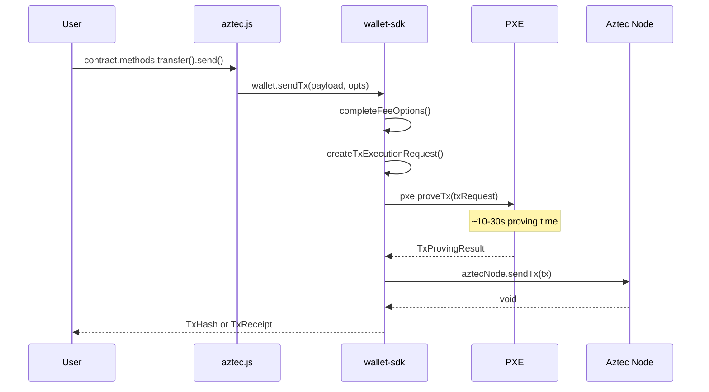

# Phase 1: User Invocation

:::note What you'll understand
How `contract.methods.transfer().send()` creates an `ExecutionPayload`, is passed to `Wallet.sendTx()`, which calls `PXE.proveTx()`, and finally submits the proven transaction to the Aztec node. Prerequisites: [Transaction Lifecycle Overview](./index.md).
:::

## The SDK Entry Point

User code interacts with deployed contracts through the `aztec.js` SDK:

```ts
const contract = Contract.at(address, artifact, wallet);
const receipt = await contract.methods.transfer(recipient, amount).send().wait();
```

`Contract.at()` returns a proxy object. Accessing `.methods.transfer()` creates a `ContractFunctionInteraction` — nothing is executed yet. This mirrors how `ethers.js` builds call objects before signing.

## 1.1 ContractFunctionInteraction

```ts
// aztec.js/src/contract/contract_function_interaction.ts
export class ContractFunctionInteraction extends BaseContractInteraction {
  public override async request(options = {}): Promise<ExecutionPayload> {
    const calls = [await this.getFunctionCall()];
    const feePayload = options.fee?.paymentMethod
      ? await options.fee.paymentMethod.getExecutionPayload()
      : undefined;
    return feePayload
      ? mergeExecutionPayloads([feePayload, functionPayload])
      : functionPayload;
  }
}
```

`ExecutionPayload` contains:
- **Function calls** — the actual contract calls to execute
- **Auth witnesses** — signatures that the account contract will verify in-circuit
- **Capsules** — read-only auxiliary data containers passed to the circuit via oracle

## 1.2 BaseContractInteraction.send()

```ts
// aztec.js/src/contract/base_contract_interaction.ts
export abstract class BaseContractInteraction {
  public async send<TReturn = TxReceipt>(
    options: SendInteractionOptions,
  ): Promise<SendReturn<typeof options.wait, TReturn>> {
    const executionPayload = await this.request(options);
    const sendOptions = toSendOptions(options);
    return await this.wallet.sendTx(executionPayload, sendOptions);
  }
}
```

The SDK never touches private state directly — all private operations flow through the wallet, which in turn flows through the PXE. This is the API boundary.

## 1.3 Wallet.sendTx() — The Orchestrator

The wallet coordinates three operations: fee estimation, proving, and broadcasting.

```ts
// wallet-sdk/src/base-wallet/base_wallet.ts
public async sendTx<W>(executionPayload: ExecutionPayload, opts: SendOptions<W>) {
  // 1. Complete fee options (gas estimation)
  const feeOptions = await this.completeFeeOptions(opts.from, ...);

  // 2. Wrap in account entrypoint — creates TxExecutionRequest
  const txRequest = await this.createTxExecutionRequestFromPayloadAndFee(...);

  // 3. PROVE: Execute private functions + generate kernel proofs via PXE
  const provenTx = await this.pxe.proveTx(txRequest);
  const tx = await provenTx.toTx();

  // 4. SEND: Submit to Aztec node (enters P2P network)
  const txHash = tx.getTxHash();
  await this.aztecNode.sendTx(tx);

  // 5. Optionally wait for confirmation
  return opts.wait === NO_WAIT ? txHash : await waitForTx(this.aztecNode, txHash);
}
```

The key observation: by the time `sendTx()` returns a `TxHash`, the transaction has already been **proven**. In Ethereum, broadcasting is nearly instant. In Aztec, the 10–30 second latency is spent here, in `pxe.proveTx()`.

## 1.4 The Tx Object

The output of `pxe.proveTx()` becomes a `Tx` — the gossipable unit:

```ts
// stdlib/src/tx/tx.ts
export class Tx extends Gossipable {
  static override p2pTopic = TopicType.tx;

  constructor(
    public readonly txHash: TxHash,
    public readonly data: PrivateKernelTailCircuitPublicInputs,
    public readonly chonkProof: ChonkProof,
    public readonly contractClassLogFields: ContractClassLogFields[],
    public readonly publicFunctionCalldata: HashedValues[],
  ) { super(); }
}
```

`Gossipable` is a base class that provides P2P topic routing, serialization (`toBuffer()`), and message ID generation. The `txHash` is computed from the kernel public inputs — it cannot be tampered with post-proving.

## Phase 1 Data Flow



## AuthWitnesses — How Signatures Work

Unlike Ethereum's ECDSA-signed transactions, Aztec auth witnesses are verified **inside a Noir circuit** by the account contract. The wallet creates an `AuthWitness` — a signature over the hash of the transaction's execution payload — and passes it to the PXE. When the account contract's `entrypoint()` runs during private execution, it fetches the witness via oracle and calls `schnorr::verify_signature()` (or whatever auth scheme the account uses).

This is full account abstraction: the authentication algorithm is circuit code, not protocol-level magic.

## Common Pitfalls

- **`proveTx()` vs `simulateTx()`**: `simulateTx()` runs the circuit without generating a proof (fast, for UI previews). `proveTx()` generates the full ZK proof (slow, required for broadcast). Don't confuse the two when debugging.
- **Fee estimation failures**: `completeFeeOptions()` runs a simulation internally. If it fails, it throws before proving. Check your fee payer's balance.
- **Auth witness scope**: Auth witnesses are scoped to a specific `outer_hash` = `hash(consumer_address, inner_hash(selector, args))`. Re-using a witness for a different call or contract will fail at the circuit level.

## What Comes Next

The PXE receives the `TxExecutionRequest` and begins private execution — the subject of [Phase 2: PXE Private Execution](./02-pxe-private-execution.md).
