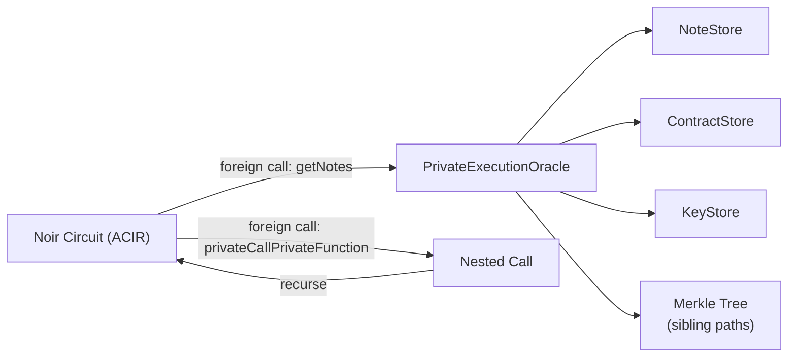
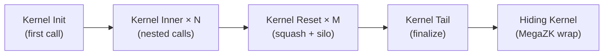

# Phase 2: PXE Private Execution

:::note What you'll understand
How `PXE.proveTx()` orchestrates private function execution via the ACVM, uses the oracle pattern to supply witnesses, chains kernel circuits (Init → Inner × N → Reset → Tail → Hiding), and packages the result into a `Tx` ready for P2P broadcast. Prerequisites: [Phase 1: User Invocation](./01-user-invocation.md). For kernel circuit internals, see [Private Kernel Circuits](../02-zk-circuits-state/03-private-kernel-circuits.md).
:::

## PXE.proveTx() — Entry Point

```ts
// pxe/src/pxe.ts
public proveTx(txRequest: TxExecutionRequest): Promise<TxProvingResult> {
  return this.#putInJobQueue(async (jobId) => {
    await this.blockStateSynchronizer.sync();   // Sync to latest finalized state

    const simulator = await this.#getSimulatorForTx(txRequest, jobId);

    // Execute private functions (Noir circuits via WASM/native ACVM)
    const executionResult = await this.#executePrivate(simulator, txRequest, scopes, jobId);

    // Run kernel circuits and generate proof
    const proofOutput = await this.#prove(executionResult, txRequest, { simulate: false });

    return new TxProvingResult(executionResult, proofOutput.publicInputs, proofOutput.chonkProof);
  });
}
```

**Job queue**: PXE serializes proving jobs via `#putInJobQueue` to avoid concurrent access to the note cache and key store. Only one transaction is proven at a time per PXE instance.

**Why sync first?** The private circuits prove non-membership in the nullifier tree and membership of past notes in the note hash tree. Both require a stable, finalized tree root — the "anchor block". Syncing finds the most recent finalized block whose tree snapshot is permanently committed to the Archive.

## ACIR Execution — Where Noir Runs

Compiled Noir bytecode (ACIR) executes through the ACVM:

```ts
// simulator/src/private/acvm/acvm.ts
export async function acvm(
  acir: Buffer, initialWitness: ACVMWitness, callback: ACIRCallback,
): Promise<ACIRExecutionResult> {
  const result = await executeCircuitWithReturnWitness(
    acir, initialWitness,
    (name: string, args: ForeignCallInput[]) => {
      const oracleFunction = callback[name];   // Oracle dispatch
      return oracleFunction.call(callback, ...args);
    },
  );
  return { partialWitness: result.solvedWitness, returnWitness: result.returnWitness };
}
```

Two backends are available:

| Backend | Use case |
|---------|----------|
| `WASMSimulator` | Default — runs ACIR in browser/Node WASM. Portable. |
| `NativeACVMSimulator` | Uses native `acvm` binary. Faster for large circuits. |

The ACVM is not an interpreter — it is a **witness solver**. It finds a satisfying assignment to all wire values in the circuit, then Barretenberg proves that assignment exists.

## The Oracle Pattern

Noir circuits are pure: no I/O, no storage access, no randomness. The `PrivateExecutionOracle` bridges this gap:



Key oracle methods in `pxe/src/contract_function_simulator/oracle/oracle.ts`:

| Oracle Method | What it Returns |
|--------------|----------------|
| `utilityGetNotes(slot, ...)` | Decrypted notes matching a storage slot |
| `getNoteHashMembershipWitness(hash)` | Merkle sibling path for a note |
| `getNullifierMembershipWitness(nullifier)` | Proof that a nullifier exists (or not) |
| `privateCallPrivateFunction(contract, selector, args)` | Result of a nested private call |
| `enqueuePublicFunctionCall(...)` | Adds a public function to the queue |
| `computeAppTaggingSecret(...)` | Derives note tagging secret for encryption |

**Critical security property**: Oracles are *hints*, not trusted inputs. The circuit re-derives and verifies everything. A malicious oracle returning a fake sibling path would produce a wrong root hash, failing the `assert(computed_root == expected_root)` constraint — the proof would be invalid.

## Nested Private Calls

When `transfer()` calls `_decrease_balance()`, the oracle recursively executes the child:

```ts
// pxe/src/contract_function_simulator/oracle/private_execution_oracle.ts
async privateCallPrivateFunction(targetContract, functionSelector, args) {
  const childOracle = new PrivateExecutionOracle(
    targetContract, /* inherits: txContext, noteCache from parent */
  );
  const childResult = await executePrivateFunction(childOracle, targetContract, functionSelector, args);
  this.nestedExecutionResults.push(childResult);
  return childResult.publicInputs;
}
```

The result is a **tree of execution results** — PXE walks this tree to build the kernel chain.

## Private Kernel Proof Chain

After all private functions execute, the kernel circuits compress the results:



```ts
// pxe/src/private_kernel/private_kernel_execution_prover.ts
async proveWithKernels(txRequest, executionResult, config) {
  let output = await this.proveInit(txRequest, firstCallResult);
  for (const nestedCall of remainingCalls)
    output = await this.proveInner(output, nestedCall);
  output = await this.proveReset(output);   // Reorder side effects, squash transients
  output = await this.proveTail(output);    // Final public inputs
  if (!config.simulate) output = await this.proveHiding(output);  // MegaZK wrap
  return output;
}
```

Each kernel circuit:
1. Verifies the previous circuit's proof (via Chonk IVC folding — cheap, no PCS check yet)
2. Processes one private function's side effects
3. Outputs updated accumulated data (note hashes, nullifiers, logs, public call requests)

The **Hiding Kernel** is the final step. It terminates the Chonk folding chain and applies MegaZK (randomized Sumcheck + ECC op queue masking) so the final proof reveals nothing about the circuit structure — not which functions ran, not how many nested calls occurred.

## Proving Times

| Step | Approximate Time |
|------|-----------------|
| Kernel Init | ~1–2s |
| Kernel Inner (per call) | ~2–5s |
| Kernel Reset | ~2s |
| Kernel Tail | ~2s |
| Hiding Kernel (MegaZK) | ~5–15s |
| **Total TX proving** | **~10–30s** |

These are current CPU times. GPU acceleration will reduce these significantly.

## Implementation Notes

- **Staged writes**: New notes discovered during simulation go to a `noteCache` keyed by `jobId`. They only commit to the persistent `NoteStore` if the TX succeeds. This prevents corruption from failed simulations.
- **Anchor block**: The PXE selects the most recent finalized block. It syncs to find this block before proving. If the chain is not synced, `proveTx()` may use a stale anchor, causing nullifier proofs to fail at inclusion time.
- **Reset variant selection**: The PXE automatically selects the smallest kernel reset circuit that fits the transaction's accumulated data — smaller circuits prove faster.

## What Comes Next

The proven `Tx` object enters the P2P network — covered in [Phase 3: P2P & Mempool](./03-p2p-mempool.md). For the cryptographic internals of the kernel circuits themselves, see [Private Kernel Circuits](../02-zk-circuits-state/03-private-kernel-circuits.md).
