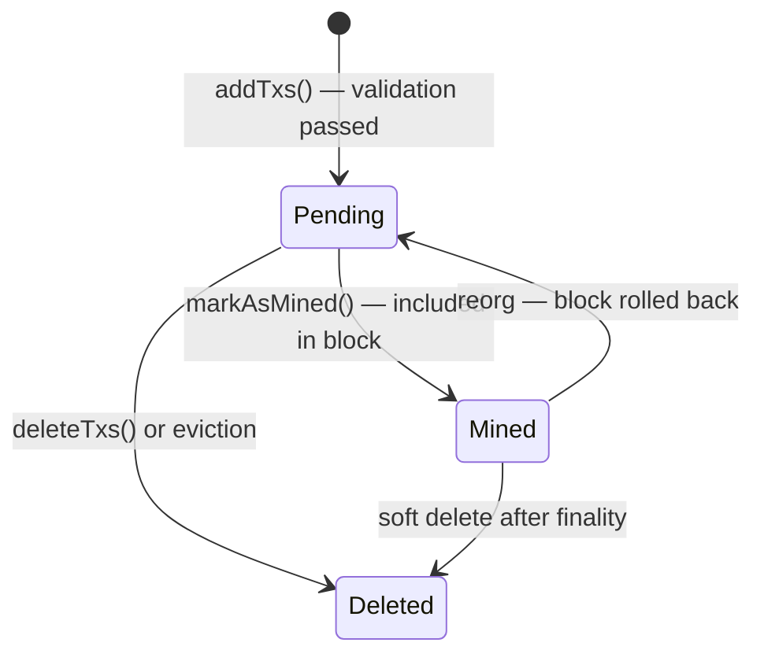
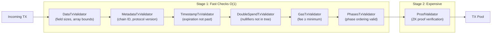

# Phase 3: P2P Network & Mempool

:::note What you'll understand
How a proven `Tx` enters the libp2p GossipSub network, passes through a two-stage validation pipeline (fast checks → expensive ZK proof verification), and is stored in the `AztecKVTxPool` mempool with eviction rules. Prerequisites: [Phase 2: PXE Private Execution](./02-pxe-private-execution.md).
:::

## Entering the P2P Network

The Aztec node calls `P2PClient.sendTx()` upon receiving a transaction from the wallet:

```ts
// p2p/src/client/p2p_client.ts
public async sendTx(tx: Tx): Promise<void> {
  const addedCount = await this.addTxsToPool([tx]);     // 1. Add to local pool
  if (addedCount === 1) {
    await this.p2pService.propagate(tx);                  // 2. Broadcast via gossipsub
  }
}
```

Propagation uses libp2p's GossipSub protocol:

```ts
// p2p/src/services/libp2p/libp2p_service.ts
public async propagate<T extends Gossipable>(message: T) {
  const p2pMessage = P2PMessage.fromGossipable(message);
  await this.node.services.pubsub.publish(
    this.topicStrings[parent.p2pTopic],   // TopicType.tx
    p2pMessage.toMessageData()            // Snappy compressed
  );
}
```

GossipSub configuration:
- `D=8` mesh peers per topic
- `StrictNoSign` policy (no sender identity required)
- Snappy compression for bandwidth efficiency
- **Async validation** — incoming messages are validated before forwarding

## The TX Pool

```ts
// p2p/src/mem_pools/tx_pool/aztec_kv_tx_pool.ts
export class AztecKVTxPool implements TxPool {
  #txs: Map<txHash, Buffer>;                           // TX data storage
  #pendingTxPriorityToHash: MultiMap<priority, txHash>; // Fee-ordered index
  #pendingNullifierToTxHash: Map<nullifier, txHash>;    // Conflict detection
}
```

### TX State Machine



## Two-Stage Validation Pipeline

Every received TX passes through validators before entering the pool. Fast checks run first; expensive ZK proof verification is deferred:



```ts
// p2p/src/msg_validators/tx_validator/factory.ts
export function createTxMessageValidators(...): Record<string, MessageValidator>[] {
  return [
    { /* Stage 1 */ dataValidator, metadataValidator, timestampValidator,
      doubleSpendValidator, gasValidator, phasesValidator },
    { /* Stage 2 */ proofValidator },  // Deferred — expensive
  ];
}
```

Failed validation **penalizes** the sending peer's GossipSub score, eventually disconnecting persistent bad actors.

## Double-Spend Prevention in the Mempool

`DoubleSpendTxValidator` checks every nullifier in the incoming TX against the nullifier tree:

```ts
// p2p/src/msg_validators/tx_validator/double_spend_validator.ts
for (const nullifier of tx.data.getNonEmptyNullifiers()) {
  const exists = await this.nullifierTree.findLeafIndex(nullifier);
  if (exists !== undefined) {
    return { result: 'invalid', reason: 'TX_ERROR_EXISTING_NULLIFIER' };
  }
}
```

If two TXs arrive with conflicting nullifiers (same note being double-spent), `nullifier_conflict_pre_add_rule.ts` keeps the higher-priority (higher-fee) TX and evicts the other.

## Eviction Rules

The pool is bounded. Five eviction triggers:

| Rule | Condition | Action |
|------|-----------|--------|
| **NullifierConflict** | Same nullifier in two TXs | Keep higher-fee TX |
| **FeePayerBalance** | Fee payer can't cover all their pending TXs | Evict lowest-fee TX from that payer |
| **LowPriority** | Pool at capacity | Evict globally lowest-fee TX |
| **InvalidAfterMining** | Nullifier was mined in a new block | Remove TX with that nullifier |
| **InvalidAfterReorg** | Chain reorg invalidated TX's anchor block | Revalidate affected TXs |

## Implementation Notes

- **Gossip deduplication**: Each `Gossipable` message has a unique `messageId`. GossipSub deduplicates by `messageId` — the same TX arriving from multiple peers is processed only once.
- **Async proof validation**: ZK proof verification is slow (~1–5s). Doing it synchronously on the gossip path would cause all peers to wait. It is scheduled asynchronously; a TX is not forwarded to other peers until its proof validates.
- **Pool persistence**: `AztecKVTxPool` uses LMDB (via `kv-store`) for persistence. A node restart recovers the pending TX set.

## What Comes Next

Pending TXs in the pool are consumed by the sequencer during block building — covered in [Phase 4: Sequencer Block Building](./04-sequencer-block-building.md).
