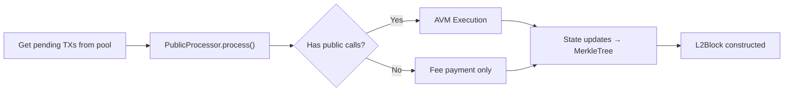

# Phase 4: Sequencer Block Building

:::note What you'll understand
How the sequencer's main loop operates per-slot, how it builds multiple blocks per checkpoint with deadline and blob-space constraints, and how `CheckpointProposalJob` orchestrates the full block-building pipeline. Prerequisites: [Phase 3: P2P & Mempool](./03-p2p-mempool.md).
:::

## Slot and Epoch Timing

Time in Aztec is organized into **slots** (fixed duration) and **epochs** (multiple slots). One validator is elected proposer per slot. Within a slot, the proposer builds **multiple L2 blocks** bundled into a **checkpoint**:

```
Epoch
┣━━━━━━━━━━━━━━━━ Slot 0 ━━━━━━━━━━━━━━━━┫┣━━━ Slot 1 ━━━...
  Block 0    Block 1    Block 2   Finalize
  ┣━━━━━━━━━━┫┣━━━━━━━━━━┫┣━━━━━━━━┫┣━━━━━━┫
```

The proposer is selected deterministically via `getProposerAt(slotNumber)` from the validator set — similar to Ethereum's beacon chain proposer selection.

## Sequencer Main Loop

```ts
// sequencer-client/src/sequencer/sequencer.ts
export class Sequencer extends EventEmitter {
  protected async work(): Promise<Checkpoint | undefined> {
    this.setState(SequencerState.SYNCHRONIZING);
    const { slot, ts, now, epoch } = this.epochCache.getEpochAndSlotInNextL1Slot();

    const job = await this.prepareCheckpointProposal(epoch, slot, ts, now);
    if (!job) return;   // Not our turn

    return await job.execute();
  }
}
```

`prepareCheckpointProposal()` checks: (1) is this our slot, (2) is there enough time left in the slot to build blocks. If we are not the proposer, `work()` exits immediately.

## Building Multiple Blocks for a Checkpoint

```ts
// sequencer-client/src/sequencer/checkpoint_proposal_job.ts
private async buildBlocksForCheckpoint(...) {
  const blocks: L2Block[] = [];
  let remainingBlobFields = BLOBS_PER_CHECKPOINT * FIELDS_PER_BLOB;

  while (true) {
    const timingInfo = this.timetable.canStartNextBlock(this.getSecondsIntoSlot());
    if (!timingInfo.canStart) break;

    const result = await this.buildSingleBlock(checkpointBuilder, {
      buildDeadline: timingInfo.deadline,
      txHashesAlreadyIncluded,
      remainingBlobFields,    // L1 EIP-4844 blob space constraint
    });

    if (!result) continue;

    blocks.push(result.block);
    remainingBlobFields -= result.usedTxBlobFields;

    // Broadcast non-last blocks to validators immediately
    if (!timingInfo.isLastBlock) {
      await this.p2pClient.broadcastProposal(
        await this.validatorClient.createBlockProposal(result.block, ...)
      );
    }
  }
}
```

Two hard limits constrain block building:
1. **Slot deadline** — `timetable.canStartNextBlock()` prevents starting a new block if there isn't enough time to complete it before the slot ends.
2. **Blob space** — `remainingBlobFields` tracks remaining EIP-4844 blob capacity. TX effects must fit within the blob size limit.

## Single Block Construction

```ts
const pendingTxs = filter(
  this.p2pClient.iteratePendingTxs(),
  tx => !txHashesAlreadyIncluded.has(tx.txHash.toString()),
);

const limits: PublicProcessorLimits = {
  maxTransactions: config.maxTxsPerBlock,
  maxBlockSize: config.maxBlockSizeInBytes,
  maxBlockGas: new Gas(config.maxDABlockGas, config.maxL2BlockGas),
  maxBlobFields: maxBlobFieldsForTxs,
  deadline: buildDeadline,
};

const result = await checkpointBuilder.buildBlock(pendingTxs, blockNumber, timestamp, limits);
```



## TX Expiration and Anchor Block

Each TX has an `expirationTimestamp` set by the PXE:

```
expirationTimestamp = anchorBlockTimestamp + MAX_TX_LIFETIME (24h)
```

The sequencer's `TimestampTxValidator` checks this before including a TX. Expired TXs are silently dropped. This bounds the maximum age of the historical anchor block that can be referenced.

## Implementation Notes

- **`calculateMaxBlocksPerSlot()`**: Dynamically computed from the remaining slot time and estimated block build duration. Prevents the sequencer from starting a block it can't finish.
- **TX ordering**: TXs are iterated from the pool in priority (fee) order. Higher-fee TXs are always preferred.
- **World state forking**: Each block's execution uses a fork of world state. If block building fails, the fork is discarded, leaving the canonical state untouched.

## What Comes Next

Public function execution happens inside block building via `PublicProcessor` — detailed in [Phase 5: Public Execution](./05-public-execution.md). After blocks are built, validators must attest — see [Phase 6: Validator Attestation](./06-validator-attestation.md).
