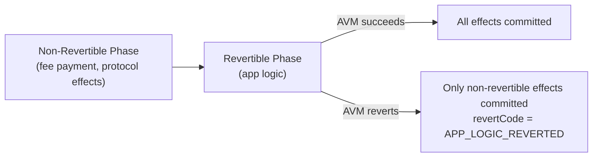

# Phase 5: Public Execution

:::note What you'll understand
How `PublicProcessor.process()` iterates pending transactions, forks world state for each, runs public functions through the AVM simulator, handles revert semantics (non-revertible vs revertible effects), and produces `ProcessedTx` objects. Prerequisites: [Phase 4: Sequencer Block Building](./04-sequencer-block-building.md). For AVM internals, see [AVM](../02-zk-circuits-state/05-avm.md).
:::

## Public vs Private Execution

Private functions ran on the **user's device** in the PXE. Public functions run on the **sequencer** during block building. The key difference:

| Dimension | Private (PXE) | Public (Sequencer) |
|-----------|--------------|-------------------|
| Executor | User's device | Sequencer node |
| State access | Note hash tree (read), nullifiers | Public data tree (read/write) |
| Privacy | Full — inputs hidden | None — fully transparent |
| VM | ACVM (Noir constraint solver) | AVM (bytecode interpreter) |
| Proof | Client-side kernel proof (Chonk) | Server-side AVM proof (Barretenberg) |

## PublicProcessor.process()

The processor iterates pending TXs and handles each atomically using world state forks:

```ts
// simulator/src/public/public_processor/public_processor.ts
export class PublicProcessor {
  public async process(txs: AsyncIterable<Tx>, limits: PublicProcessorLimits) {
    const result: ProcessedTx[] = [];

    for await (const tx of txs) {
      if (result.length >= maxTransactions) break;
      if (this.dateProvider.now() > +deadline) break;

      // Fork world state for atomic TX execution
      const checkpoint = await ForkCheckpoint.new(this.guardedMerkleTree.getUnderlyingFork());

      try {
        const [processedTx] = tx.hasPublicCalls()
          ? await this.processTxWithPublicCalls(tx)
          : await this.processPrivateOnlyTx(tx);
        result.push(processedTx);
        await checkpoint.commit();           // Persist state changes
      } catch (err) {
        await checkpoint.revert();           // Rollback — skip this TX
      }
    }
  }
}
```

**Fork-based atomicity**: Each TX executes against a forked copy of world state. If execution fails, the fork is reverted — the canonical state is never corrupted.

## Private-Only TX Path

No public calls — just compute the fee and do tree insertions:

```ts
private async processPrivateOnlyTx(tx: Tx) {
  const fee = computeTransactionFee(
    gasFees, tx.data.constants.txContext.gasSettings, tx.data.gasUsed,
  );
  const feePaymentWrite = await this.performFeePaymentPublicDataWrite(fee, tx.data.feePayer);
  const processedTx = makeProcessedTxFromPrivateOnlyTx(tx, fee, feePaymentWrite, this.globalVariables);
  await this.doTreeInsertionsForPrivateOnlyTx(processedTx);
  return [processedTx, undefined];
}
```

Private-only TXs are fast — they skip the AVM entirely and just insert note hashes and nullifiers into the Merkle trees, then deduct the fee.

## TX With Public Calls Path

```ts
private async processTxWithPublicCalls(tx: Tx) {
  const result = await this.publicTxSimulator.simulate(tx);
  const { hints, publicInputs, publicTxEffect, gasUsed, revertCode } = result;

  const avmProvingRequest = hints && publicInputs
    ? PublicProcessor.generateProvingRequest(publicInputs, hints)
    : undefined;

  const processedTx = makeProcessedTxFromTxWithPublicCalls(
    tx, this.globalVariables, avmProvingRequest, publicTxEffect, gasUsed, revertCode,
  );
  return [processedTx, returnValues];
}
```

## Revertibility — Non-Revertible vs Revertible Effects

Aztec transactions have two phases:



**Why the split?** Consider a failed swap. The user still consumed sequencer resources, so the fee must be deducted (non-revertible). But the swap's state changes should not persist (revertible). Without this split, a user could craft a TX that always reverts, consuming gas without paying fees — a DoS vector.

`revertCode` in the `ProcessedTx` tells the TX Base rollup circuit which effects to include.

## Implementation Notes

- **`deadline` parameter**: The processor checks wall-clock time on each iteration. If the slot deadline passes mid-block, it stops processing TXs. The partial list of processed TXs still forms a valid block.
- **Gas metering**: Both L2 gas and DA gas are tracked. A TX that runs out of either gas type halts with an exceptional halt (consumes all remaining gas, no revert reason returned).
- **`publicTxSimulator`**: This is the `PublicTxSimulator` class which wraps the AVM and manages nested call stacks. Each enqueued public call is executed in order — they form a flat queue, not a recursive call stack (unlike private calls).

## What Comes Next

Processed blocks go to validators for attestation — [Phase 6: Validator Attestation](./06-validator-attestation.md). For AVM opcode internals, see [AVM](../02-zk-circuits-state/05-avm.md).
