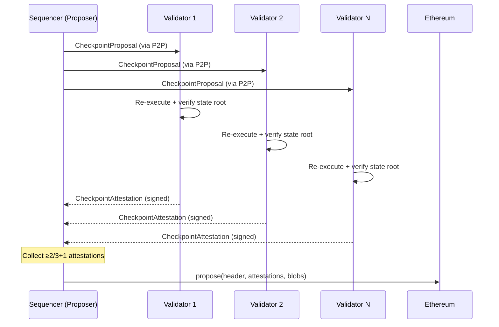

# Phase 6: Validator Attestation

:::note What you'll understand
How validators receive `BlockProposal` messages via P2P, independently re-execute public transactions to verify state roots, sign `CheckpointAttestation` objects, and why re-execution and ZK proving are complementary rather than redundant. Prerequisites: [Phase 5: Public Execution](./05-public-execution.md).
:::

## Why Validators Re-Execute

Ethereum engineers often ask: "If ZK proofs guarantee correctness, why re-execute at all?"

The answer: ZK epoch proofs take **30–60 minutes** to generate — far too slow for block-by-block consensus. Validators re-execute **public calls** to catch sequencer misbehavior fast (within the slot). The ZK proof comes later and is the ultimate cryptographic guarantee.

| Layer | Speed | What It Verifies |
|-------|-------|-----------------|
| **Validator re-execution** | Seconds (within slot) | Public state root correct; sequencer didn't cheat on public effects |
| **ZK epoch proof** | 30–60 minutes | Everything: private + public execution, all tree transitions |

Re-execution cannot verify private execution (validators don't have private inputs). ZK proofs can. Neither is redundant.

## Block Proposal Handling

```ts
// validator-client/src/validator.ts
async validateBlockProposal(proposal: BlockProposal, proposalSender: PeerId): Promise<boolean> {
  const proposer = proposal.getSender();

  // Verify proposer is elected for this slot
  const isInCommittee = await this.epochCache.isInCommittee(proposal.slotNumber, proposer);

  const shouldReexecute = this.config.fishermanMode
    || this.config.slashingEnabled
    || inCommitteeWithValidationEnabled;

  const result = await this.blockProposalHandler.handleBlockProposal(
    proposal, proposalSender, shouldReexecute
  );
  return result.isValid;
}
```

**Fisherman mode**: When enabled, every validator re-executes every block, not just when they are in the committee. This maximizes detection of invalid blocks at the cost of higher compute.

## Re-Execution

Validators fork world state at the parent block and rebuild:

```ts
// validator-client/src/block_proposal_handler.ts
async reexecuteTransactions(proposal, blockNumber, txs, ...) {
  const fork = await this.worldState.fork(blockNumber - 1);

  const result = await checkpointBuilder.buildBlock(txs, blockNumber, timestamp, {
    expectedEndState: proposal.stateReference,
  });

  if (result.block.header.stateReference !== proposal.stateReference) {
    return { isValid: false, reason: 'state_mismatch' };
  }
  return { isValid: true };
}
```

If the state root doesn't match, the block proposal is rejected and the proposer is slashable.

## Attestation

After all blocks in a slot are validated, the validator signs an attestation:

```ts
// validator-client/src/duties/validation_service.ts
async attestToCheckpointProposal(
  proposal: CheckpointProposalCore, attestors: EthAddress[],
): Promise<CheckpointAttestation[]> {
  const payload = ConsensusPayload.fromCheckpointProposal(proposal);
  const digest = payload.getPayloadToSign();  // Keccak256 of checkpoint

  return Promise.all(attestors.map(async (attestor) => {
    const signature = await this.keyStore.signMessageWithAddress(attestor, digest, context);
    return new CheckpointAttestation(payload, signature);
  }));
}
```

The proposer **collects attestations** from the P2P attestation pool, polling until **≥2/3+1** of the committee has signed (BFT threshold), then submits the checkpoint to L1.

## Attestation Collection Flow



## Equivocation and Slashing

If a proposer signs two different `CheckpointProposal` objects for the same slot (equivocation), any node that observes both signatures can submit a slashing proof. The slasher contract verifies the double-signature and penalizes the proposer's stake.

Validators protect against this on their side: they refuse to attest to a proposal if they've already attested to a conflicting proposal for the same slot.

## Implementation Notes

- **`epochCache`**: Both the proposer and validators use a shared `EpochCache` to determine committee membership for each slot. It derives the committee from the validator set on-chain.
- **Attestation timeout**: The proposer waits up to a configurable deadline for attestations. If the threshold isn't met, the checkpoint is abandoned for this slot. No TX is lost — they remain in the mempool for the next slot.
- **P2P attestation topic**: Attestations are broadcast on a separate GossipSub topic (`TopicType.attestation`), distinct from the TX topic.

## What Comes Next

The proven TX and block data go to the ProvingOrchestrator — [Phase 7: Proving Infrastructure](./07-proving-infrastructure.md). The checkpoint is submitted to L1 — [Phase 8: L1 Finality](./08-l1-finality.md).
