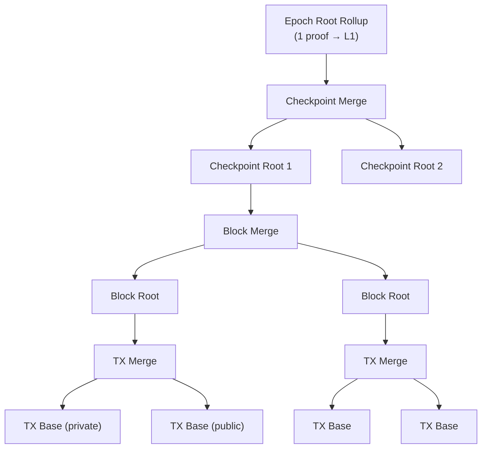
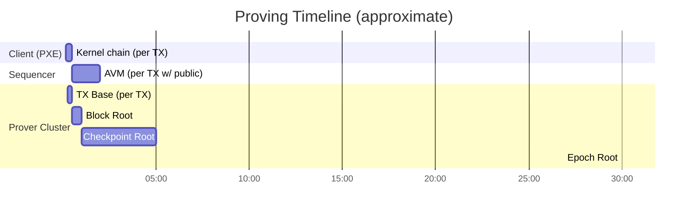

# Phase 7: Proving Infrastructure

:::note What you'll understand
How the `ProvingOrchestrator` manages a hierarchical proof tree (TX Base → TX Merge → Block Root → Checkpoint Root → Epoch Root), how the `ProvingBroker` distributes jobs to `ProvingAgent` workers, and how Barretenberg generates the final proof for L1. Prerequisites: [Phase 6: Validator Attestation](./06-validator-attestation.md). For circuit topology, see [Rollup Circuits](../02-zk-circuits-state/04-rollup-circuits.md).
:::

## The Proof Tree

ZK proofs are generated **bottom-up** and recursively merged:



Each level **verifies the proofs from the level below** recursively. The final Epoch Root proof is a single proof verifiable on L1 with one pairing check (~500k gas).

## ProvingOrchestrator — State Management

```ts
// prover-client/src/orchestrator/orchestrator.ts
EpochProvingState
  → CheckpointProvingState[]
    → BlockProvingState[]
      → TxProvingState[]   // tracks AVM + Chonk + TX Base per TX
```

Key lifecycle methods:

| Method | Trigger | Effect |
|--------|---------|--------|
| `startNewEpoch()` | New epoch begins | Initializes `EpochProvingState` |
| `startNewCheckpoint()` | New slot begins | Forks world state, creates `CheckpointProvingState` |
| `startNewBlock()` | Sequencer starts new block | Initializes `BlockProvingState` |
| `addTxs(txs)` | Block assembled | Adds simulated TXs to the block's scheduler |
| `finaliseBlock()` | Block complete | Triggers base proof generation for the block |

## ProvingBroker — Job Queue

The broker distributes work across multiple agents:

```ts
// prover-client/src/proving_broker/proving_broker.ts
export class ProvingBroker {
  private queues: ProvingQueues = {
    ROOT_ROLLUP:        new PriorityQueue(),
    CHECKPOINT_ROOT:    new PriorityQueue(),
    BLOCK_ROOT_ROLLUP:  new PriorityQueue(),
    TX_MERGE:           new PriorityQueue(),
    PRIVATE_TX_BASE:    new PriorityQueue(),
    PUBLIC_TX_BASE:     new PriorityQueue(),
    PUBLIC_VM:          new PriorityQueue(),
    PARITY_BASE:        new PriorityQueue(),
  };

  #getProvingJob(filter) {
    // Priority order: Root → Checkpoint → Block → TX
    for (const type of PRIORITY_ORDER) {
      const job = this.queues[type].getImmediate();
      if (job) return { job };
    }
  }
}
```

Higher-level proofs are prioritized. This ensures the critical path (root proofs) completes as soon as their dependencies are ready, minimizing total proof time.

## ProvingAgent — Worker

```ts
// prover-client/src/proving_broker/proving_agent.ts
export class ProvingAgent {
  private async work() {
    if (this.currentJobController) {
      const status = this.currentJobController.getStatus();
      if (status === RUNNING)
        await this.broker.reportProvingJobProgress(jobId);
      else if (status === DONE)
        await this.reportResult(jobId, result);
    } else {
      const job = await this.broker.getProvingJob({ allowList: ... });
      if (job) await this.startJob(job);
    }
  }
}
```

Agents poll the broker for work. Each agent runs one job at a time via Barretenberg. Timed-out jobs are re-enqueued automatically via the broker's `cleanupPass()`.

## Barretenberg — The Proving Backend

All ZK proofs are generated by `barretenberg` (C++). Two TypeScript wrappers call it:

| Prover Class | Used For | Proof Flavor |
|-------------|----------|-------------|
| `BBNativeRollupProver` | TX Base, Merge, Block Root, AVM, Parity | Ultra Rollup Honk / Ultra Keccak Honk |
| `BBPrivateKernelProver` | Private kernel chain (Chonk IVC) | MegaHonk + MegaZK |

The **Epoch Root Rollup** uses `Ultra Keccak Honk` specifically because the L1 `HonkVerifier` contract uses Keccak256 for transcript hashing — cheaper to verify on-chain than Poseidon2.

## Proving Timeline



## Implementation Notes

- **`TxProvingState.ready()`**: Returns `true` only when both the AVM proof and Chonk kernel proof are complete. The TX Base rollup cannot start until both inputs are available.
- **`BlockProvingState.tryStartProvingBase(txIndex)`**: Ensures only one agent starts proving each TX's base rollup — prevents duplicate work if multiple agents poll simultaneously.
- **LMDB persistence**: The broker's job state is persisted to LMDB. A prover node restart recovers in-progress jobs without losing work.
- **Distributed proving**: The broker/agent model supports horizontal scaling. Multiple prover nodes can each run multiple agents, all polling the same broker (via network RPC).

## What Comes Next

The epoch proof is submitted to Ethereum for final settlement — [Phase 8: L1 Finality](./08-l1-finality.md).
