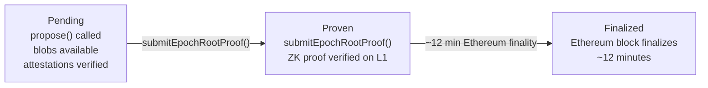

# Phase 8: L1 Finality

:::note What you'll understand
How the sequencer calls `propose()` on the Rollup contract with EIP-4844 blobs and committee attestations, how the prover submits `submitEpochRootProof()` for ZK verification, and what the three finality stages (Pending → Proven → Finalized) mean. Prerequisites: [Phase 7: Proving Infrastructure](./07-proving-infrastructure.md).
:::

## Three Finality Stages



| Stage | Meaning | What the L1 Contract Does |
|-------|---------|--------------------------|
| **Pending** | Checkpoint proposed, blobs available, ≥2/3+1 committee signed | Advances `tips.pending` |
| **Proven** | ZK epoch proof verified | Advances `tips.proven`, unlocks L2→L1 message processing |
| **Finalized** | Ethereum L1 block containing the proof finalizes | Irreversible |

## Blob Publishing — propose()

The sequencer packages the checkpoint for L1:

```ts
// sequencer-client/src/publisher/sequencer-publisher.ts
private async prepareProposeTx(encodedData, timestamp, options) {
  const blobInput = getPrefixedEthBlobCommitments(encodedData.blobs);  // EIP-4844

  const args = [
    { header: encodedData.header.toViem(), archive: toHex(encodedData.archive) },
    encodedData.attestationsAndSigners.getPackedAttestations(),
    signers,
    encodedData.attestationsAndSignersSignature.toViemSignature(),
    blobInput,
  ] as const;

  const rollupData = encodeFunctionData({ abi: RollupAbi, functionName: 'propose', args });

  await this.l1TxUtils.sendAndMonitorTransaction(
    { to: this.rollupContract.address, data: rollupData },
    gasConfig,
    { blobs: encodedData.blobs.map(b => b.data), kzg },  // EIP-4844 blob sidecar
  );
}
```

**EIP-4844 blobs**: TX effects (nullifiers, note hashes, public data writes, fees) are encoded into blobs instead of calldata — ~10x cheaper for DA. Blobs are pruned by Ethereum nodes after ~18 days (they are not permanent storage).

## L1 Rollup Contract — propose()

```solidity
// l1-contracts/src/core/libraries/rollup/ProposeLib.sol
function propose(
  ProposeArgs calldata _args,
  CommitteeAttestations memory _attestations,
  address[] memory _signers,
  Signature calldata _attestationsAndSignersSignature,
  bytes calldata _blobsInput
) internal {
    BlobLib.validateBlobs(_blobsInput);              // 1. Validate EIP-4844 blobs
    validateHeader(header, manaMinFee, blobsHash);   // 2. Validate checkpoint header

    // 3. Verify proposer + committee attestations (≥2/3+1)
    ValidatorSelectionLib.verifyProposer(
      header.slotNumber, currentEpoch, _attestations, _signers, payloadDigest
    );

    // 4. Advance pending chain tip
    uint256 checkpointNumber = tips.getPending() + 1;
    tips = tips.updatePending(checkpointNumber);
    rollupStore.archives[checkpointNumber] = _args.archive;
}
```

The contract verifies:
1. Blob data is valid KZG commitments (EIP-4844)
2. The header's `blobsHash` matches the submitted blobs (binding ZK-proven effects to blob data)
3. The proposer was legitimately elected for this slot
4. ≥2/3+1 of the committee signed the checkpoint

## Epoch Proof Submission

After the prover cluster completes the epoch root proof (~30–60 minutes), the prover node submits it:

```solidity
// l1-contracts/src/core/libraries/rollup/EpochProofLib.sol
function submitEpochRootProof(SubmitEpochRootProofArgs calldata _args) internal {
    Epoch endEpoch = assertAcceptable(_args.start, _args.end);  // Validate epoch range

    verifyLastCheckpointAttestationsAndOutHash(_args.end, _args.attestations, ...);

    require(verifyEpochRootProof(_args), Errors.Rollup__InvalidProof());  // ZK verify!

    if (_args.end > rollupStore.tips.getProven()) {
        rollupStore.tips = rollupStore.tips.updateProven(_args.end);
        if (outHash != EMPTY) rollupStore.config.outbox.insert(endEpoch, outHash);
    }

    RewardLib.handleRewardsAndFees(_args, endEpoch);
    emit L2ProofVerified(_args.end, _args.args.proverId);
}
```

`verifyEpochRootProof()` calls the `HonkVerifier` contract — a Solidity implementation of the UltraKeccakHonk verifier generated from the circuit's verification key. This is a single pairing check on BN254 (~500k gas). One proof validates an entire epoch of blocks.

## SpongeBlob — Binding ZK Proofs to Blobs

The `SpongeBlob` is the cryptographic link between what's proven in circuits and what's published in blobs:

```
TX effects → absorbed into Poseidon2 sponge (per TX, per block) →
squeezed value generates challenge point z →
blob polynomial evaluated at z → must match KZG commitment
```

This ensures the sequencer cannot prove one set of TX effects but publish a different set in the blob.

## Implementation Notes

- **L2→L1 message outbox**: When `tips.proven` advances past an epoch, the `outbox` contract allows L2-to-L1 messages from that epoch to be consumed by L1 contracts. This is how bridges work: the L2 side emits a message; after epoch proof, the L1 side can process it.
- **Fee distribution**: `RewardLib.handleRewardsAndFees()` distributes sequencer fees and prover rewards based on the epoch proof.
- **Blob pruning vs proof**: Blobs are only guaranteed available for ~18 days. The ZK proof is permanent and is all that's needed for ongoing verification. Anyone wanting to re-verify historic TX effects must fetch blobs before they're pruned (or from a DA storage provider).

## Complete End-to-End Summary

| Time | Event |
|------|-------|
| T+0s | User calls `contract.methods.transfer().send()` |
| T+10s–30s | PXE proves private execution (Chonk kernel chain) |
| T+30s | TX enters P2P mempool, validated and gossiped |
| T+slot | Sequencer builds block, validators re-execute and attest |
| T+slot | `propose()` called on L1 — TX is **Pending** |
| T+30–60min | Epoch ZK proof generated |
| T+~1h | `submitEpochRootProof()` — TX is **Proven** |
| T+~1h12min | Ethereum L1 finalizes — TX is **Finalized** |
