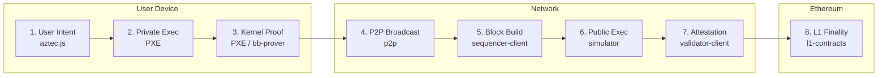
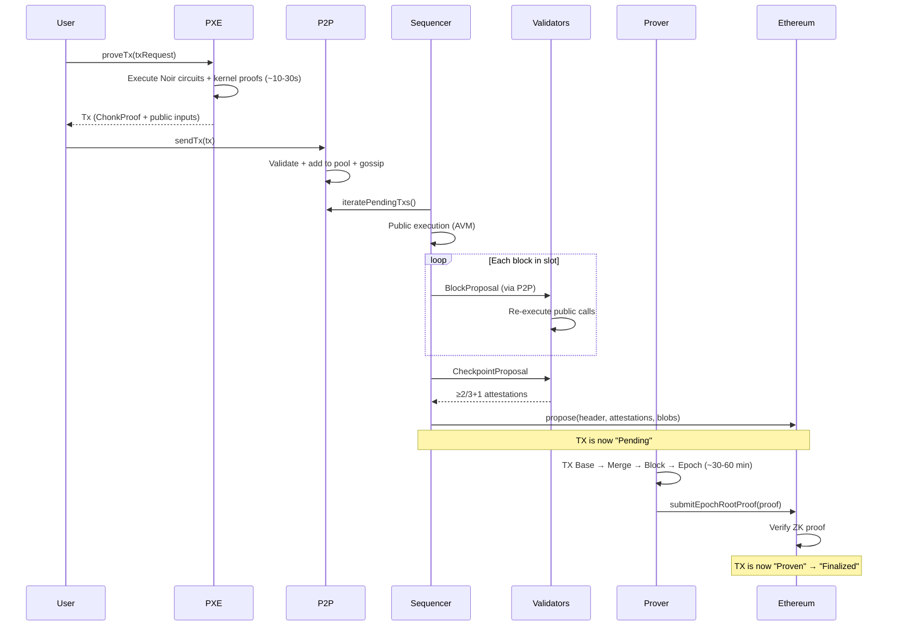

# Transaction Lifecycle Overview

:::note What you'll understand
After reading this section you will be able to trace any transaction from `contract.methods.transfer().send()` through 8 distinct phases to Ethereum L1 finality, naming the exact TypeScript package and key function at each stage. Prerequisite: basic Ethereum familiarity. No prior ZK knowledge needed.
:::

## The 8 Phases

A transaction in Aztec traverses eight phases across three trust boundaries:

| Phase | Package | Key Function | Output |
|-------|---------|-------------|--------|
| 1. User Intent | `aztec.js`, `wallet-sdk` | `BaseContractInteraction.send()` | `TxExecutionRequest` |
| 2. Private Execution | `pxe`, `simulator` | `PXE.proveTx()` | `PrivateExecutionResult` |
| 3. Kernel Proof | `pxe`, `bb-prover` | `proveWithKernels()` | `ChonkProof` |
| 4. P2P Broadcast | `p2p` | `P2PClient.sendTx()` | TX in gossip pool |
| 5. Block Building | `sequencer-client` | `buildBlocksForCheckpoint()` | `L2Block[]` |
| 6. Public Execution | `simulator` | `PublicProcessor.process()` | `ProcessedTx[]` |
| 7. Validator Attestation | `validator-client` | `attestToCheckpointProposal()` | `CheckpointAttestation[]` |
| 8. L1 Finality | `l1-contracts` | `propose()` + `submitEpochRootProof()` | On-chain state update |

## Three Paradigm Shifts From Ethereum

If you're coming from Ethereum, these differences matter most:

**1. Proving moves to the client.** You don't broadcast calldata; you broadcast a ZK proof. The sequencer never reads your private inputs. "Sending" takes 10–30 seconds because your device is proving.

**2. State is split.** Private state (encrypted note commitments) lives in the Note Hash Tree. Public state (readable slots) lives in the Public Data Tree. They are processed by different VMs with different trust assumptions.

**3. Every account is programmable.** There are no EOAs. Authentication logic is a Noir circuit — multisig, biometrics, and session keys are first-class.

## Why ZK, Not Optimistic?

Optimistic rollups (Arbitrum, Optimism) rely on fraud proofs: a challenger re-executes a disputed transaction to prove the sequencer lied. This is incompatible with private state — re-execution requires the private inputs, which breaks privacy. ZK proofs prove correctness without revealing inputs. **ZK is not a performance choice in Aztec — it is a privacy necessity.**

## End-to-End Sequence

## What Comes Next

Each phase has its own deep-dive page:

- [Phase 1: User Invocation](./01-user-invocation.md) — `contract.method().send()` → `Wallet.sendTx()` → `PXE.proveTx()`
- [Phase 2: PXE Private Execution](./02-pxe-private-execution.md) — ACIR execution, oracle pattern, kernel proof chain
- [Phase 3 combined with Phase 2]
- [Phase 4: P2P & Mempool](./03-p2p-mempool.md) — GossipSub, TX pool state machine, validation chain
- [Phase 5: Sequencer Block Building](./04-sequencer-block-building.md) — slot timing, checkpoint construction
- [Phase 6: Public Execution](./05-public-execution.md) — PublicProcessor, AVM simulator, revertibility
- [Phase 7: Validator Attestation](./06-validator-attestation.md) — committee, re-execution, attestation
- [Phase 8: Proving Infrastructure](./07-proving-infrastructure.md) — proof tree, orchestrator, broker/agents
- [Phase 9: L1 Finality](./08-l1-finality.md) — blob publishing, `propose()`, epoch proof submission
