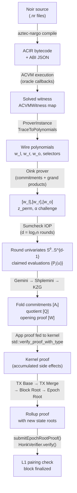
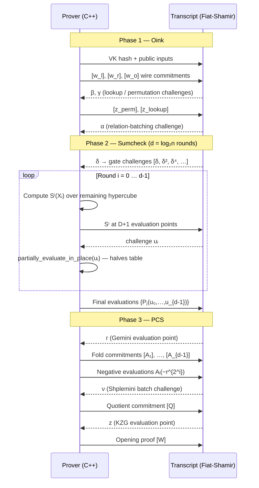
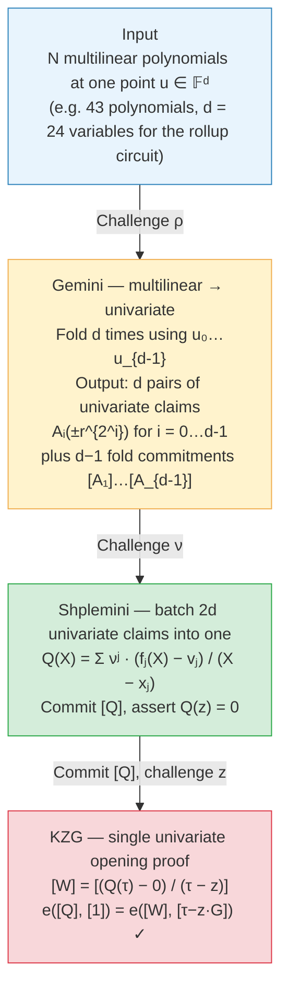

# Proof Generation Journey

:::note What you'll understand
The exact path a ZK proof takes from Noir source code to an on-chain pairing check. For each stage you'll see: what goes in, what comes out, which file/function handles it, and what breaks the security guarantee if that stage is compromised. Prerequisites: [Transaction Lifecycle Overview](../01-transaction-lifecycle/index.md), [Barretenberg Prover Internals](./07-barretenberg-prover.md).
:::

## Overview



Each arrow is a trust boundary. A cheating prover must break all of them simultaneously; breaking any single one is computationally infeasible (or explicitly checked by the next stage).

---

## Stage 1 — Noir → ACIR: Circuit Compilation

The developer writes functions in Noir. `aztec-nargo compile` transforms the source into **ACIR** (Abstract Circuit Intermediate Representation) — a list of arithmetic gate constraints and opcode instructions, together with an ABI describing public/private inputs.

### Inputs / Outputs

| | |
|--|--|
| **Input** | Noir source files (`.nr`), dependency tree |
| **Output** | `target/<contract>.json` containing `bytecode` (ACIR) + `abi` |

### Polynomial constraint system

**A system of polynomial constraints** $\{C_i\}$ over a finite field $\mathbb{F}_p$ where $p$ is the BN254 scalar field order. Each gate $i$ is a constraint $q_m \cdot w_l \cdot w_r + q_l \cdot w_l + q_r \cdot w_r + q_o \cdot w_o + q_c = 0$.

### Source locations

- Compilation: `noir/tooling/nargo_cli/` (Rust, `nargo compile`)
- ACIR definition: `noir/acvm-repo/acir/` — the `Circuit` and `Opcode` types
- Integration with Aztec: `yarn-project/aztec.js/src/contract/contract_artifact.ts`

### Why the circuit definition is tamper-evident

Nothing at this stage is secret — ACIR is a **public circuit description**. The constraint system is part of the verification key and is reproduced in the verifier. A cheating prover cannot modify the ACIR without the verifier noticing (VK hash mismatch in the transcript preamble).

---

## Stage 2 — ACVM Witness Generation: Solving the Circuit

The PXE's simulator runs the ACIR bytecode through the **ACVM** (Abstract Circuit Virtual Machine). The ACVM is an interpreter: it steps through each opcode, resolves arithmetic gates, and whenever it hits an oracle call (e.g., `getNotes`, `getAuthWitness`) it pauses and asks the oracle callback for a value. The result is a **witness** — a complete assignment of field elements to every wire in the circuit.

### Inputs / Outputs

| | |
|--|--|
| **Input** | ACIR bytecode; initial witness (public inputs, calldata); oracle callback handler |
| **Output** | Solved `ACVMWitness` (TypeScript: `Map<number, string>`), one hex field element per wire index |

### The witness: a satisfying assignment

A **satisfying assignment** $\{w_i\}$ such that every constraint $C_i(\ldots) = 0$ holds. The witness is not a proof — it is the secret information the prover will commit to.

### TypeScript entry point

```typescript
// yarn-project/simulator/src/private/acvm.ts
export async function acvm(
  acir: Buffer,                           // ACIR bytecode
  initialWitness: ACVMWitness,            // Public inputs + calldata pre-filled
  callback: ACIRCallback,                 // Oracle handler (PXE resolves these)
): Promise<ACIRExecutionResult> {
  return executeCircuitWithReturnWitness(acir, initialWitness, callback);
  // Returns: { partialWitness: ACVMWitness, returnWitness: ACVMWitness }
}
```

The `callback` implements all oracle methods: `getNotes`, `checkNullifierMembership`, `getAuthWitness`, `getBlockHeader`, etc. The PXE resolves each by querying its local database and the world-state trees.

### Oracle constraints and witness validity

The witness is private, but the constraints are public. A cheating prover could try to supply a witness that does **not** satisfy all constraints (e.g., claiming they own a note they don't). This would produce a witness that fails the constraint check — the Honk prover would either fail to compute a valid proof or produce a proof the verifier rejects.

:::tip Security implication
Oracles themselves are **trusted to provide correct data**, but each piece of oracle data that enters the circuit as a **constrained value** must satisfy a circuit relation. For example, a note returned by `getNotes` must satisfy a Merkle membership proof against the anchor block's note hash root. A lying oracle cannot produce a passing proof — it can only cause proof generation to fail or stall. See [Trust Boundaries and Oracles](./08-trust-boundaries-oracles.md).
:::

---

## Stage 3 — Witness → Polynomials: ProverInstance

The barretenberg `ProverInstance` converts the solved witness into polynomial form. The execution trace — every gate's wire values — is written into coefficient vectors that become the **prover polynomials**.

### Inputs / Outputs

| | |
|--|--|
| **Input** | Solved witness vector; circuit selectors (from ACIR) |
| **Output** | `ProverPolynomials`: `w_l`, `w_r`, `w_o`, `w_4` (wires); `q_m`, `q_l`, `q_r`, `q_o`, `q_c`, ... (selectors); `σ_l`, `σ_r`, `σ_o` (permutation); `table_1..4` (lookups) |

### Polynomial form of the circuit

**Multilinear polynomials** over $\mathbb{F}_p^n$ where $n = 2^k$ is the circuit size (next power of 2). Each polynomial $P: \{0,1\}^k \to \mathbb{F}_p$ assigns a value to each of the $n$ rows. Multilinear means degree ≤ 1 in each variable — the key property that makes Sumcheck efficient.

### C++ constructor pipeline

```cpp
// barretenberg/cpp/src/barretenberg/ultra_honk/prover_instance.hpp
// Constructor pipeline:
circuit.finalize();                         // Pad to power-of-2
allocate_polynomial_storage(dyadic_size);   // Create coefficient vectors
TraceToPolynomials<Flavor>::populate(       // Fill row by row from witness
    circuit, polynomials);
construct_lookup_tables();                  // Build table_1..4 columns
```

Row $i$ of the execution trace maps to index $i$ of each polynomial. Gate $i$'s left wire value $v$ is stored as `w_l[i] = v`.

### Why invalid witnesses fail Sumcheck

The prover constructs these polynomials from their own witness. If the witness is invalid (a constraint is unsatisfied), the corresponding polynomial combination will be non-zero at that row. The Sumcheck protocol will detect this — the round univariates will not sum correctly, and the verifier's final consistency check will fail.

---

## Stage 4 — Oink: Wire Commitments and Grand Products

The **Oink prover** executes the pre-Sumcheck rounds of the Fiat-Shamir protocol. It commits to the witness polynomials using MSM against the SRS (structured reference string), derives permutation and lookup arguments, and extracts the $\alpha$ challenge for batching.

### Inputs / Outputs

| | |
|--|--|
| **Input** | Prover polynomials; SRS (`CommitmentKey`); transcript |
| **Output** | G1 commitments `[w_l], [w_r], [w_o]`; grand product polynomial `z_perm`; log-derivative inverse `z_lookup`; relation-batching challenge $\alpha$ |

### KZG commitments and grand product polynomial

**KZG polynomial commitments**: $[f] = f(\tau) \cdot G$ where $\tau$ is the trusted setup secret and $G$ is the BN254 generator. The commitment hides the polynomial contents (computationally, under the discrete log assumption) while binding the prover to a specific polynomial.

The **permutation grand product** $z_\text{perm}$ encodes Plonk's copy constraint argument:

$$z_\text{perm}[i+1] = z_\text{perm}[i] \cdot \frac{(w_l[i] + \beta \cdot \sigma_l[i] + \gamma) \cdots}{(w_l[i] + \beta \cdot id_l[i] + \gamma) \cdots}$$

If all wire copy constraints hold, then $z_\text{perm}[n] = 1$.

### C++ implementation

```cpp
// barretenberg/cpp/src/barretenberg/ultra_honk/oink_prover.cpp
void OinkProver::prove() {
    execute_preamble_round();               // Hash VK; send public inputs
    execute_wire_commitments_round();       // MSM: [w_l], [w_r], [w_o]
    execute_sorted_list_accumulator_round();// Lookup table sorted lists
    execute_log_derivative_inverse_round(); // β, γ → z_lookup inverses
    execute_grand_product_computation_round(); // z_perm polynomial
    alpha = generate_alpha_round();         // α = H(transcript so far)
}
```

**MSM internals** (`commitment_key.hpp`):
```cpp
Commitment commit(PolynomialSpan<const Fr> poly) {
    return Pippenger_MSM(poly, srs_points);
    // C = poly[0]·G₀ + poly[1]·G₁ + ··· (Pippenger's algorithm, O(n/log n))
}
```

### KZG binding

To cheat at this stage, the prover would need to commit to a polynomial that satisfies the relation but is **different from their actual witness** — i.e., produce `[f]` as a commitment to a fake polynomial $f^*$ while using $f$ in subsequent steps. This is the **binding property** of KZG: the commitment uniquely determines the polynomial (under the KZG binding assumption), and the opening proof in Stage 6 will expose any inconsistency.

---

## Stage 5 — Sumcheck: The Multivariate IOP

The Sumcheck protocol is the core of Honk. The prover and verifier interactively reduce the claim "all $n = 2^d$ constraints are satisfied" to a single evaluation claim at a random point $u = (u_0, \ldots, u_{d-1})$. With $d = \log_2(n)$ rounds, this takes the circuit from $n$ constraints to a single field element check.

**The claim being proven:**

$$\sum_{X \in \{0,1\}^d} \underbrace{\text{pow}_\delta(X)}_{\text{gate weight}} \cdot \underbrace{R\bigl(P_1(X), \ldots, P_N(X)\bigr)}_{\text{all gate relations}} = 0$$

### Inputs / Outputs

| | |
|--|--|
| **Input** | All prover polynomials; `gate_challenges` (pow polynomial); $\alpha$; transcript |
| **Output** | Round univariates $S^0, S^1, \ldots, S^{d-1}$; Sumcheck challenges $u_0, \ldots, u_{d-1}$; final claimed evaluations $\{P_j(u)\}_j$ |

### Round univariates

For round $i$, the **round univariate** $S^i(X_i)$ is a degree-$D$ univariate polynomial (where $D+1 \approx 6$ for Ultra flavor) obtained by summing the full relation over all remaining hypercube points:

$$S^i(X_i) = \sum_{\ell \in \{0,1\}^{d-i-1}} \text{pow}_\delta(u_0,\ldots,u_{i-1},X_i,\ell) \cdot R\bigl(P_1(u_0,\ldots,u_{i-1},X_i,\ell), \ldots\bigr)$$

The key identity maintained across rounds: $S^i(0) + S^i(1) = S^{i-1}(u_{i-1})$ (or equals 0 in round 0).

### C++ implementation

```cpp
// barretenberg/cpp/src/barretenberg/sumcheck/sumcheck.hpp
SumcheckOutput prove() {
    for (size_t i = 0; i < log_n; i++) {
        // Compute round univariate at points 0..D using book-keeping table
        auto univariate = round.compute_univariate(polynomials, alpha, gate_challenges);
        transcript->send_to_verifier("Sumcheck:univariate_" + i, univariate);

        FF challenge = transcript->get_challenge<FF>("Sumcheck:u_" + i);

        // Fold: partially evaluate all polys at X_i = challenge
        // Halves the "active table" size each round
        polynomials.partially_evaluate_in_place(challenge);
    }
    return extract_claimed_evaluations(); // Pⱼ(u₀,...,u_{d-1}) for all j
}
```

**Book-keeping table optimization:** Each `partially_evaluate_in_place(uᵢ)` call reduces the multilinear table from size $2^{d-i}$ to $2^{d-i-1}$ using the identity $P(u_i, \ell) = (1-u_i) \cdot P(0, \ell) + u_i \cdot P(1, \ell)$. Total work: $O(n)$ field operations across all rounds.

**Gate separator** $\text{pow}_\delta$: derived from transcript challenge $\delta$ as dyadic powers $[\delta, \delta^2, \delta^4, \ldots, \delta^{2^{d-1}}]$. Evaluates to $\delta^\ell$ at hypercube point $\ell$, giving each row a distinct weight.

The following sequence diagram shows the complete message flow across all three phases — every arrow is a Fiat-Shamir transcript call that binds prover and verifier:



### Why Sumcheck catches constraint violations

A cheating prover who sends incorrect round univariates will be caught at the **final consistency check**: the verifier evaluates the full relation $R$ at the claimed evaluations $\{P_j(u)\}$ using only field arithmetic, and checks it equals $S^{d-1}(u_{d-1})$. If any gate was violated, the combined relation evaluates to a non-zero value, and the check fails.

The challenges $u_0, \ldots, u_{d-1}$ are derived from the transcript (Fiat-Shamir), so the prover cannot choose them to avoid exposing a violated constraint.

---

## Stage 6 — PCS: Polynomial Commitment Scheme (Gemini → Shplemini → KZG)

After Sumcheck, the verifier needs to confirm the claimed evaluations $\{P_j(u)\}$ are consistent with the earlier commitments $\{[P_j]\}$. Three nested reductions achieve this with a single elliptic curve pairing:



### Inputs / Outputs

| | |
|--|--|
| **Input** | All polynomial commitments $\{[P_j]\}$; Sumcheck evaluations $\{P_j(u)\}$; Sumcheck point $u$ |
| **Output** | Gemini fold commitments $[A_1],\ldots,[A_{d-1}]$; negative evaluations at $\pm r^{2^i}$; quotient commitment $[Q]$; KZG opening proof $[W]$ |

### Fold polynomials, batched quotient, KZG witness

**Gemini fold polynomials:** A sequence $A_0, A_1, \ldots, A_{d-1}$ where $A_{i+1}(X) = (1-u_i) \cdot \text{even}(A_i)(X) + u_i \cdot \text{odd}(A_i)(X)$. The fold satisfies: evaluating $A_i$ at $r^{2^i}$ and $-r^{2^i}$ recovers the evaluation of $A_{i-1}$ at $r^{2^{i-1}}$ via a simple relation.

**Shplemini quotient:** A single batched polynomial $Q(X) = \sum_j \nu^{j-1} \cdot \frac{f_j(X) - v_j}{X - x_j}$ where each $f_j(x_j) = v_j$ is a univariate opening claim. If all claims are correct, $Q$ is a valid polynomial; $Q(z) = 0$ at a random $z$.

**KZG witness:** $[W] = [(Q(\tau) - Q(z)) / (\tau - z)]$. Used in the pairing check.

### C++ call chain

```
PCS execution (ultra_prover.cpp execute_pcs()):
  ├─ GeminiProver::prove()
  │    gemini.hpp: fold A₀ → A₁ → ... → A_{d-1}
  │    Commit each fold: [A₁], ..., [A_{d-1}]
  │    Send negative evaluations: Aᵢ(-r^{2^i})
  │
  ├─ ShplonkProver::prove()
  │    shplemini.hpp: receive ν, batch all (fⱼ, xⱼ, vⱼ) claims
  │    Compute quotient Q = Σ νʲ(fⱼ - vⱼ)/(X - xⱼ)
  │    Commit [Q]; receive evaluation point z
  │
  └─ KZG::compute_opening_proof()
       kzg.hpp: compute q(X) = (Q(X) - 0)/(X - z)
       Commit [W] = [q(τ)]
```

### Polynomial binding security

The KZG binding property: to produce a valid opening proof $[W]$ for a false claimed evaluation $v^* \neq P_j(x_j)$, the adversary would need to compute $[(P(\tau) - v^*) / (\tau - x_j)]$ without knowing $\tau$. This is equivalent to breaking the **polynomial binding** of KZG, which reduces to the Diffie-Hellman assumption over BN254.

The Gemini folding ensures that a lie about any one of the $N$ multilinear polynomials at $u$ propagates into a lie about a univariate at $\pm r^{2^i}$, which Shplemini batches into a single KZG claim. The adversary cannot hide a lie because the batching challenge $\nu$ and evaluation point $z$ are derived from the transcript after all commitments are sent.

---

## Stage 7 — Goblin ECC Deferral (MegaHonk Only)

When private circuits use elliptic curve operations (ECDSA verification, Schnorr, Grumpkin scalar multiplications for key derivation), proving these "non-native" curve operations inside BN254 arithmetic is expensive. **Goblin** extracts all such operations into a separate OpQueue and proves them in a specialized circuit.

This stage applies to the **Hiding Kernel** (the final kernel that uses MegaZK flavor).

### Inputs / Outputs

| | |
|--|--|
| **Input** | OpQueue of pending ECC operations accumulated across all app + kernel circuits |
| **Output** | Merge proof (queue consistency); ECCVM proof (Grumpkin operations); Translator proof (translation to BN254 claims) |

### The three-part Goblin proof

Three sub-proofs bundled as a `GoblinProof`:
- **Merge proof**: Proves the current op queue is a consistent extension of the previous one (UltraHonk over BN254)
- **ECCVM proof**: Proves all ECC operations in the queue were computed correctly on Grumpkin (a specialized circuit with ECC-optimized gates)
- **Translator proof**: Proves the ECCVM's scalar field elements correspond to the expected values in BN254 field arithmetic (circuit-to-circuit translation)

### C++ implementation

```cpp
// barretenberg/cpp/src/barretenberg/goblin/goblin.hpp
GoblinProof Goblin::prove() {
    auto merge_proof = prove_merge();   // Goblin merge circuit (UltraHonk)
    auto eccvm_proof = prove_eccvm();   // ECCVM prover (Grumpkin)
    auto translator_proof = prove_translator(); // Translator circuit
    return { merge_proof, eccvm_proof, translator_proof };
}
```

### ECCVM correctness guarantee

To fake an ECDSA signature check, the adversary would need to produce an ECCVM proof showing a scalar multiplication $k \cdot G = P$ where $k$ is not the actual signing key. The ECCVM circuit enforces the correct execution of Grumpkin group operations — faking this requires breaking the ECCVM's constraint system, which is proven by a full Honk proof.

---

## Stage 8 — Private Kernel: Recursive Verification

The private kernel circuits form a chain. Each kernel verifies the previous kernel (or app circuit) proof **inside the circuit itself** using Noir's `std::verify_proof_with_type`. This is recursive verification: the verifier logic runs as a circuit constraint.

The kernel chain: **Init → Inner × N → Reset × M → Tail → Hiding (MegaZK)**

```mermaid
flowchart LR
    APP["App Circuit\nNoir private fn\nUltraHonk proof"]
    INIT["Kernel Init\nFirst call only\nSeeds accumulator"]
    INNER["Kernel Inner\n× N calls\nFolds each app proof\nAccumulates side effects"]
    RESET["Kernel Reset\nClears transient notes\nValidates nullifier keys"]
    TAIL["Kernel Tail\nFinalises side effects\nHyperNova decider"]
    HIDING["Hiding Kernel\nMegaZK + Goblin\nECC masking"]
    ROLLUP["TX Base\nRollup Circuit"]

    APP -->|"app proof + VK"| INIT
    INIT --> INNER
    INNER -->|"repeat"| RESET
    RESET --> TAIL
    TAIL -->|"kernel proof"| HIDING
    HIDING -->|"hiding proof\n+ Goblin proof"| ROLLUP

    style APP fill:#e8f4fd,stroke:#2980b9
    style HIDING fill:#f8d7da,stroke:#dc3545
    style ROLLUP fill:#d4edda,stroke:#28a745
```



Each `-->` represents an in-circuit `std::verify_proof_with_type()` call. The VK of the incoming proof is validated against the canonical VK tree at each step.

### Inputs / Outputs

| | |
|--|--|
| **Input** | Previous kernel's proof + VK data (`VkData<MEGA_VK_LENGTH_IN_FIELDS>`); current private call's inputs and side effects |
| **Output** | Accumulated `PrivateKernelCircuitPublicInputs`: merged side effects (note hashes, nullifiers, L2→L1 messages), call stack, validation requests |

### HyperNova accumulator

After the Init kernel, each Inner kernel takes the accumulated public inputs from the previous step and verifies them alongside a new private call. The **HyperNova accumulator** folds the proofs: instead of verifying a full Honk proof inside the circuit (expensive), each intermediate kernel runs a **folding step** that "accumulates" the proof obligation. Only the final Tail/Hiding kernel runs a full decider proof.

### Noir kernel source

```noir
// noir-projects/noir-protocol-circuits/crates/private-kernel-lib/src/
// private_kernel_inner.nr, lines 60-64
pub fn execute(inputs: PrivateKernelInnerCircuitPrivateInputs)
    -> PrivateKernelCircuitPublicInputs
{
    if !std::runtime::is_unconstrained() {
        inputs.previous_kernel.verify(false); // Verify previous kernel proof in-circuit
    }
    inputs.previous_kernel.validate_vk_in_vk_tree(ALLOWED_PREVIOUS_CIRCUITS);
    // ... accumulate side effects
}

// private_kernel_data.nr, lines 41-71
pub fn verify(self, is_last_kernel: bool) {
    let proof_type = if is_last_kernel { PROOF_TYPE_HN_TAIL } else { PROOF_TYPE_HN };
    std::verify_proof_with_type(
        self.vk_data.vk.key,  // Verification key polynomial commitments
        [],                    // No traditional public inputs (Databus)
        [],                    // Proof data via folding accumulator
        self.vk_data.vk.hash,
        proof_type,
    );
}
```

**VK tree authorization:** The kernel validates that the app circuit's VK is in the canonical VK tree (a Merkle tree of all allowed circuit VKs committed on L1). This prevents the prover from substituting a malicious app circuit.

### VK tree authorization and recursive soundness

To inject a false side effect (e.g., a nullifier for a note they don't own), the cheating prover would need to produce an app circuit proof that:
1. Passes `std::verify_proof_with_type` inside the kernel, AND
2. Has the false nullifier in its public inputs.

This requires either (a) breaking the Honk proof system, or (b) producing a proof for a different (malicious) circuit — which the VK tree check prevents. The VK tree root is committed on L1 and included in the epoch proof's public inputs, so even if the adversary crafted a custom circuit, the rollup verifier would reject it.

---

## Stage 9 — Rollup: Aggregation to Epoch Root

The rollup circuit hierarchy aggregates individual transaction kernel proofs into a single epoch-level proof that can be verified on L1 with one pairing check.

```
TX Base (private)  TX Base (public)
       └─────TX Merge─────┘
             TX Merge
          Block Root Rollup
          Block Merge (if multiple blocks)
       Checkpoint Root Rollup
         Final Root Rollup  ← single proof verified on L1
```

### Inputs / Outputs

| Stage | Input | Output |
|-------|-------|--------|
| TX Base | Kernel tail proof + world state snapshots | Tx rollup public inputs: start/end tree roots |
| TX Merge | Two TX rollup proofs | Merged TX rollup (same schema) |
| Block Root | Two TX merges + archive sibling path | Block rollup with archive tree update |
| Epoch Root | All block roots | Single proof with epoch start/end roots |

### Nested Honk proofs with state continuity

Each rollup circuit verifies its children's Honk proofs via `std::verify_proof_with_type` and **composes** the public inputs. The key invariant:

$$\text{end\_roots}[\text{left}] = \text{start\_roots}[\text{right}]$$

This state continuity check ensures no state is dropped or duplicated between the left and right subtree. The final Root Rollup outputs:
- `start_archive_root` (the archive root from the previous epoch)
- `end_archive_root` (the new archive root after inserting this epoch's blocks)
- `end_note_hash_root`, `end_nullifier_root`, `end_public_data_root` (post-epoch state)
- `blob_public_inputs` (linking to the DA blobs published on Ethereum)

### Noir source

```noir
// noir-projects/noir-protocol-circuits/crates/rollup-lib/src/block_root/block_root_rollup.nr
pub fn execute(inputs: BlockRootRollupPrivateInputs) -> BlockRollupPublicInputs {
    // Verify both child TX rollup proofs
    validate_previous_rollups(inputs.previous_rollups, ALLOWED_PREVIOUS_VK_INDICES);

    // Compose: extract start/end roots, validate continuity
    let left = inputs.previous_rollups[0].public_inputs;
    let right = inputs.previous_rollups[1].public_inputs;
    assert(left.end == right.start, "State discontinuity");

    // Update archive tree with new block header
    BlockRollupPublicInputsComposer::new_from_two_rollups([left, right])
        .finish(inputs.new_archive_sibling_path)
}
```

### Why fraud cannot propagate up the tree

To insert a fraudulent transaction, the adversary needs a valid TX Base proof that includes a false side effect. As shown in Stage 8, this requires breaking the private kernel circuit. Even if the adversary could produce a fake TX Base proof, the TX Merge circuit verifies both children's proofs — the fraud must propagate up the entire tree without being caught. The final L1 verifier catches any inconsistency at the root.

---

## Stage 10 — L1 Verification: The Final Pairing Check

`submitEpochRootProof()` on the `Rollup` L1 contract passes the epoch root proof to the **HonkVerifier** Solidity contract, which performs the single BN254 pairing check that validates the entire epoch.

### Inputs / Outputs

| | |
|--|--|
| **Input** | Epoch root proof bytes (serialized Honk proof); public inputs array (state roots, blob commitments) |
| **Output** | `true` / `false`; if true, L1 updates archive root and emits `L2BlockFinalized` event |

### BN254 pairing verification

**Two BN254 pairing checks** (from KZG verification):

$$e\bigl([Q] - 0 \cdot [1],\ [1]\bigr) = e\bigl([W],\ [\tau] - z \cdot [1]\bigr)$$

In the aggregated rollup, the KZG proof is verified by checking that the committed polynomial opens correctly at the Shplemini evaluation point. The Solidity verifier performs:

1. Reconstruct all transcript challenges using Keccak256 (Fiat-Shamir in EVM context)
2. Validate Gemini fold relation (field arithmetic only)
3. Compute batched commitment via MSM on G1 (Shplemini aggregation)
4. Final pairing check (2 pairings on BN254 precompile at `0x08`)

### L1 Solidity

```solidity
// l1-contracts/generated/HonkVerifier.sol
interface IVerifier {
    function verify(
        bytes calldata _proof,         // Serialized Honk proof (~2KB)
        bytes32[] calldata _publicInputs  // State roots, blob commitments (119 fields)
    ) external view returns (bool);
}

// Verification key constants (generated from circuit):
// Circuit size: 2^24 = 16,777,216 gates
// VK hash: 0x1287596c...
// Polynomial commitments: ql, qr, qo, q4, qm, qc, qLookup, ...
```

The public inputs include the **blob commitment** (`z`, `y` from EIP-4844) that links the proof to the DA layer — ensuring the encrypted note ciphertexts published as a blob match what the circuits committed to.

### Cryptographic finality

To pass the L1 verifier with a fraudulent state transition, the adversary must produce a valid KZG opening proof for a polynomial that encodes the fraudulent state roots in its public inputs. This requires:

1. Knowing $\tau$ (the trusted setup secret) — computationally infeasible after the multi-party trusted setup ceremony, OR
2. Finding a collision in BN254's pairing — no known attack in classical computing

The blob commitment linkage additionally means the adversary would need to simultaneously forge the blob commitment that ties the proof to the published DA data.

---

## Cheating Prover Summary

| Stage | What cheating requires | Why it's infeasible |
|-------|----------------------|---------------------|
| ACIR compilation | Modify circuit without verifier noticing | VK hash in transcript detects any change |
| ACVM witness | Satisfy all constraints with false inputs | Every oracle-provided value is circuit-constrained |
| ProverInstance | Commit to polynomial satisfying wrong relation | Sumcheck final check exposes the violation |
| Oink commitments | Produce opening for a different polynomial | KZG binding assumption (DH over BN254) |
| Sumcheck rounds | Send fake univariates that pass consistency | Final relation check uses Fiat-Shamir challenge (can't predict) |
| PCS (Gemini/KZG) | Fake polynomial opening | Breaking KZG binding ≡ breaking discrete log |
| Goblin ECCVM | Fake ECC operation result | ECCVM proof must verify — requires breaking Honk |
| Kernel recursion | Inject false side effect | VK tree rejects unauthorized circuits; recursion catches bad proofs |
| Rollup aggregation | Include fraudulent TX proof | Block/Epoch roots verify all children; state continuity enforced |
| L1 pairing check | Produce valid proof for false public inputs | Equivalent to breaking BN254 pairing |

## What Comes Next

Now that you understand how a proof is generated, follow [State Transition Journey](./02-state-transition-journey.md) to see how the state changes those proofs encode — note hashes, nullifiers, tree roots — travel through the same pipeline and end up anchored on L1.
