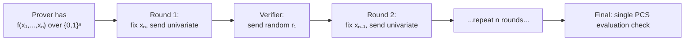

# The Honk Proof System

:::note What you'll understand
Aztec's Honk proof system: the Sumcheck protocol over `{0,1}^n`, multilinear polynomial commitment schemes (KZG on BN254 and IPA on Grumpkin), and why Poseidon2 costs ~73 gates vs SHA256's ~25,000. Prerequisites: [ZK Circuits Overview](./index.md).
:::

## What is a ZK Proof?

A **zero-knowledge proof** lets a prover convince a verifier that a computation was done correctly without revealing the private inputs:

```
Circuit: "I know a note with value=100 owned by me, and I'm spending it"
  → Public inputs:  noteHash (commitment), nullifier
  → Private inputs: value=100, owner_address, secret_key, randomness
  → Proof:          ~2KB cryptographic blob
  → Verify:         check(proof, public_inputs) → true in O(1)
```

In Aztec, ZK proofs serve two purposes: **privacy** (private inputs stay hidden) and **validity** (sequencer cannot accept invalid state transitions).

## Honk — Aztec's Proof System

**Honk** is a multilinear proof system built by the Barretenberg team, replacing Plonk's univariate polynomial approach. The key protocol is **Sumcheck**:



**Why Sumcheck over Plonk?**
- No FFTs needed → lower memory usage → client-friendly
- Native multilinear representation → direct circuit compilation
- Recursive verification cost: ~10–20k gates per recursive step

## Polynomial Commitment Schemes

| PCS | Curve | Properties | Used For |
|-----|-------|------------|---------|
| **KZG** | BN254 | Constant-size proof, fast verify, requires SRS (trusted setup) | Epoch Root → L1 |
| **IPA** | Grumpkin | No trusted setup, O(log n) size | Internal recursive steps |

The epoch root proof uses **KZG on BN254** because Ethereum has a BN254 pairing precompile, making on-chain verification cheap (~500k gas). Internal recursion uses **IPA on Grumpkin** where the Grumpkin scalar field equals the BN254 base field — enabling native in-circuit elliptic curve operations.

## Ultra Honk vs Mega Honk

| Flavor | Used For | Key Feature |
|--------|---------|------------|
| **Ultra Rollup Honk** | Most rollup circuits | IPA accumulation across levels |
| **Ultra Keccak Honk** | Epoch Root (L1 verification) | Uses Keccak256 for transcript hashing |
| **MegaHonk** | Private kernel Chonk IVC | Supports Goblin (ECCVM + Translator) |
| **MegaZK** | Hiding kernel | Full ZK: randomized Sumcheck + ECC masking |

## Poseidon2 — The ZK-Friendly Hash

Aztec uses **Poseidon2** for all hashing in circuits: Merkle trees, nullifiers, siloing, note nonces, SpongeBlob, and key derivation.

### Why Not SHA256 or Keccak?

| Hash | Gates in Circuit | Reason |
|------|-----------------|--------|
| SHA256 | ~25,000 | Bitwise ops expensive in arithmetic circuits |
| Keccak | ~50,000 | Even worse — large XOR/rotation patterns |
| **Poseidon2** | **~73** | Native to finite fields — no bit decomposition |

SHA256 and Keccak are designed for 32-bit/64-bit hardware. ZK circuits work over finite fields (BN254 scalar field, ~254 bits). Encoding a 32-bit operation as field arithmetic requires many constraints. Poseidon2 is designed *for* field arithmetic.

### How Poseidon2 Works

A sponge construction based on an algebraic permutation over field elements:

```
State: [f₀, f₁, f₂, f₃] ∈ BN254 scalar field

External rounds (8 total):
  S-box on ALL elements: fᵢ → fᵢ⁵   (cheap in field arithmetic!)
  MDS matrix mixing

Internal rounds (56 total):
  S-box on FIRST element only  (cheaper than external)
  MDS matrix mixing

Result: permuted state
```

The S-box `x → x⁵` costs just **one constraint** in an arithmetic circuit (one multiplication). Compare this to one bit of SHA256 (which requires many constraints just to represent the XOR).

Implementation references:
- `barretenberg/cpp/src/barretenberg/crypto/poseidon2/poseidon2.hpp`
- `noir-projects/noir-protocol-circuits/crates/types/src/poseidon2.nr`

## Recursive Verification Cost

Each level of the proof tree recursively verifies the proofs below it. The cost per recursive step in Honk:

- **Sumcheck verification**: ~N rounds of polynomial evaluation checks
- **PCS verification** (Chonk defers this): a KZG or IPA pairing/inner product check
- **Total**: ~10–20k gates per recursion

With Chonk IVC, the expensive PCS check happens only **once** at the end of the entire kernel chain — not once per nested call. This is the core saving.

## Implementation Notes

- **BN254 vs Grumpkin**: BN254 is the "outer curve" for proofs. Grumpkin is the "inner curve" for in-circuit elliptic curve operations (keys, ECDH). A Grumpkin point's coordinates are BN254 base field elements — native in BN254 arithmetic circuits.
- **Trusted setup**: KZG requires a structured reference string (SRS) from a trusted setup ceremony. Aztec reuses the Ethereum KZG SRS (EIP-4844's ceremony). IPA requires no trusted setup.
- **Proof size**: A Honk proof is ~2KB. On-chain verification is dominated by the pairing check (~500k gas for one verification, regardless of proof size).

## What Comes Next

The proof system underlies everything. Next: [State Trees](./02-state-trees.md) — the data structures that circuits operate on.
