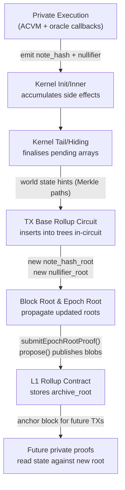
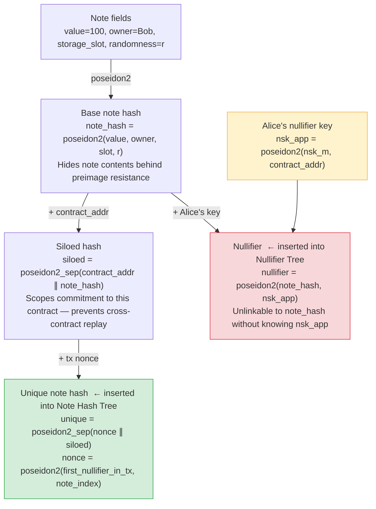
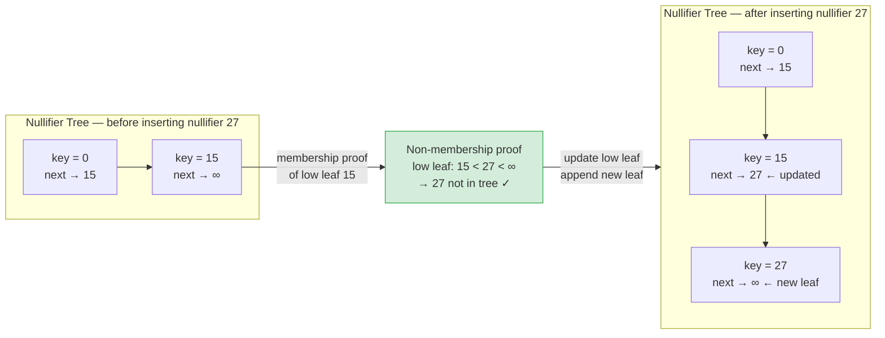
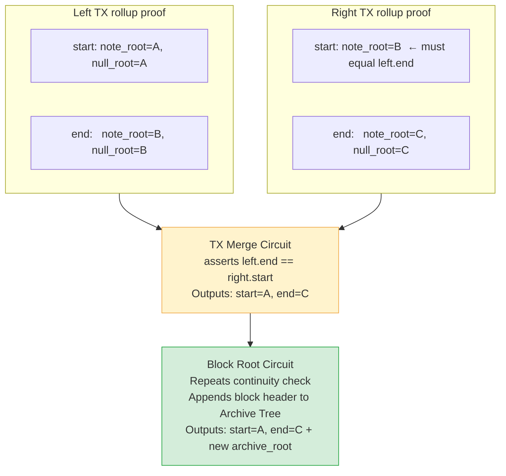

# State Transition Journey

:::note What you'll understand
The complete cryptographic lifecycle of a private state change: how a note's commitment is computed and what hides its contents, how it enters the Note Hash Tree, how the Nullifier Tree prevents double-spends without revealing which note was spent, how the private kernel circuit proves all of this without exposing the note, how rollup circuits aggregate the tree transitions, and how the resulting state roots become L1 trust anchors. Prerequisites: [Transaction Lifecycle](../01-transaction-lifecycle/index.md), [Proof Generation Journey](./01-proof-generation-journey.md).
:::

## Concrete Example

Throughout this document we follow a single `transfer` call: Alice sends 100 tokens to Bob.

- Alice's **existing note** (value 100, owned by Alice) is **nullified** — spent, never usable again
- A **new note** (value 100, owned by Bob) is **created** — Bob can spend it in a future TX
- Both operations happen entirely in private: no observer can link "note destroyed" to "note created" or identify Alice or Bob from on-chain data

---

## Overview



---

## Stage 1 — Private Execution Produces Commitments

Inside the ACVM, Alice's `transfer` function calls `note.nullify()` and `note.create(owner: bob, value: 100)`. These calls emit **side effects** — the note hash and nullifier are pushed onto the private context's arrays but are not yet in any tree.

### Note commitment derivation

The new note Bob receives is a struct of field elements, e.g.:
```noir
struct TokenNote {
    value: Field,      // 100
    owner: AztecAddress,
    randomness: Field, // private randomness for privacy
}
```

The commitment is computed in three steps:

**Step 1 — Base note hash** (inside the note's `NoteHash` implementation):
```noir
// aztec-nr/aztec/src/note/
fn compute_note_hash(owner: AztecAddress, storage_slot: Field, randomness: Field) -> Field {
    poseidon2_hash([value, owner.to_field(), randomness, storage_slot])
}
```
`randomness` is sampled from the ACVM's `unsafe { random() }` oracle — a fresh random field element that binds the commitment to an unpredictable value, preventing brute-force attacks.

**Step 2 — Siloing** (bind to contract address):
```noir
// noir-projects/noir-protocol-circuits/crates/types/src/hash.nr
fn compute_siloed_note_hash(contract_address: AztecAddress, note_hash: Field) -> Field {
    poseidon2_hash_with_separator(
        [contract_address.to_field(), note_hash],
        SEPARATOR_SILOED_NOTE_HASH,
    )
}
```
Without siloing, a note commitment produced in contract A could be "re-used" in contract B (which has the same storage layout). Siloing makes each commitment unique to its originating contract.

**Step 3 — Uniqueness** (bind to transaction position):
```noir
fn compute_unique_note_hash(note_nonce: Field, siloed_note_hash: Field) -> Field {
    poseidon2_hash_with_separator(
        [note_nonce, siloed_note_hash],
        SEPARATOR_UNIQUE_NOTE_HASH,
    )
}
// note_nonce = poseidon2(first_nullifier_in_tx, note_index_in_tx)
```
The **note nonce** is derived from the first nullifier in the transaction. Without uniqueness, a sequencer could duplicate a TX (replay it in a later block), creating identical note commitments. The uniqueness step binds the commitment to a specific transaction, making duplicates impossible.

The full three-step chain for Bob's new note, and the parallel nullifier derivation for Alice's spent note:



### Nullifier derivation

Alice's existing note is nullified by computing:
```
nullifier = poseidon2(note_hash, nsk_app, is_transient: 0)
```
where `nsk_app = poseidon2(nsk_m, contract_address)` is Alice's app-scoped nullifier key (derived from her master nullifier secret `nsk_m`). The nullifier:
- Is a deterministic function of the note — the same note always produces the same nullifier
- Is **unlinkable** to the note hash without knowledge of `nsk_app`
- Is **unlinkable** to Alice's identity without knowledge of `nsk_m`

### Why Poseidon2 rather than SHA-256

**Poseidon2 hash** — a ZK-friendly hash function (approx. 73 gates per hash in-circuit vs. 25,000 for SHA-256). Poseidon2 is used throughout because its low gate count makes Merkle tree membership proofs affordable inside circuits.

### What observers can and cannot see

| Object | What observers can see | What observers cannot see |
|--------|----------------------|--------------------------|
| `note_hash` (in pending array) | A field element | Note value, owner, randomness |
| `nullifier` (in pending array) | A field element | Which note was spent, who spent it |

### Source files: commitment derivation

```
yarn-project/simulator/src/private/               ← ACVM execution
noir-projects/aztec-nr/aztec/src/note/lifecycle.nr ← create_note(), nullify_note()
noir-projects/noir-protocol-circuits/.../hash.nr   ← compute_siloed_note_hash(), compute_unique_note_hash()
```

### Attacks these steps prevent

- **No base hash**: Notes could be forged — the note value could be changed after the fact
- **No siloing**: Cross-contract note replay — an attacker could spend a note from contract A in contract B
- **No uniqueness/nonce**: TX replay attacks — a sequencer could replay a TX in a later block, cloning notes
- **No `randomness`**: Brute-force note discovery — observers could enumerate all possible (value, owner) pairs to identify note owners

---

## Stage 2 — Kernel Accumulation of Pending Side Effects

As the kernel chain processes private calls (Init → Inner × N → Reset), each kernel circuit accumulates the note hashes and nullifiers emitted by each private function. These are collected into **pending arrays**:

- `pending_note_hashes`: new note commitments that will be inserted into the Note Hash Tree
- `pending_nullifiers`: nullifiers to be inserted into the Nullifier Tree

During Reset kernels, some pending values are resolved — e.g., a note created and spent in the same transaction gets its hash removed from `pending_note_hashes` (it's transient). This optimization prevents filling the tree with notes that will immediately be nullified.

### Accumulated kernel arrays

| | |
|--|--|
| **Input** | Previous kernel's accumulated arrays + current private call's new note hashes/nullifiers |
| **Output** | Merged arrays with consistency checks enforced |

### Key consistency checks in-circuit

1. **Counter ordering**: Each side effect has a `counter` field. The kernel enforces monotonic counters, preventing out-of-order side effects.

2. **Scoping**: Each side effect is scoped to a `contract_address`. The kernel verifies the emitting contract matches the one currently executing.

3. **Max array sizes**: The kernel enforces hard limits (e.g., MAX_NOTE_HASHES_PER_TX = 64). Exceeding limits causes proof failure.

4. **Transient note matching**: During Reset, for each nullifier that matches a pending note hash in the same TX, the note hash is removed (and the nullifier is kept but marked `is_transient = true`, so it won't be inserted into the nullifier tree on-chain).

### Source files: kernel accumulation

```
noir-projects/noir-protocol-circuits/crates/private-kernel-lib/src/
  private_kernel_inner.nr             ← accumulates side effects per call
  reset/transient_data_reset_hint.nr  ← matches nullifiers to pending note hashes
  common/verify_sorted_arrays.nr      ← counter ordering checks
```

### Why the kernel validates these invariants

Without the kernel's accumulation checks, a malicious app circuit could:
- Emit nullifiers for notes it doesn't own (by guessing the `note_hash` input to `poseidon2`)
- Emit the same nullifier twice within a TX
- Emit side effects out of counter order to confuse the rollup's sequencing

---

## Stage 3 — Settled Read Validation (Reading Existing State)

Before Alice can nullify her note, the private kernel must prove the note **exists** in the Note Hash Tree. This is a **Merkle membership proof**: given the current tree root, a leaf value (the unique note hash), and a sibling path, the circuit verifies the leaf is in the tree.

:::note Pending vs. Settled
"Pending" notes: created in the current TX, not yet in the tree. The kernel tracks them in `pending_note_hashes` and validates by array lookup.

"Settled" notes: from previous TXs, already in the Note Hash Tree. The kernel validates via Merkle membership proof against the anchor block's note hash root.
:::

### Merkle membership proof (in-circuit)

```noir
// Simplified circuit logic in private-kernel-lib
fn validate_settled_note_read(
    note_hash: Field,        // The unique_note_hash of Alice's existing note
    leaf_index: u64,         // Position in the tree
    sibling_path: [Field; NOTE_HASH_TREE_HEIGHT], // Provided as witness hint
    tree_root: Field,        // From anchor block header (committed in archive tree)
) {
    // Recompute root from leaf and sibling path
    let computed_root = merkle_root_from_leaf(note_hash, leaf_index, sibling_path);
    assert(computed_root == tree_root, "Note not in tree");
}

fn merkle_root_from_leaf(leaf: Field, index: u64, path: [Field; H]) -> Field {
    let mut current = leaf;
    for i in 0..H {
        let (left, right) = if (index >> i) & 1 == 0 {
            (current, path[i])  // current is left child
        } else {
            (path[i], current)  // current is right child
        };
        current = poseidon2_hash([left, right]);
    }
    current  // computed root
}
```

The sibling path is provided by the PXE oracle (`getNoteHashMembershipWitness`) and verified in-circuit. A lying PXE that provides a wrong sibling path will produce a proof that fails on this assertion.

### What the membership proof reveals

The circuit proves membership using only the **note_hash** (a commitment). The note's actual value, owner, and randomness are never revealed to the verifier — only the hash is checked against the public tree root.

### Source files: note read validation

```
noir-projects/noir-protocol-circuits/crates/private-kernel-lib/src/reset/
  read_request/read_request_validator.nr     ← validate_settled_read_requests()
  read_request/settled_read_hint.nr          ← SettledReadHint with sibling path

yarn-project/simulator/src/private/oracles/
  note_hash_membership.ts                   ← PXE oracle: provides sibling paths
```

### Consequences of skipping read validation

Without Merkle membership validation, anyone could claim to own any note by simply providing a nullifier. Alice could nullify Bob's tokens, or nullify notes that don't exist. The membership proof ensures only notes that were previously committed to the tree can be spent.

---

## Stage 4 — Nullifier Non-Membership Proof (Preventing Double-Spend)

After the kernel collects Alice's nullifier, the TX Base Rollup circuit checks that it does **not** already exist in the Nullifier Tree. This is an **indexed Merkle non-membership proof** — more complex than a membership proof because it must prove absence.

### The Indexed Merkle Tree (low-leaf mechanism)

The Nullifier Tree is an **indexed Merkle tree** (depth 42). Unlike a standard Merkle tree, its leaves are kept in sorted order by nullifier value, and each leaf stores a pointer to the next leaf:

```
Leaf preimage: { key: nullifier_value, nextKey: next_nullifier_in_sorted_order, nextIndex: u64 }
```

**Non-membership proof algorithm:**

To prove nullifier $N$ is NOT in the tree, provide the **low leaf** $L$ — the leaf with the largest key less than $N$:

```
L.key < N < L.nextKey    (N is "between" two adjacent leaves)
```

Prove $L$ is in the tree (membership proof), then assert $L.\text{nextKey} > N$ (no element between $L$ and $L.\text{next}$ exists). If $N$ were already in the tree, $L.\text{nextKey}$ would equal $N$, failing the assertion.

```noir
// Simplified circuit logic in rollup circuits
fn prove_nullifier_non_membership(
    nullifier: Field,
    low_leaf: NullifierLeafPreimage,   // { key, nextKey, nextIndex }
    low_leaf_index: u64,
    low_leaf_sibling_path: [Field; NULLIFIER_TREE_HEIGHT],
    tree_root: Field,
) {
    // 1. Prove low_leaf exists in tree
    let computed_root = merkle_root_from_leaf(
        hash_preimage(low_leaf), low_leaf_index, low_leaf_sibling_path);
    assert(computed_root == tree_root);

    // 2. Prove nullifier is "between" low_leaf and its successor
    assert(low_leaf.key < nullifier);
    assert(nullifier < low_leaf.next_key); // non-membership!
}
```

The sorted-list structure makes this visual:



### Inserting the nullifier (updating the low leaf)

Once non-membership is proven, the circuit **inserts** the nullifier by:
1. Updating the low leaf: `L.nextKey = N`, `L.nextIndex = new_leaf_index`
2. Appending the new leaf $N$ at the next available position
3. Recomputing the tree root after both updates

This is handled by the TypeScript world-state layer when building witness hints:

```typescript
// yarn-project/world-state/src/native/native_world_state_instance.ts
// yarn-project/merkle-tree/src/standard_indexed_tree/standard_indexed_tree.ts

public async batchInsert<N>(nullifiers: Buffer[], subtreeHeight: N) {
    // Sort descending for efficient low-leaf lookup
    // For each nullifier: find low leaf, update pointers, insert new leaf
    // Return: insertion witnesses (low leaf proofs + updated paths)
}
```

### Nullifier unlinkability

The nullifier reveals nothing about the note:
- `nullifier = poseidon2(note_hash, nsk_app)` — without `nsk_app`, the note_hash cannot be recovered
- Without `note_hash`, the note's value and owner are hidden
- An observer can see *that* a nullifier was inserted (a note was spent) but not *which* note or *who* spent it

### Source files: nullifier tree operations

```
noir-projects/noir-protocol-circuits/crates/rollup-lib/
  components/nullifier_tree_builder.nr    ← in-circuit nullifier insertion

yarn-project/merkle-tree/src/standard_indexed_tree/
  standard_indexed_tree.ts               ← batchInsert(), findLowLeaf()

yarn-project/world-state/src/
  native/native_world_state_instance.ts  ← provides insertion witnesses to circuits
```

### Double-spend attack vector

Without nullifier non-membership proof, Alice could call `transfer` twice with the same note. Both TXs would emit the same nullifier. The second TX would try to insert a nullifier that already exists — if this check is skipped in the circuit, the double-spend succeeds and Alice creates value from nothing.

The indexed Merkle non-membership proof makes double-spending equivalent to finding two different witnesses for the same tree state — computationally infeasible.

---

## Stage 5 — TX Base Rollup: In-Circuit Tree Root Computation

The **TX Base Rollup circuit** receives the batch of note hashes and nullifiers from a single transaction, along with Merkle tree witness hints, and **re-derives the new tree roots in-circuit**. This is the stage where the world state actually transitions.

### Inputs / Outputs

| | |
|--|--|
| **Input** | Kernel tail proof; `start_note_hash_tree_snapshot` (root + size); `start_nullifier_tree_snapshot`; batch of `[unique_note_hashes]`; batch of `[nullifiers]`; Merkle insertion witnesses |
| **Output** | `end_note_hash_tree_snapshot` (new root); `end_nullifier_tree_snapshot` (new root); combined public inputs for rollup merge |

### Note hash tree insertion (append-only)

The Note Hash Tree is a **standard (non-indexed) append-only Merkle tree** (depth 42, ~4 trillion slots). Leaves are appended at the next available index:

```noir
// Conceptual circuit logic in rollup-lib/components/note_hash_tree_builder.nr
fn insert_note_hashes(
    start_root: Field,
    start_size: u64,
    note_hashes: [Field; MAX_NOTE_HASHES_PER_TX],
    insertion_subtree_sibling_path: [Field; SUBTREE_SIBLING_PATH_HEIGHT],
) -> Field {
    // batch insert: compute subtree from the new note hashes
    let subtree_root = compute_subtree(note_hashes);
    // insert subtree into tree at position start_size
    let end_root = update_subtree_path(subtree_root, start_size, insertion_subtree_sibling_path);
    end_root
}
```

The **batch insert optimization** inserts an entire subtree of new notes at once rather than leaf-by-leaf, requiring only one sibling path of height `TREE_HEIGHT - SUBTREE_HEIGHT` instead of N separate paths.

### Rollup state continuity invariant

The fundamental correctness guarantee of the rollup hierarchy is:

```
for every pair (left_proof, right_proof) at any rollup level:
    left_proof.end_roots == right_proof.start_roots
```

This invariant, enforced by every TX Merge and Block Root circuit, ensures no state is silently dropped or duplicated between transactions or blocks.



### Source files: rollup tree insertions

```noir
// noir-projects/noir-protocol-circuits/crates/rollup-lib/src/
//   block_root/block_root_rollup.nr         ← top-level block circuit
//   base/private_tx_base_rollup.nr          ← per-TX state transitions
//   components/note_hash_tree_builder.nr    ← note hash tree insertions
//   components/nullifier_tree_builder.nr    ← nullifier tree insertions

// yarn-project/world-state/src/
//   world_state_synchronizer.ts             ← feeds witness hints to circuits
```

### What the rollup circuit exposes

The rollup circuit:
- Inserts **unique_note_hashes** into the tree (committed values, not plaintext note contents)
- Inserts **nullifiers** into the nullifier tree (unlinkable to notes without `nsk_app`)
- Verifies the kernel tail proof (which proved the notes/nullifiers were legitimately produced)

An observer watching the rollup circuit's public inputs sees: "some new leaves were appended to the note hash tree, some new leaves were appended to the nullifier tree." They cannot determine who created or destroyed which note.

### Sequencer forgery without in-circuit roots

If the TX Base Rollup skips re-deriving tree roots in-circuit:
- The sequencer could provide false "new roots" without inserting the actual note hashes
- Future TXs that try to spend those notes would fail Merkle membership proofs (notes are "gone")
- Or inversely, the sequencer could claim old roots and effectively "undo" state transitions

The in-circuit root computation is the mechanism that makes the sequencer's claimed state transitions **verifiably correct**.

---

## Stage 6 — Block Root and Epoch Root: Aggregating State Transitions

Multiple TX rollup proofs are merged bottom-up. The **Block Root** circuit combines all TX rollups for a single L2 block and adds the block header to the Archive Tree. The **Epoch Root** circuit combines all block roots for an epoch into a single proof.

### Archive Tree update

The Archive Tree (depth 30, ~1 billion slots) stores a rolling history of block header hashes. Each block header includes the block's `note_hash_root`, `nullifier_root`, `public_data_root`, `l1_to_l2_message_root`, and metadata.

```noir
// block_root_rollup.nr: Archive Tree insertion
fn update_archive(
    prev_archive_root: Field,
    new_block_header: BlockHeader,
    sibling_path: [Field; ARCHIVE_HEIGHT],
) -> Field {
    let block_hash = poseidon2_hash(new_block_header.to_fields());
    insert_leaf(prev_archive_root, block_hash, block_index, sibling_path)
}
```

The Archive Tree is the **trust anchor** for future transactions: when Alice's PXE selects an anchor block for a new TX, it provides a Merkle proof against the Archive Tree root committed on L1. This proves the anchor block header (and its state roots) are canonical.

### Epoch root public inputs

The final Root Rollup outputs — verified on L1 — include:
```
{
  start_archive_root: Field,     // Archive root at epoch start (matches previous L1 state)
  end_archive_root: Field,       // New archive root after this epoch's blocks

  start_note_hash_tree_root: Field,
  end_note_hash_tree_root: Field,

  start_nullifier_tree_root: Field,
  end_nullifier_tree_root: Field,

  start_public_data_tree_root: Field,
  end_public_data_tree_root: Field,

  blob_public_inputs: BlobPublicInputs,  // Links to EIP-4844 blobs on L1
}
```

### Blob linkage (DA binding)

`blob_public_inputs` contains the **KZG commitment** and **evaluation point/value** `(z, y)` for the EIP-4844 blob published during `propose()`. The epoch root proof includes a circuit that verifies:

$$\text{SHA256}(\text{note ciphertexts}) = \text{expected blob hash}$$

This links the proof to the specific DA data — preventing the sequencer from publishing a valid proof that covers different data than what was actually published.

### Source files: rollup aggregation circuits

```noir
// noir-projects/noir-protocol-circuits/crates/rollup-lib/src/
//   block_root/block_root_rollup.nr     ← archive tree update
//   root_rollup/root_rollup.nr          ← epoch root (final L1-verifiable proof)
//   sponge_blob/sponge_blob.nr          ← DA blob binding via Poseidon2 sponge

// l1-contracts/src/core/libraries/rollup/
//   ProposeLib.sol                      ← validates blob KZG proof on L1
//   EpochProofLib.sol                   ← calls HonkVerifier.verify()
```

### Without archive updates and DA binding

If the Archive Tree update is skipped, the new block header is never included in the canonical chain. Future TXs that try to use this block's state roots as an anchor block would fail to prove their anchor is valid — the Merkle proof against the archive would fail.

If the DA blob linkage is skipped, the sequencer could publish a proof for one set of note ciphertexts while actually publishing different (or no) ciphertexts. Users would be unable to find their incoming notes, effectively making the network unusable without breaking any cryptography.

---

## Stage 7 — L1 State Root Commitment and Trust Anchor

`submitEpochRootProof()` on L1 verifies the epoch root proof via `HonkVerifier.verify()`, then:
1. Verifies `start_archive_root` matches the currently stored L1 archive root
2. Stores `end_archive_root` as the new canonical archive root
3. Validates the blob `(z, y)` point evaluation against the EIP-4844 blob commitment
4. Emits `L2BlockFinalized` events for each block in the epoch

### The new state roots become a trust anchor

Once `end_archive_root` is stored on L1, future private transactions can use any block from this epoch as their **anchor block**:

```
Future TX proof generation:
  PXE selects anchor block B at height h
  PXE provides:
    - block_header[h] (note_hash_root, nullifier_root, ...)
    - Merkle proof: block_header[h] is in archive_root (stored on L1)

  Private kernel circuit verifies:
    - The archive root in the proof == the L1-committed archive root
    - The block header Merkle membership is valid
    - All note reads/nullifier checks use this block's tree roots
```

This creates a **chain of trust**: the L1 archive root is the root of a chain of verified block headers, each of which commits to verified state tree roots, each of which was updated by verified rollup circuits, each of which verified valid kernel proofs, each of which verified valid app circuit proofs.

### What L1 reveals to public observers

On-chain, the L1 Rollup contract stores only:
- `archive_root` (a 32-byte hash) — reveals nothing about who transacted or what was spent
- `blob_hash` (EIP-4844 commitment) — the blob itself contains encrypted note ciphertexts, readable only by intended recipients

The full note ciphertexts in the blob are encrypted using ECDH (see [Note Encryption](../03-keys-accounts-privacy/02-note-encryption.md)). Only Bob (the recipient) can decrypt his new note. Alice's spent note is only identifiable as "some nullifier in the nullifier tree" — unlinkable to her identity.

### L1 Solidity implementation

```solidity
// l1-contracts/src/core/libraries/rollup/EpochProofLib.sol
function submitEpochRootProof(
    RollupData storage self,
    EpochProofQuote calldata args,
    bytes calldata proof,
) {
    // 1. Verify Honk proof
    require(IVerifier(self.verifier).verify(proof, args.publicInputs));

    // 2. Check start roots match stored state
    require(args.startArchiveRoot == self.archive);

    // 3. Verify blob commitment (EIP-4844 point evaluation precompile)
    verifySpongeBlob(args.blobPublicInputs, args.blobProof);

    // 4. Update L1 state
    self.archive = args.endArchiveRoot;
    emit L2BlockFinalized(args.epochNumber);
}
```

### Without L1 trust anchoring

If L1 state root commitment is skipped (i.e., all proving happens off-chain without L1 anchoring):
- No canonical reference point — anyone could claim any state
- Future TXs have no verifiable anchor — the Merkle proof against the archive would reference an unverifiable root
- The security model collapses: fraud proofs are meaningless without a finalized reference state

The L1 Rollup contract acts as an **independent verifier** that cannot be coerced or censored (short of Ethereum compromise), making the stored `archive_root` the universally trusted foundation for all Aztec state.

---

## End-to-End Privacy Analysis

Following the complete journey, here is what each party can observe:

| Observer | Can see | Cannot see |
|----------|---------|-----------|
| **Ethereum full node** | Blob hash (KZG commitment), archive_root, nullifier count | Note values, note owners, who spent what |
| **Anyone reading the blob** | Encrypted note ciphertexts (fixed-length ciphertext per note) | Note contents (encrypted with Bob's key), who it's for (tags are unlinkable without tagging keys) |
| **Aztec network node** | P2P gossiped TX, kernel proof bytes, note hashes/nullifiers in pending state | Private function arguments, actual note contents |
| **Sequencer** | Same as network node + transaction ordering | Same as above — sequencer cannot decrypt notes |
| **Alice (sender)** | Her own transactions | Bob's notes (she can see her own sending tags but not Bob's receiving key) |
| **Bob (recipient)** | Discovers his new note by scanning blobs with his tagging key | Alice's identity (tag tells him "a note was sent" but tagging keys don't reveal senders unless Bob knows Alice's tagging key) |

The privacy holds at each stage because:
1. **Commitments** hide values under Poseidon2 (preimage resistance)
2. **Nullifiers** hide spending keys under Poseidon2 (preimage resistance)
3. **Merkle roots** hide individual leaves (logarithmic information leakage per access)
4. **Encryption** hides note contents (ECDH + AES-128-CBC)
5. **ZK proofs** prove all the above are consistent without revealing any of the inputs

## "What Breaks" Summary

| Stage | Cryptographic scheme | What breaks if skipped |
|-------|---------------------|----------------------|
| Note commitment | Poseidon2 hash | Notes forgeable; note contents guessable |
| Siloing | Poseidon2 with contract address | Cross-contract note replay |
| Uniqueness | Poseidon2 with first_nullifier nonce | TX replay; Faerie Gold attacks |
| Nullifier derivation | Poseidon2 with nullifier key | Double-spend possible |
| Merkle membership (notes) | Merkle proof + Poseidon2 | Spending non-existent notes |
| Non-membership (nullifiers) | Indexed Merkle low-leaf | Double-spend |
| In-circuit root recomputation | Rollup circuit constraints | Sequencer can forge state transitions |
| Archive tree update | Merkle proof + Poseidon2 | No canonical history; anchor blocks unverifiable |
| L1 state root commitment | BN254 pairing (Honk) | Trust anchor depends on off-chain party |
| DA blob linkage | EIP-4844 point evaluation | Sequencer can hide data from recipients |

## What Comes Next

- [Private Kernel Circuits](./03-private-kernel-circuits.md) — the full kernel chain that accumulates and validates side effects
- [State Trees Reference](./02-state-trees.md) — detailed structure of all five Merkle trees (depths, leaf types, indexed vs. append-only)
- [Note Encryption](../03-keys-accounts-privacy/02-note-encryption.md) — how Bob's PXE discovers the new note from the blob data
- [Anchor Block Concept](../01-transaction-lifecycle/09-anchor-block-concept.md) — how the L1-committed archive root becomes a trust anchor for future TXs
