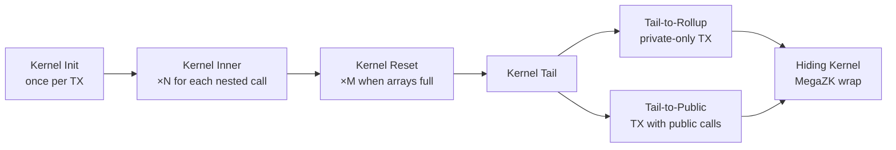

# Private Kernel Circuits

:::note What you'll understand
The five-circuit private kernel chain (Init → Inner × N → Reset × M → Tail → Hiding), how the VK tree prevents circuit impersonation, how the Databus enables efficient data passing between chained proofs, how Reset variants handle accumulated side effects, and how Chonk IVC makes the whole chain client-feasible. Prerequisites: [Proof System](./01-proof-system.md), [State Trees](./02-state-trees.md).
:::

## Why Kernel Circuits?

A transaction may call multiple private functions (e.g., `transfer` calls `_decrease_balance` then `_increase_balance`). The **kernel circuit chain** does three things:

1. **Proves each function executed correctly** — verifies the app circuit proof
2. **Accumulates side effects** — note hashes, nullifiers, logs from all calls
3. **Hides the execution graph** — the final proof reveals nothing about which functions ran

## The Kernel Chain



| Circuit | Runs | Purpose |
|---------|------|---------|
| **Init** | Once | First function + TX request validation |
| **Inner** | 0–N | Each additional private function call |
| **Reset** | 0–M | Squash transient data, silo, validate reads |
| **Tail** | Once | Finalize, split private/public paths |
| **Hiding** | Once | MegaZK wrap — hides everything |

## PrivateKernelCircuitPublicInputs — The Running State

Each kernel outputs this accumulated struct:

```rust
// noir-projects/noir-protocol-circuits/crates/types/src/abis/
//   kernel_circuit_public_inputs/private_kernel_circuit_public_inputs.nr
struct PrivateKernelCircuitPublicInputs {
    constants: PrivateTxConstantData,       // TX hash, anchor block, vk_tree_root
    min_revertible_side_effect_counter: u32, // Boundary: non-revertible | revertible
    validation_requests: PrivateValidationRequests,
    end: PrivateAccumulatedData,            // The growing side effects
    fee_payer: AztecAddress,
    is_private_only: bool,
}
```

`PrivateAccumulatedData` grows with each inner kernel:

| Array | Max | Contents |
|-------|-----|---------|
| `note_hashes` | 64 | New note commitments |
| `nullifiers` | 64 | Spent notes + TX identifier |
| `l2_to_l1_msgs` | 16 | Cross-chain messages |
| `private_logs` | 64 | Encrypted log data |
| `public_call_requests` | 16 | Enqueued public function calls |

## VK Tree — Circuit Identity Verification

How does a kernel circuit know it's verifying the *correct* predecessor and not an impersonator?

The **VK Tree** is a Merkle tree (height 7, 128 leaves) of verification key hashes. Each protocol circuit has a fixed index:

| Index | Circuit |
|-------|---------|
| 0 | `PRIVATE_KERNEL_INIT` |
| 1 | `PRIVATE_KERNEL_INNER` |
| 2 | `PRIVATE_KERNEL_RESET` |
| 5 | `PRIVATE_KERNEL_TAIL` |
| 12 | `TX_BASE_PRIVATE` |
| 22 | `ROOT_ROLLUP` |

Validation in every recursive circuit:
1. `assert predecessor.vk_tree_root == my_vk_tree_root` (same circuit set)
2. `assert vk_data.leaf_index == expected_index` (correct circuit type)
3. Compute Merkle root from `vk_data.vk.hash` + sibling path
4. `assert computed_root == vk_tree_root`

This prevents a malicious actor from substituting a weakened circuit at a known position.

Reference: `yarn-project/noir-protocol-circuits-types/src/artifacts/vks/server.ts`

## Kernel Init — Bootstrapping

```rust
// noir-projects/noir-protocol-circuits/crates/private-kernel-init/src/main.nr
fn main(
    tx_request: TxRequest,
    vk_tree_root: Field,
    protocol_contracts: ProtocolContracts,
    private_call: PrivateCallDataWithoutPublicInputs,
    is_private_only: bool,
    first_nullifier_hint: Field,      // TX unique identifier
    revertible_counter_hint: u32,     // Non-revertible | revertible boundary
    app_public_inputs: call_data(1) PrivateCircuitPublicInputs,
) -> return_data PrivateKernelCircuitPublicInputs
```

Init:
1. Verifies the first app circuit proof is valid
2. Checks the call matches the `TxRequest` (correct contract + function)
3. Creates the **first nullifier** — a unique TX identifier that prevents replay attacks
4. Initializes empty accumulated data arrays

**Why `first_nullifier_hint`?** The Reset circuit uses it to compute note hash nonces (`nonce = hash(first_nullifier, note_index)` → unique hash). Without this, Faerie-Gold attacks are possible: a malicious contract could replicate existing note hashes by knowing the nonce derivation formula. The first nullifier is unique per TX, making all nonces unique.

## Kernel Inner — Chaining with Databus

```rust
// noir-protocols/noir-protocol-circuits/crates/private-kernel-inner/src/main.nr
fn main(
    previous_kernel: PrivateKernelDataWithoutPublicInputs,
    previous_kernel_public_inputs: call_data(0) PrivateKernelCircuitPublicInputs,
    private_call: PrivateCallDataWithoutPublicInputs,
    app_public_inputs: call_data(1) PrivateCircuitPublicInputs,
) -> return_data PrivateKernelCircuitPublicInputs
```

**The Databus** (`call_data`/`return_data`) enables efficient data passing between chained proofs:

```
Previous Kernel                   This Kernel
┌──────────────────┐             ┌─────────────────────┐
│ return_data      ├─commitment─▶│ call_data(0)        │
└──────────────────┘  match      └─────────────────────┘

App Circuit                       This Kernel
┌──────────────────┐             ┌─────────────────────┐
│ return_data      ├─commitment─▶│ call_data(1)        │
└──────────────────┘  match      └─────────────────────┘
```

Barretenberg checks that the previous proof's `return_data` commitment matches this circuit's `call_data(0)` commitment. Data flows through commitments instead of being re-proven as public inputs — significantly cheaper.

## Kernel Reset — The Optimization Circuit

Reset is called when accumulated arrays are getting full. It processes and clears them:

**Operations performed by Reset:**
- **Transient data squashing**: If the same TX creates and nullifies a note (e.g., in a DEX swap that reads then destroys a note), both cancel: `noteHashes=[A,B] nullifiers=[A]` → `noteHashes=[B] nullifiers=[]`
- **Siloing**: Scopes note hashes and nullifiers to their contract: `siloedHash = poseidon2(contractAddr, noteHash)`
- **Read request processing**: Proves that notes the function read exist in the state trees (Merkle membership proofs from oracle)
- **Key validation** (`KEY_VALIDATION` dimension): Verifies `nsk_app = poseidon2(nhk_m, contractAddr)` — app-siloed keys are correctly derived

**Reset variants** — 9 configurable dimensions × different sizes = many compiled variants:

| Dimension | Operation | Gate Cost |
|-----------|-----------|----------|
| `NOTE_HASH_PENDING_READ` | Validate reads of in-TX notes | 100 |
| `NOTE_HASH_SETTLED_READ` | Validate reads of on-chain notes (Merkle proof) | 3000 |
| `NULLIFIER_SETTLED_READ` | Validate reads of nullifiers | 3000 |
| `KEY_VALIDATION` | Verify key derivation chain | 2500 |
| `NOTE_HASH_SILOING` | Silo note hashes to contract | 250 |
| `TRANSIENT_DATA_SQUASHING` | Cancel create+nullify pairs | 100 |

The PXE selects the **smallest variant** that fits the TX's needs — smaller circuits prove faster.

## Kernel Tail — Two Paths

**Tail (private-only)**: `private-kernel-tail/src/main.nr`
- Verifies no public call requests remain
- Rounds `expirationTimestamp` to the nearest expiry window (privacy: precise timestamps reveal information)
- Output: `PrivateToRollupKernelCircuitPublicInputs` → TX Base rollup

**Tail-to-Public**: `private-kernel-tail-to-public/src/main.nr`
- Splits data: non-revertible effects vs revertible effects
- Sorts public call requests by counter (execution order)
- Output: `PrivateToPublicKernelCircuitPublicInputs` → feeds AVM execution

## Hiding Kernel — Preventing Information Leakage

The raw Tail proof reveals which verification key was used → leaks circuit structure → leaks TX complexity. The **Hiding Kernel** prevents this via three mechanisms:

**1. Terminates Chonk IVC**: Collapses the entire folding chain into a single provable statement (verifies HyperNova accumulator + decider).

**2. Masks ECC Op Queue**: Pads the ECC operation queue with random values, hiding which curve operations occurred (which would reveal circuit topology).

**3. MegaZK Proving**: Uses `MegaZKFlavor` with:
- ZK Sumcheck (randomized polynomial evaluations)
- Masking polynomials
- Fixed virtual circuit size (`HIDING_KERNEL_LOG_N`) — all TXs produce identically-sized proofs

Two variants: `hiding-kernel-to-rollup` (private-only) and `hiding-kernel-to-public` (has public calls).

## Implementation Notes

- **Kernel Reset is called multiple times**: If a TX has 10 nested calls each creating 10 notes (100 total), the array fills multiple times. PXE calls Reset whenever arrays approach their per-call accumulator limits.
- **`revertible_counter_hint`**: If the TX reverts during public execution, only effects with counter ≥ this value are discarded. Effects before this counter are non-revertible (fee payment, etc.).
- **Databus vs public inputs**: Pre-Databus, chained proofs had to serialize all outputs as public inputs to the next proof. The Databus replaces serialization with commitment matching — much cheaper for large structs.

## What Comes Next

The Hiding Kernel produces the `ChonkProof` that enters the rollup — [Rollup Circuits](./04-rollup-circuits.md). For the IVC system details, see [Client IVC & Chonk](./06-client-ivc-chonk.md).
