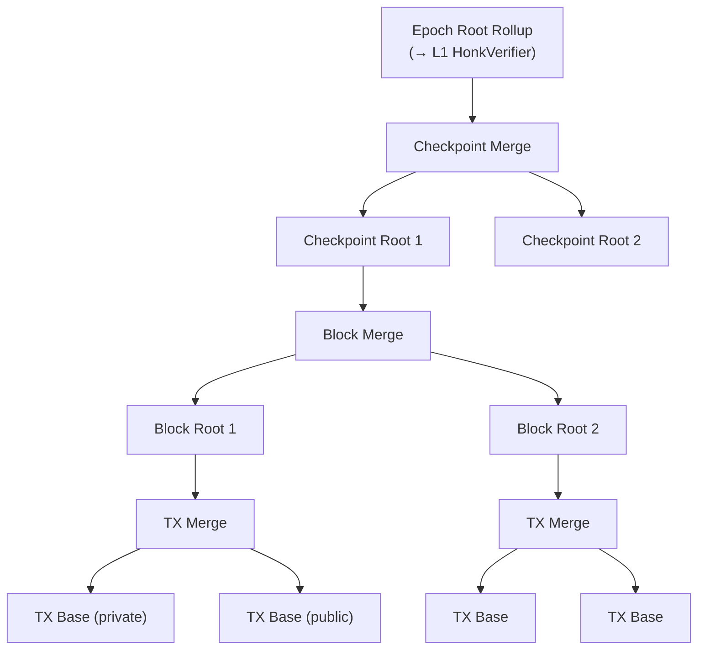
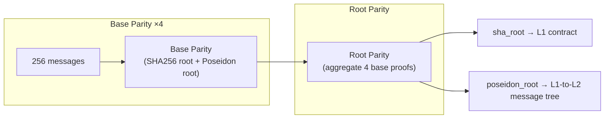

# Rollup Circuits

:::note What you'll understand
The eight rollup circuit types that aggregate transaction proofs into an epoch proof, the state continuity invariant enforced at every merge level, how the Parity circuits bridge L1/L2 hash formats, and how SpongeBlob binds ZK-proven effects to EIP-4844 blob data. Prerequisites: [Private Kernel Circuits](./03-private-kernel-circuits.md).
:::

## The Proof Tree

All TX proofs are aggregated bottom-up into a binary tree:



Each level verifies the proofs from the level below recursively. The final Epoch Root proof is the **only proof verified on Ethereum L1**.

## State Continuity — The Core Invariant

At every merge circuit:

```
left.end_tree_snapshots  == right.start_tree_snapshots   // unbroken state chain
left.constants           == right.constants               // same block/epoch context
verify(left.proof) && verify(right.proof)                 // recursive verification
```

This enforces that every TX in an epoch is a valid state transition chained to the previous one. A single invalid TX causes the entire block's proof to fail.

## TX Base Rollup — Two Variants

### Private TX Base (`rollup-tx-base-private/src/main.nr`)

For transactions with **no public calls**:

1. Verify `hiding-kernel-to-rollup` proof (ChonkProof)
2. Validate anchor block in Archive tree (Merkle membership)
3. **Insert note hashes** into Note Hash Tree (3 Merkle operations per nullifier: low-leaf update × 2 + append)
4. **Insert nullifiers** into Nullifier Tree (non-membership proof + insertion)
5. **Deduct fee** from fee payer's Public Data slot
6. Absorb TX effects into SpongeBlob

### Public TX Base (`rollup-tx-base-public/src/main.nr`)

For transactions with **public function calls**:

1. Verify ChonkProof AND AVM proof (two recursive verifications)
2. Validate consistency between AVM output and private kernel output
3. Handle **reversion**: if `revertCode == APP_LOGIC_REVERTED`, discard revertible note hashes/nullifiers
4. State changes already performed by AVM simulation
5. Absorb TX effects into SpongeBlob

**Key insight**: The AVM already executed during block building. The TX Base circuit's role is to prove that execution was correct, not to re-execute.

## TX Merge — Combining Proofs

Merges two TX rollup proofs into one:

```ts
// Combined outputs:
{
  start: left.start,            // State before first TX
  end: right.end,               // State after last TX
  out_hash: hash(left.out_hash, right.out_hash),  // L2→L1 messages
  accumulated_fees: left.fees + right.fees,
  accumulated_mana: left.mana + right.mana,
}
```

## Block Root Rollup — Creating a Block

After all TXs are merged, Block Root creates the block:

1. **L1-to-L2 messages** (first block in checkpoint only): Insert new messages from Ethereum, verified via Parity proof
2. **Validate TX proofs**: Verify two child TX rollup proofs
3. **Create block header**: block number, timestamp, all tree roots, `out_hash`
4. **Insert into Archive**: `poseidon2_hash(blockHeader)` → appended to Archive tree

Three variants:
- `block-root-first`: First block in checkpoint — handles L1→L2 messages via Parity proof
- `block-root`: Subsequent blocks — simpler (no new messages)
- `block-root-single-tx`: Optimization for single-TX blocks — skips TX Merge level

## Parity Circuits — Bridging Hash Formats

L1 uses SHA256 for Merkle trees. L2 uses Poseidon2 (ZK-friendly). Parity circuits compute **both roots simultaneously** from the same messages:



- **Base Parity** (`parity-base/src/main.nr`): Processes 256 messages, outputs `(sha_root, poseidon_root)` pair
- **Root Parity** (`parity-root/src/main.nr`): Aggregates 4 Base proofs for 1024 messages total

## Checkpoint Root Rollup

Combines all blocks in a checkpoint:

1. Merges block rollup proofs (via Block Merge)
2. Validates continuity with the previous checkpoint's end state
3. **Processes blob data**: Validates EIP-4844 blobs match accumulated TX effects
4. **KZG commitments**: Batches polynomial evaluations for blob verification
5. Outputs `CheckpointRollupPublicInputs`

## Epoch Root Rollup — The Final Proof

Combines all checkpoint proofs:

```rust
// noir-protocol-circuits/crates/rollup-root/src/main.nr
// Output: RootRollupPublicInputs
{
    previous_archive_root,   // Archive root BEFORE this epoch
    end_archive_root,        // Archive root AFTER this epoch
    checkpoint_fees[],       // Fees per checkpoint
    epoch_out_hash,          // All L2→L1 messages hashed
    blob_public_inputs,      // KZG blob verification data → L1
}
```

**This single proof is what gets submitted to `submitEpochRootProof()` on Ethereum.**

## SpongeBlob — Binding ZK Proofs to Blob Data

The SpongeBlob is the cryptographic link between circuit-proven effects and on-chain blobs:

```
TX effects → absorbed into Poseidon2 sponge (per TX in TX Base circuit)
Block end marker → absorbed (in Block Root circuit)
Checkpoint end marker → absorbed (in Checkpoint Root circuit)
→ Final squeeze: blobFieldsHash
→ Challenge point z derived from blobFieldsHash
→ Blob polynomial evaluated at z must match KZG commitment
```

**Why is this necessary?** Without SpongeBlob, a sequencer could prove one set of TX effects in circuits but publish different data in blobs. SpongeBlob creates a cryptographic binding: the blob data published to Ethereum must exactly match what the circuits proved.

TX effect encoding (first field):
```
| TX_START_PREFIX (64b) | num_note_hashes (16b) | num_nullifiers (16b) |
| num_l1_to_l2_msgs (16b) | num_public_data_writes (16b) | ... |
| revert_code (8b) | num_blob_fields (32b) |
```

Reference: `noir-protocol-circuits/crates/types/src/blob_data/sponge_blob.nr`

## Implementation Notes

- **Padded proof trees**: If a block has an odd number of TXs, the last TX is padded with a dummy TX proof. Similarly for odd-numbered blocks within an epoch. The dummy circuits are real circuits with known-valid inputs.
- **Block Root variants**: The `block-root-first` and `block-root` variants share most code. The difference is whether they verify a Parity proof (for L1→L2 messages). Using separate compiled circuits avoids conditional logic that would increase circuit size.
- **`out_hash` propagation**: L2→L1 messages are hashed pairwise through the tree using `hash(left.out_hash, right.out_hash)`. The final Epoch Root `out_hash` is submitted with the epoch proof; the Outbox contract on L1 uses it to authenticate L2-originating messages.

## What Comes Next

The AVM generates the public proofs that feed TX Base Public — [AVM](./05-avm.md).
