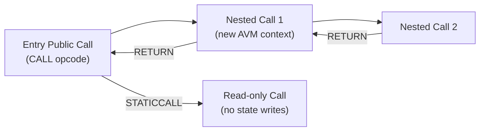
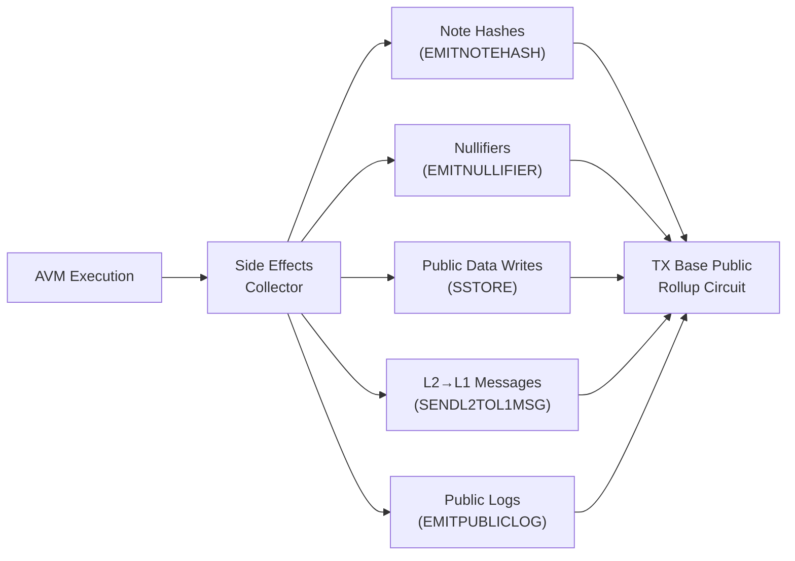

# The Aztec Virtual Machine (AVM)

:::note What you'll understand
The AVM's bytecode-interpreter execution model, two-dimensional gas (L2 + DA), the 77-opcode instruction set categorized by purpose, how AVM side effects (storage writes, nullifiers, logs) feed into the TX Base rollup circuit, and how AVM proofs are generated by Barretenberg. Prerequisites: [State Trees](./02-state-trees.md).
:::

## Why a Custom VM?

The EVM cannot be efficiently proven in ZK circuits:
- EVM uses 32-byte words → expensive in BN254 field arithmetic
- EVM has complex exception semantics → hard to arithmetize
- EVM has no native notes, nullifiers, or cross-chain operations

The AVM is designed for ZK-provable public execution with Aztec-specific opcodes.

## Execution Model

The AVM runs compiled Noir public functions as bytecode:

```ts
// simulator/src/public/avm/avm_simulator.ts
class AvmSimulator {
  async execute(): Promise<AvmContractCallResult> {
    const bytecode = await this.persistableState.getBytecode(contractAddress);

    while (!machineState.getHalted()) {
      const instruction = decodeInstructionFromBytecode(bytecode, machineState.pc);
      await instruction.execute(this.context);
      // PC advanced by instruction size or jump target
    }
    return { reverted, output, gasUsed, stateWrites };
  }
}
```

**Two halt modes:**
- **Normal revert** (`REVERT` opcode): Returns remaining gas, outputs revert reason. Non-revertible effects persist.
- **Exceptional halt** (out-of-gas, invalid PC, invalid opcode): Consumes ALL allocated gas, empty output.

## Nested Calls

Public functions can call other public functions. The AVM manages a call stack:



Each nested call gets its own gas allocation, memory space, and storage context. If a nested call reverts, its side effects are discarded but the caller can continue (unlike exceptional halts).

## Two-Dimensional Gas

The AVM tracks two independent gas meters simultaneously:

```ts
// simulator/src/public/avm/avm_machine_state.ts
consumeGas(gasCost: Gas) {
  this.l2GasLeft -= gasCost.l2Gas;
  this.daGasLeft -= gasCost.daGas;
  if (this.l2GasLeft < 0 || this.daGasLeft < 0) {
    throw new OutOfGasError();   // Exceptional halt
  }
}
```

| Gas Type | What It Prices | Example |
|----------|---------------|---------|
| **L2 Gas** | Computation (CPU cycles) | ADD costs ~5 L2 gas |
| **DA Gas** | Data availability (blob bytes) | SSTORE costs ~storage_write_da_gas |

A TX that writes to many storage slots may run out of DA gas before L2 gas. Each opcode has static costs in `simulator/src/public/avm/avm_gas.ts`.

## 77 Opcodes

| Category | Opcodes | Notes |
|----------|---------|-------|
| **Arithmetic** | ADD, SUB, MUL, DIV, FDIV, EQ, LT, LTE | Integer + field operations |
| **Bitwise** | AND, OR, XOR, NOT, SHL, SHR | 8/16/32/64/128-bit variants |
| **Memory** | SET, MOV, CAST | Register manipulation |
| **Control** | JUMP, JUMPI, INTERNALCALL, INTERNALRETURN | Flow control |
| **Calls** | CALL, STATICCALL, RETURN, REVERT | Contract interaction |
| **Public Storage** | SLOAD, SSTORE | Public Data Tree R/W |
| **Notes** | NOTEHASHEXISTS, EMITNOTEHASH | Note Hash Tree |
| **Nullifiers** | NULLIFIEREXISTS, EMITNULLIFIER | Nullifier Tree |
| **L1↔L2** | L1TOL2MSGEXISTS, SENDL2TOL1MSG | Cross-chain messaging |
| **Crypto** | POSEIDON2, SHA256COMPRESSION, KECCAK, ECADD | Cryptographic primitives |
| **Environment** | GETENVVAR, CALLDATACOPY | Execution context |
| **Other** | GETCONTRACTINSTANCE, EMITPUBLICLOG, DEBUGLOG, TORADIXBE | Misc |

Most opcodes have **8-bit and 16-bit variants** (e.g., `ADD_8`, `ADD_16`) for different operand addressing modes. Indirect and relative addressing add gas overhead.

## Side Effects and State Interaction

AVM side effects are collected during execution, not immediately committed:



At the end of AVM execution, the `PublicTxEffect` is passed to `makeProcessedTxFromTxWithPublicCalls()`, which packages it for the TX Base Public rollup circuit.

## AVM Proving

The AVM simulator generates **proving hints** alongside the simulation result:

```ts
// simulator/src/public/avm/avm_simulator.ts
const { executionResult, hints } = await simulate(tx);
const avmProvingRequest = PublicProcessor.generateProvingRequest(publicInputs, hints);
```

Barretenberg's AVM circuit (`bb_prover`) takes:
- `publicInputs`: The AVM's declared side effects (what the circuit claims happened)
- `hints`: Execution trace (witness data for each opcode)

It proves that running the bytecode with the given inputs produces the declared outputs. This is a large circuit — AVM proofs take ~30–120 seconds on a server CPU.

## Implementation Notes

- **`SLOAD` (read)**: Reads from the Public Data Tree. The AVM receives a "leaf preimage hint" from the native world state — the circuit verifies it matches the expected tree root.
- **`SSTORE` (write)**: Writes to Public Data Tree. DA gas cost depends on whether the slot already exists ("warm" vs "cold" storage — similar to Ethereum's EIP-2929).
- **`GETCONTRACTINSTANCE`**: Returns deployment information for a contract at a given address. Useful for DeFi protocols that need to verify they're calling an authentic implementation.
- **`STATICCALL`**: Like EVM's `staticcall` — prohibits state writes in the callee. The AVM enforces this by tracking call depth and write permissions.

## What Comes Next

The AVM proof feeds into the TX Base rollup — already covered in [Rollup Circuits](./04-rollup-circuits.md). For the broader proving infrastructure that generates AVM proofs at scale, see [Proving Infrastructure](../01-transaction-lifecycle/07-proving-infrastructure.md). For the client-side IVC system, see [Client IVC & Chonk](./06-client-ivc-chonk.md).
