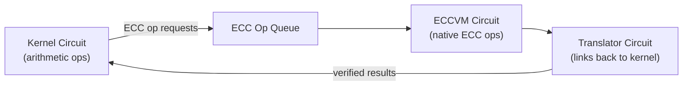

# Client IVC & Chonk

:::note What you'll understand
How Chonk's HyperNova folding chains all kernel circuits with O(1) cost per step (versus O(N) for standard recursion), how PCS verification is deferred to one final "decider" step, how Goblin defers expensive ECC operations, and what real-world proving times look like. Prerequisites: [Private Kernel Circuits](./03-private-kernel-circuits.md), [Proof System](./01-proof-system.md).
:::

## IVC vs Standard Recursive Proving

### Standard Recursion (the naive approach)

Each kernel circuit verifies the full proof from the previous circuit, including polynomial commitment scheme (PCS) evaluation:

```
App₁ → prove → Kernel_Init(verify_proof(App₁)) → prove → Kernel_Inner(verify_proof(Kernel_Init)) → ...
                ↑ full PCS check each time: expensive!
```

Cost per step: O(circuit_size) gates for the recursive verifier.

### IVC — Incremental Verifiable Computation

Instead of verifying the full proof at each step, IVC **folds** two instances together into one accumulated instance:

```
App₁ + Kernel_Init → fold → Accumulator₁
Accumulator₁ + Kernel_Inner → fold → Accumulator₂
...
AccumulatorN → prove → Final proof  (PCS check happens ONCE)
```

Cost per fold: O(log circuit_size) for the Sumcheck fold (no PCS).

## Chonk — Aztec's Client IVC System

**Chonk** (Client Highly Optimized ploNK) implements IVC using **HyperNova folding** over multilinear polynomials:

```
Each fold step:
  1. Prover sends a few field elements (Sumcheck rounds)
  2. Verifier sends random challenge
  3. Accumulate: new_acc = fold(old_acc, new_circuit)
  Cost: N rounds of Sumcheck (~N field operations)

Final step (decider):
  1. Open accumulated polynomial at challenge point (PCS)
  2. Generate full proof
  Cost: one PCS evaluation
```

This reduces the total cost from `N × PCS` (standard recursion) to `N × Sumcheck + 1 × PCS`.

## Goblin — Deferring ECC Operations

Kernel circuits involve elliptic curve operations (key derivation, ECDH). ECC operations in an arithmetic circuit require "non-native field arithmetic" — very expensive.

**Goblin** defers ECC operations to a separate circuit:



- **ECCVM (Elliptic Curve Virtual Machine)**: A specialized circuit that executes ECC operations natively. Much cheaper than non-native arithmetic.
- **Translator**: Proves that the ECCVM's inputs match what the kernel circuit requested via the op queue.

The ECC op queue is what the Hiding Kernel's "ECC op queue masking" hides — padding it with random operations to conceal the actual ECC operations performed (which would reveal circuit structure).

## RCG vs Standard IVC

Standard IVC proves at each fold step (witness generation interleaved with proving). Chonk uses **Repeated Computation with Global state** (RCG):

```
Phase 1 — Witness Generation (all circuits):
  Execute App₁ → witness₁
  Execute Kernel_Init(witness₁) → witness₂
  ...
  Execute Kernel_Tail(witnessN) → witnessM

Phase 2 — Folding + Proving (all circuits):
  fold(circuit₁, witness₁) → acc₁
  fold(circuit₂, witness₂) → acc₂
  ...
  prove(accM) → Final proof
```

Why RCG? On client devices (browsers, phones), memory is constrained. Completing all witness generation first before starting proving enables better memory management — witnesses can be streamed or garbage-collected during the proving phase.

## Proving Backend — Barretenberg

All Chonk proofs are generated by Barretenberg's `AztecClientBackend`:

```ts
// bb-prover/src/prover/client/bb_private_kernel_prover.ts
export class BBPrivateKernelProver implements PrivateKernelProver {
  async prove(witnessStack, circuitStack): Promise<ChonkProof> {
    // Calls bb binary with --scheme client_ivc
    return this.bb.proveClientIVC(witnessStack, circuitStack);
  }
}
```

The `bb` (barretenberg) binary handles the HyperNova accumulation and final decider proof generation.

## Proving Times In Practice

| Circuit | Time (CPU) | Notes |
|---------|-----------|-------|
| Kernel Init | ~1–2s | One per TX |
| Kernel Inner (per call) | ~2–5s | N calls → N × this |
| Kernel Reset | ~2s | Depends on variant size |
| Kernel Tail | ~2s | One per TX |
| Hiding Kernel (MegaZK) | ~5–15s | Includes ECCVM + Translator |
| **Total per TX** | **~10–30s** | Scales with call depth |

For comparison, without Chonk (standard recursion each step), proving a 5-call TX would take ~3–5 minutes. Chonk reduces this to ~20–30s.

## Implementation Notes

- **`HIDING_KERNEL_LOG_N`**: The Hiding Kernel uses a fixed virtual circuit size. All TXs — whether they have 1 nested call or 8 — produce identically-sized proofs. This prevents an observer from distinguishing TX complexity by proof size.
- **Chonk proof format** (`ChonkProof`): The output of the Hiding Kernel. It contains the folded accumulator's decider proof plus the Goblin artifacts (ECCVM + Translator proofs). This is the proof embedded in the `Tx` object broadcast to P2P.
- **GPU acceleration roadmap**: Current times are CPU-only. GPU proving (via barretenberg's CUDA backend) is expected to reduce times by 5–10×. FPGA acceleration is also being explored.

## What Comes Next

The `ChonkProof` exits the PXE and enters the P2P network — covered in [Transaction Lifecycle](../01-transaction-lifecycle/index.md). The rollup circuits that verify ChonkProofs are covered in [Rollup Circuits](./04-rollup-circuits.md).
