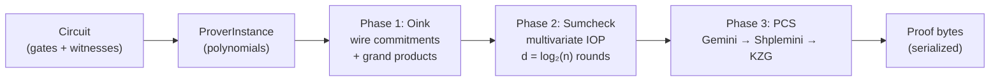
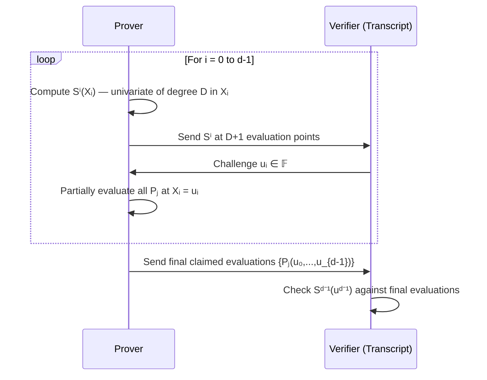
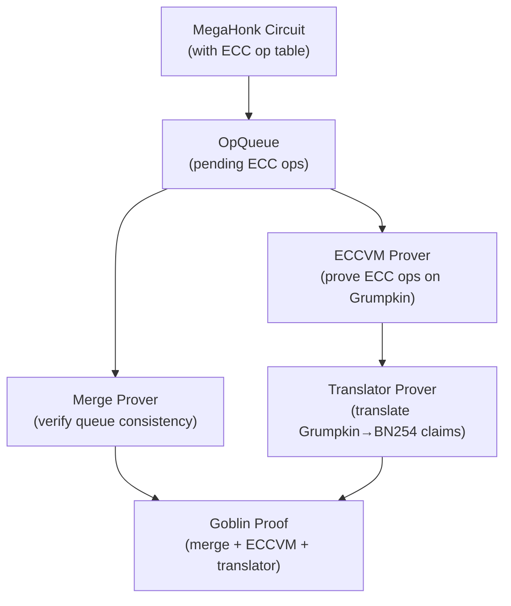

# Barretenberg Prover Internals

:::note What you'll understand
How the C++ Barretenberg library converts a circuit into a ZK proof: the three proving phases (Oink → Sumcheck → PCS), how wire polynomials are built from the execution trace, how the Sumcheck IOP works round-by-round, how Gemini reduces multilinear openings to a single KZG pairing, and how the Fiat-Shamir transcript binds everything together. Prerequisites: [Proof System](./01-proof-system.md), [Client IVC & Chonk](./06-client-ivc-chonk.md).
:::

## Where Barretenberg Fits

Every proof in Aztec ultimately executes inside `barretenberg/cpp/`:

```
PXE (TypeScript)
  └─→ BBPrivateKernelProver (TypeScript wrapper)
        └─→ bb binary (C++ CLI)
              └─→ UltraProver / MegaProver (barretenberg)
                    ├─→ OinkProver      (Phase 1: commitments)
                    ├─→ SumcheckProver  (Phase 2: IOP)
                    └─→ ShpleminiProver (Phase 3: PCS)

ProvingOrchestrator (TypeScript)
  └─→ bb binary via IPC
        └─→ UltraProver / MegaProver
```

**Two main prover variants:**

| Prover | Flavor | Used For |
|--------|--------|----------|
| `UltraProver` | `UltraFlavor` | Kernel circuits, rollup circuits, AVM circuits |
| `MegaProver` | `MegaFlavor` | Client IVC (MegaHonk), ECC-heavy circuits |
| `UltraZKProver` | `UltraZKFlavor` | Hiding kernel (full ZK with Libra masking) |
| `MegaZKProver` | `MegaZKFlavor` | Client IVC with ZK |

Both share the same three-phase pipeline. The "Flavor" is a C++ template parameter that threads through every component, specifying which polynomials exist, which relations apply, and which PCS backend to use.

## The Three-Phase Pipeline



**Source:** `barretenberg/cpp/src/barretenberg/ultra_honk/ultra_prover.cpp` — `construct_proof()` orchestrates all three phases.

---

## Phase 0: Circuit → Polynomials (ProverInstance)

Before proving begins, the circuit must be converted into polynomial form.

**File:** `barretenberg/cpp/src/barretenberg/ultra_honk/prover_instance.hpp`

```cpp
template <IsUltraOrMegaHonk Flavor_> class ProverInstance_ {
    ProverPolynomials polynomials;       // All wires, selectors, permutation polys
    WitnessCommitments commitments;      // G1 points for each poly
    RelationParameters<FF> relation_parameters;  // β, γ for permutation
    std::vector<FF> gate_challenges;     // Sumcheck pow polynomial
    CommitmentKey commitment_key;        // SRS for MSM
};
```

**Constructor pipeline** (lines 95–202):

```
1. circuit.finalize()
   └─ Adds placeholder gates, enforces power-of-2 size

2. Allocate polynomial storage
   ├─ Wires:       w_l, w_r, w_o, w_4
   ├─ Selectors:   q_m, q_l, q_r, q_o, q_c, q_4, q_arith, q_lookup, ...
   ├─ Permutation: σ_l, σ_r, σ_o, σ_4  (copy constraints)
   ├─ Lookup:      table_1..4, sorted_list_1..4, lookup_inverses
   └─ Lagrange:    lagrange_first, lagrange_last

3. TraceToPolynomials<Flavor>::populate(circuit, polynomials)
   └─ Fills wire polys row-by-row from the execution trace

4. Construct lookup tables
   └─ Combine all table entries into table_1..table_4 columns

5. Extract public inputs
   └─ First `pub_inputs_size` entries of w_r
```

**Wire polynomial structure:**

Each wire polynomial $w_l, w_r, w_o, w_4$ is a vector of field elements of length $n = 2^k$ (the next power of 2 above the circuit size). Gate $i$ contributes one element to each wire at row $i$:

```
Row 0: w_l[0], w_r[0], w_o[0]   ← Gate 0's left/right/output values
Row 1: w_l[1], w_r[1], w_o[1]   ← Gate 1
...
Row n-1: 0, 0, 0                  ← Padding to power-of-2
```

The selector polynomials encode which relation is active at each row:

| Selector | Meaning |
|----------|---------|
| `q_arith = 1` | Standard arithmetic gate: $q_m \cdot w_l \cdot w_r + q_l \cdot w_l + q_r \cdot w_r + q_o \cdot w_o + q_c = 0$ |
| `q_lookup = 1` | Row participates in a lookup table |
| `q_elliptic = 1` | Elliptic curve addition gate (Mega only) |
| `q_aux` | Auxiliary gates (RAM/ROM, range checks) |

---

## Phase 1: Oink — Commitments & Challenges

**File:** `barretenberg/cpp/src/barretenberg/ultra_honk/oink_prover.cpp`

The Oink prover executes the pre-sumcheck rounds of the Fiat-Shamir protocol, producing polynomial commitments and deriving the relation-batching challenge $\alpha$.

```cpp
// oink_prover.cpp lines 21–47
template <IsUltraOrMegaHonk Flavor> void OinkProver<Flavor>::prove() {
    execute_preamble_round();                   // [1] VK hash + public inputs
    execute_wire_commitments_round();           // [2] Commit w_l, w_r, w_o (+ w_4 for Mega)
    execute_sorted_list_accumulator_round();    // [3] Commit sorted lookup tables
    execute_log_derivative_inverse_round();     // [4] β, γ → commit z_lookup inverses
    execute_grand_product_computation_round();  // [5] Compute + commit z_perm, z_lookup
    prover_instance->alpha = generate_alpha_round(); // [6] α challenge
}
```

### [1] Preamble

Hashes the verification key into the transcript and sends public inputs. This binds the proof to a specific circuit.

```cpp
transcript->add_to_hash_buffer("vk_hash", honk_vk->sha256_hash());
for (auto& pi : prover_instance->public_inputs) {
    transcript->send_to_verifier("public_input_" + i, pi);
}
```

### [2] Wire Commitments

Commits to each wire polynomial using a multi-scalar multiplication (MSM) against the structured reference string (SRS):

```
[w_l] = w_l[0]·G₀ + w_l[1]·G₁ + ··· + w_l[n-1]·G_{n-1}
[w_r] = ...
[w_o] = ...
```

Each $G_i = \tau^i \cdot G$ where $\tau$ is the trusted setup secret. The commitments are G1 points sent to the transcript.

### [3] Sorted List Accumulator

For lookup arguments, the prover commits to a sorted accumulation of the witness values and table values. This enables the log-derivative lookup argument without a traditional permutation.

### [4] Log-Derivative Inverses

The verifier sends $\beta, \gamma$ challenges. The prover computes and commits to $z_\text{lookup}$, the polynomial of inverses used in the log-derivative lookup relation:

$$z_\text{lookup}[i] = \frac{1}{\beta + f[i] + \gamma \cdot t[i]}$$

where $f[i]$ is the lookup wire value and $t[i]$ is the table value at row $i$.

### [5] Grand Product Polynomials

The prover computes and commits to the permutation grand product $z_\text{perm}$:

$$z_\text{perm}[0] = 1, \quad z_\text{perm}[i+1] = z_\text{perm}[i] \cdot \frac{(w_l[i] + \beta \cdot \sigma_l[i] + \gamma)(\ldots)}{(w_l[i] + \beta \cdot id_l[i] + \gamma)(\ldots)}$$

This encodes Plonk's copy constraint argument: if any wire values don't match their expected permutation, $z_\text{perm}[n] \neq 1$ and the relation fails.

### [6] Alpha Challenge

The verifier (via transcript) sends $\alpha$. This single field element is used to batch all subrelation polynomials in the Sumcheck:

$$F_\text{batched}(X) = R_0(X) + \alpha \cdot R_1(X) + \alpha^2 \cdot R_2(X) + \cdots$$

where each $R_i$ is a different gate relation (arithmetic, permutation, lookup, etc.).

---

## Phase 2: Sumcheck — The Multivariate IOP

Sumcheck is the heart of Honk. It lets the prover convince the verifier that $\sum_{X \in \{0,1\}^d} F(X) = 0$ without the verifier evaluating $F$ at all $2^d$ points.

**File:** `barretenberg/cpp/src/barretenberg/sumcheck/sumcheck.hpp`

### The Claim

The circuit is satisfied iff:

$$\sum_{X \in \{0,1\}^d} \text{pow}_\beta(X) \cdot R\bigl(P_1(X), \ldots, P_N(X)\bigr) = 0$$

where:
- $d = \log_2(n)$ is the number of variables (number of sumcheck rounds)
- $P_1 \ldots P_N$ are **all** polynomials: wires, selectors, permutation polys, lookup polys
- $R$ is the **batched relation** (all gate types combined with $\alpha$ powers)
- $\text{pow}_\beta(X) = \prod_{i=0}^{d-1} \beta_i^{X_i}$ is the **gate separator** (pow polynomial)

**The gate separator** $\text{pow}_\beta$ is derived from the gate challenges generated by the transcript before sumcheck starts. It weights each row differently, so the verifier can distinguish gate positions — critical for sound verification.

### Round Structure (d Rounds)

Each round $i$ reduces the $d$-variate claim to a $(d-1)$-variate claim:



**Computing the round univariate `Sⁱ(Xᵢ)`** (`sumcheck_round.hpp`):

```
For each Xᵢ ∈ {0, 1, ..., D}:
  For each ℓ ∈ {0,1}^{d-i-1}:
    Evaluate all Pⱼ(u₀,...,u_{i-1}, Xᵢ, ℓ)
    using barycentric extension from their current book-keeping table
  Evaluate all relations Rₖ at these values
  Accumulate: Sⁱ(Xᵢ) += powβ_contribution * batchedRelations(Xᵢ, ℓ)
```

**The book-keeping table optimization:**

At each round, partially evaluating the multilinear polynomial $P(u_0, \ldots, u_{i-1}, X_i, \ldots)$ at $X_i = u_i$ halves the table:

```
Initial:  table[ℓ] = Pⱼ(ℓ) for ℓ ∈ {0,1}^d   (size n)
After u₀: table[ℓ] = (1-u₀)·P(0,ℓ) + u₀·P(1,ℓ)  (size n/2)
After u₁: table[ℓ] = ...                           (size n/4)
...
After uᵈ⁻¹: single value = Pⱼ(u)
```

This is the multilinear property: $O(n)$ work total across all rounds, not $O(n^2)$.

### The Gate Separator (pow Polynomial)

**File:** `barretenberg/cpp/src/barretenberg/polynomials/gate_separator.hpp`

Generated from dyadic powers of the transcript challenge:

```cpp
// ultra_prover.cpp lines 95-103
prover_instance->gate_challenges =
    transcript->get_dyadic_powers_of_challenge<FF>("Sumcheck:gate_challenge", log_n);
// Returns: [δ, δ², δ⁴, δ⁸, ..., δ^{2^{d-1}}]
```

At hypercube point $\ell = (\ell_0, \ell_1, \ldots, \ell_{d-1})$:
$$\text{pow}_\delta(\ell) = \prod_{i} \delta^{2^i \cdot \ell_i} = \delta^{\sum_i 2^i \cdot \ell_i} = \delta^\ell$$

So $\text{pow}_\delta$ evaluates to $\delta^0, \delta^1, \delta^2, \ldots, \delta^{n-1}$ at the $n$ hypercube points — a different weight for each row.

### ZK Adjustments (ZK Flavors Only)

For `UltraZKFlavor` and `MegaZKFlavor`, three additional mechanisms ensure the proof reveals nothing about the witness:

**1. Row Disabling Polynomial** (`sumcheck/Sumcheck.md` lines 53–74):

The last 4 rows of each witness polynomial are filled with random field elements. A disabling polynomial zeros out their contribution to the sumcheck:

$$\text{RowDisabling}(X) = 1 - X_{d-2} \cdot X_{d-3} \cdots X_0 \quad \text{(last 4 rows only)}$$

This prevents any constraint from revealing those random values.

**2. Libra Masking Polynomial** (`sumcheck/Sumcheck.md` lines 120–174):

An additional masking polynomial is added to the round univariates:

$$G(X) = a_0 + \sum_{i=0}^{d-1} g_i(X_i)$$

where each $g_i$ is a uniformly random univariate of degree $D$ (max individual degree). The prover sends $\text{libra\_total\_sum} = \sum_{X \in \{0,1\}^d} G(X)$ and the verifier adds $\rho \cdot G(u)$ as a correction to the final evaluation.

This masks the round univariates: even if an adversary gets the intermediate $S^i$ values, they reveal nothing about $P_j$.

**3. Virtual Padding Rounds:**

To ensure all proofs have the same structure (fixed-size proof), rounds beyond the actual $d$ send zero univariates. Padding indicator arrays prevent the verifier from applying consistency checks to these virtual rounds.

---

## Phase 3: PCS — Polynomial Commitment Scheme

After Sumcheck, the verifier needs to confirm the claimed evaluations $\{P_j(u)\}$ match the earlier commitments $\{[P_j]\}$. This is the Polynomial Commitment Scheme (PCS) phase.

The challenge: we have **many multilinear polynomials** each evaluated at the **same multilinear point** $u = (u_0, \ldots, u_{d-1})$. KZG only handles univariate polynomials at univariate points. Three layers reduce the problem:

```
Many multilinear polynomials at u
    │
    ├─→ [Gemini] multilinear → univariate reduction
    │   Output: d univariate polynomials at points {r, r², ..., r^{2^{d-1}}}
    │
    ├─→ [Shplonk] batch d univariate openings into 1
    │   Output: single batched polynomial at single point z
    │
    └─→ [KZG] univariate opening proof
        Output: pairing proof (one G1 point [W])
```

### Gemini: Multilinear → Univariate

**File:** `barretenberg/cpp/src/barretenberg/commitment_schemes/gemini/gemini.hpp`

Gemini reduces opening $d$ multilinear polynomials at $u$ to opening $d$ univariates at $d$ pairs of points $\{(r, -r), (r^2, -r^2), \ldots, (r^{2^{d-1}}, -r^{2^{d-1}})\}$.

**Algorithm:**

```
1. Batch all multilinear polys (and their "shifts"):
   A₀(X) = Σⱼ ρʲ · fⱼ(X) + Σⱼ ρ^{k+j} · gⱼ(X)/X

2. Fold d times using Sumcheck challenges u₀,...,u_{d-1}:
   A_{i+1}(X) = (1 - uᵢ) · even(Aᵢ)(X) + uᵢ · odd(Aᵢ)(X)
   where even/odd split the polynomial into even/odd coefficients

3. Commit and send [A₀], [A₁], ..., [A_{d-1}]

4. Verifier reconstructs Aᵢ(r^{2^i}) using the fold relation:
   Aᵢ(r) = uᵢ · A_{i+1}(r²) + (1-uᵢ) · A_{i+1}(-r²)   [simplified]
```

Each fold commitment $[A_i]$ needs to be opened at two points $\pm r^{2^i}$, producing $2d$ univariate opening claims.

### Shplemini: Batching d Univariate Openings

**File:** `barretenberg/cpp/src/barretenberg/commitment_schemes/shplonk/shplemini.hpp`

Shplonk (combined with Gemini into "Shplemini") batches all $2d$ opening claims into a single polynomial commitment opening:

```
Receive ν challenge from transcript
For each claim (fⱼ, xⱼ, vⱼ):  // fⱼ(xⱼ) = vⱼ
  (fⱼ - vⱼ) / (X - xⱼ)

Batched quotient: Q(X) = Σⱼ νʲ⁻¹ · (fⱼ(X) - vⱼ) / (X - xⱼ)
Commit [Q] and send to transcript

Receive evaluation point z
Claim: Q(z) = 0  (verified via KZG)
```

The key insight: if each $(f_j - v_j)$ is divisible by $(X - x_j)$ (i.e., $f_j(x_j) = v_j$), then $Q$ is a valid polynomial. Committing to $Q$ and proving $Q(z) = 0$ verifies all claims simultaneously.

**MSM optimization:** The verifier computes a single MSM over all polynomial commitments to construct $[Q]$ check — no individual per-polynomial pairings needed.

### KZG: Final Univariate Opening

**File:** `barretenberg/cpp/src/barretenberg/commitment_schemes/kzg/kzg.hpp`

KZG proves that a committed polynomial $p$ evaluates to $v$ at point $r$:

```cpp
// Compute quotient: q(X) = (p(X) - v) / (X - r)
Polynomial quotient = opening_claim.polynomial;
quotient[0] -= evaluation_value;    // p(X) - v
quotient.factor_roots(challenge);   // Divide by (X - r)

// Commit to quotient
auto [W] = ck.commit(quotient);     // [W] = [q(τ)]
transcript->send_to_verifier("KZG:W", [W]);
```

**Verification:** One pairing check:
$$e([p] - v \cdot [1], [1]) = e([W], [\tau] - r \cdot [1])$$

This is the single pairing operation in the entire proof. Everything else is MSM or field arithmetic.

---

## The Fiat-Shamir Transcript

**File:** `barretenberg/cpp/src/barretenberg/transcript/transcript.hpp`

The transcript implements the Fiat-Shamir heuristic, converting the interactive proof into a non-interactive one. Every challenge is derived from all prior messages.

### Duplex Sponge Challenge Generation

```cpp
// First challenge of a round:
c₀ = H(round_0_data)

// Subsequent challenges (building on prior state):
cᵢ = H(c_{i-1} || round_i_data)

// Multiple challenges from one round:
[c_a, c_b] = split( H(round_data) )
// Each challenge is 127 bits (fits in field element)
```

### Transcript API

```cpp
// Prover sends data (adds to proof bytes + current_round_data):
transcript->send_to_verifier("w_l", [w_l]);

// Public data (adds to hash only, not proof bytes):
transcript->add_to_hash_buffer("vk_hash", vk_hash);

// Generate challenge (hashes current_round_data, clears buffer):
auto alpha = transcript->get_challenge<FF>("alpha");

// Multiple challenges from one round:
auto [beta, gamma] = transcript->get_challenges<FF>({"beta", "gamma"});

// Dyadic powers (for gate separator):
auto challenges = transcript->get_dyadic_powers_of_challenge<FF>(
    "Sumcheck:gate_challenge", log_n);
// Returns [δ, δ², δ⁴, δ⁸, ...]
```

### Transcript Instantiations

| Transcript | Hash Function | Used For |
|-----------|--------------|---------|
| `NativeTranscript` | Poseidon2 | Proof generation (native C++) |
| `KeccakTranscript` | Keccak-256 | Solidity verifier compatibility |
| `StdlibTranscript<Builder>` | Poseidon2 in-circuit | Recursive verification circuits |

### Origin Tags (In-Circuit Security)

When the transcript runs inside a circuit (for recursive verification), an additional tracking mechanism prevents subtle attacks:

```cpp
struct OriginTag {
    size_t transcript_index;               // Which transcript instance
    numeric::uint256_t round_provenance;   // Bitmask of round dependencies
    bool instant_death;                    // Poison flag
};
```

**Round provenance:** Each bit tracks which transcript round a value depends on. When values are combined (multiplied, added), their provenance bits are ORed together. If a value tries to "skip" a round (use data from round $i+1$ without going through round $i$'s challenge), the check fails.

**Why this matters:** In recursive verification, a malicious prover could try to submit a witness where a "verifier challenge" is actually a value they chose themselves. Origin tags catch this at the circuit level.

---

## Commitment Key & Multi-Scalar Multiplication

**File:** `barretenberg/cpp/src/barretenberg/commitment_schemes/commitment_key.hpp`

```cpp
template <class Curve> class CommitmentKey {
    std::shared_ptr<srs::factories::Crs<Curve>> srs;

    Commitment commit(PolynomialSpan<const Fr> polynomial) const {
        // Pippenger's MSM: C = Σ aᵢ · Gᵢ
        return MSM(polynomial, get_monomial_points());
    }
};
```

**SRS structure (BN254):**
- Points: $\{G, \tau G, \tau^2 G, \ldots, \tau^{n-1} G\}$ from a trusted setup ceremony
- Loaded from disk at prover startup
- Size: up to $2^{23}$ points for large circuits
- Pippenger precomputes lookup tables (2× memory, faster MSM)

**Why Pippenger?** Naïve MSM is $O(n)$ doublings + additions. Pippenger reduces this to roughly $O(n / \log n)$ group operations by batching scalar bits. For $n = 2^{20}$, this is ~20× faster than naïve.

---

## Proof Serialization

The final proof is the transcript's `proof_data` buffer, which collects every `send_to_verifier()` call in order:

```
[Phase 1 — OINK]
  public_input_0 ... public_input_k       (k × 32 bytes)
  [w_l], [w_r], [w_o]                    (3 × 64 bytes, G1 compressed)
  [w_4]                                   (Mega only)
  [sorted_list_1..4]                      (4 × 64 bytes)
  [z_perm]                                (64 bytes)
  [z_lookup]                              (64 bytes)

[Phase 2 — Sumcheck]
  S⁰[0], S⁰[1], ..., S⁰[D]             (D+1 field elements)
  S¹[0..D]
  ...
  S^{d-1}[0..D]
  claimed_eval_P₁, ..., claimed_eval_Pₙ  (N field elements)

[Phase 3 — PCS]
  [A₁], [A₂], ..., [A_{d-1}]            (d-1 fold commitments)
  gemini_neg_eval_1 .. neg_eval_{d-1}    (d-1 negative evaluations)
  [Q]                                    (Shplemini quotient commitment)
  [W]                                    (KZG opening proof)
```

Total size: roughly `32*(k + N*d) + 64*(6 + d)` bytes, where $k$ = public inputs, $N$ = number of polynomials, $d = \log_2(n)$.

---

## Goblin ECC Acceleration (Mega Flavor)

For the Hiding Kernel (MegaZK), elliptic curve operations inside circuits are expensive — each scalar multiplication in Noir becomes thousands of field arithmetic constraints. Goblin separates these out:



**Why Goblin?** Proving secp256k1 ECDSA or Grumpkin scalar mults inside BN254 arithmetic requires "non-native field arithmetic" — very expensive. Goblin's ECCVM is a specialized circuit optimized for Grumpkin operations, producing a proof that those operations were computed correctly, without needing to redo them in the main circuit's constraint system.

**Files:**
- `barretenberg/cpp/src/barretenberg/goblin/goblin.hpp`
- `barretenberg/cpp/src/barretenberg/honk/proof_system/types/goblin_proof.hpp`

---

## Flavor Specification System

The C++ "Flavor" pattern uses template specialization to configure the proving system for different use cases without runtime overhead:

```cpp
// Each Flavor defines:
struct UltraFlavor {
    using FF = bb::fr;              // BN254 scalar field
    using Curve = curve::BN254;
    using Transcript = NativeTranscript;

    static constexpr size_t NUM_WIRES = 4;
    static constexpr size_t NUM_ALL_ENTITIES = 43; // all polys in the IOP

    using Relations = std::tuple<
        UltraArithmeticRelation<FF>,
        UltraPermutationRelation<FF>,
        LogDerivLookupRelation<FF>,
        ...
    >;

    static constexpr size_t MAX_PARTIAL_RELATION_LENGTH = 6;
};
```

`MAX_PARTIAL_RELATION_LENGTH` determines how many points each round univariate has. Higher degree relations → more evaluation points per round → larger proof.

---

## Source Code Map

| Component | Path | Key Entry Point |
|-----------|------|----------------|
| Main prover | `ultra_honk/ultra_prover.hpp` | `UltraProver_::construct_proof()` |
| Proof orchestration | `ultra_honk/ultra_prover.cpp` | `construct_proof()` lines 105–121 |
| Circuit → polynomials | `ultra_honk/prover_instance.hpp` | `ProverInstance_` constructor |
| Phase 1: Oink | `ultra_honk/oink_prover.cpp` | `OinkProver::prove()` |
| Phase 2: Sumcheck | `sumcheck/sumcheck.hpp` | `SumcheckProver::prove()` |
| Sumcheck rounds | `sumcheck/sumcheck_round.hpp` | `compute_univariate()` |
| Sumcheck docs | `sumcheck/Sumcheck.md` | Full IOP spec |
| Gate separator | `polynomials/gate_separator.hpp` | `GateSeparatorPolynomial` |
| Phase 3: Gemini | `commitment_schemes/gemini/gemini.hpp` | `GeminiProver_::prove()` |
| Phase 3: Shplemini | `commitment_schemes/shplonk/shplemini.hpp` | `ShpleminiProver_::prove()` |
| Phase 3: KZG | `commitment_schemes/kzg/kzg.hpp` | `KZG::compute_opening_proof()` |
| Transcript | `transcript/transcript.hpp` | `BaseTranscript` |
| Transcript docs | `transcript/README.md` | Full spec |
| Commitment key / MSM | `commitment_schemes/commitment_key.hpp` | `CommitmentKey::commit()` |
| Goblin | `goblin/goblin.hpp` | `Goblin::prove()` |
| Flavor definitions | `flavor/ultra.hpp`, `flavor/mega.hpp` | Flavor structs |

## What Comes Next

With the full proof pipeline understood, you can explore how individual circuits plug into this machinery: [Private Kernel Circuits](./03-private-kernel-circuits.md) shows which circuits run in which flavor, and [Rollup Circuits](./04-rollup-circuits.md) shows how rollup proofs use UltraHonk.
