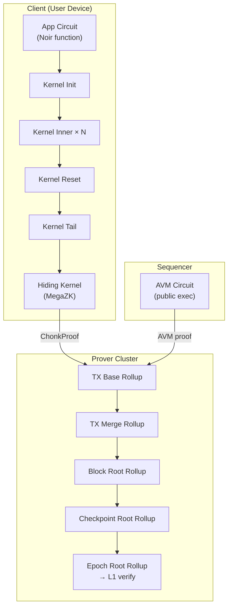

# ZK Circuits & State Architecture

:::note What you'll understand
How Aztec uses ZK proofs at every layer — private kernel circuits prove private execution, rollup circuits aggregate everything into one epoch proof for L1. Prerequisites: [Transaction Lifecycle Overview](../01-transaction-lifecycle/index.md).
:::

## How ZK, State, and Proofs Compose

In Aztec, every state change is proven in zero-knowledge. The architecture has three layers:



## Section Map

| Page | Covers |
|------|--------|
| [Proof System](./01-proof-system.md) | Honk, Sumcheck, Poseidon2, KZG/IPA |
| [State Trees](./02-state-trees.md) | The 5 Merkle trees, append-only vs indexed, batch inserts |
| [Private Kernel Circuits](./03-private-kernel-circuits.md) | Full kernel chain, VK tree, Databus, Reset variants, Chonk |
| [Rollup Circuits](./04-rollup-circuits.md) | TX Base/Merge, Block Root, Parity, Checkpoint, Epoch Root, SpongeBlob |
| [AVM](./05-avm.md) | Execution model, two-dimensional gas, 77 opcodes |
| [Client IVC & Chonk](./06-client-ivc-chonk.md) | HyperNova folding, PCS deferral, Barretenberg backend |

## The Fundamental Pattern

Every circuit in Aztec follows this pattern:

```
Private inputs (witnesses):  values, keys, sibling paths
Public inputs:               tree roots (start + end), fees, effects
Constraints:                 hash(leaf + siblings) == expected_root
Output:                      new tree root after insertions
```

At every merge circuit, state continuity is enforced:
```
left.end_state == right.start_state   // chains must be unbroken
left.constants == right.constants      // same block/epoch context
verify(left.proof) && verify(right.proof)  // recursive proof verification
```
