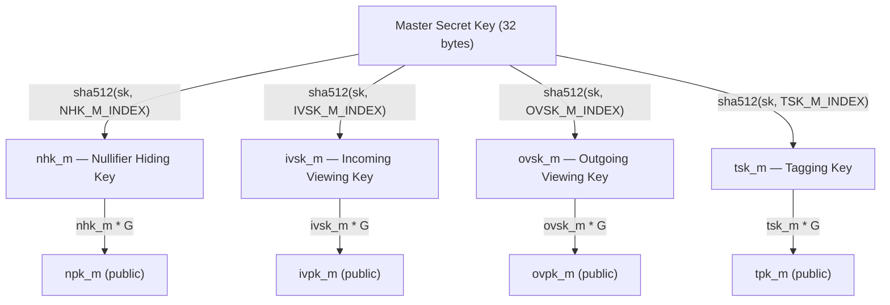
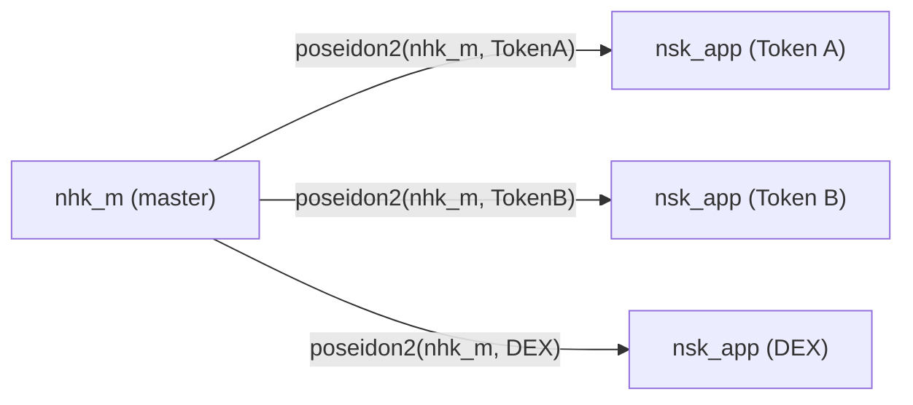

# Key Hierarchy

:::note What you'll understand
How a single master secret derives four master keys via SHA-512, what each key does and what's at risk if it leaks, how app siloing via `poseidon2(master_key, contractAddress)` prevents cross-contract attacks, and the exact address derivation formula that embeds `ivpk_m`. Prerequisites: [Keys Overview](./index.md).
:::

## One Secret, Four Keys

Every Aztec account starts with **one 32-byte master secret key**. From it, four purpose-specific master keys are derived:



```ts
// yarn-project/stdlib/src/keys/derivation.ts
nhk_m  = sha512ToGrumpkinScalar(secretKey, GeneratorIndex.NHK_M);
ivsk_m = sha512ToGrumpkinScalar(secretKey, GeneratorIndex.IVSK_M);
ovsk_m = sha512ToGrumpkinScalar(secretKey, GeneratorIndex.OVSK_M);
tsk_m  = sha512ToGrumpkinScalar(secretKey, GeneratorIndex.TSK_M);
```

`sha512ToGrumpkinScalar` hashes the secret key concatenated with a `GeneratorIndex` domain separator, then interprets the 64-byte output as a Grumpkin scalar. The domain separators ensure each key is independent — knowing one reveals nothing about the others.

## What Each Key Does

### Nullifier Hiding Key (nhk_m)

**Purpose**: Derive nullifiers that prove note ownership without revealing which note is spent.

```
nullifier = poseidon2(noteHash, nsk_app)
// nsk_app = app-siloed nullifier key
```

The circuit proves the nullifier was derived from the correct note hash and the correct key. Only the note owner can generate a valid nullifier — proving ownership cryptographically.

**Risk if leaked**: Attacker can compute correct nullifiers → can spend your notes.

### Incoming Viewing Key (ivsk_m)

**Purpose**: Decrypt notes sent **to** you.

When someone sends you a note, they encrypt it with your public key `ivpk_m`. Only you can decrypt with `ivsk_m`:

```
shared_secret = ivsk_m * ephemeral_pk    // ECDH
aes_key = poseidon2_derive(shared_secret)
plaintext = AES_decrypt(ciphertext, aes_key)
```

**Risk if leaked**: Attacker can decrypt all your incoming notes (past and future).

### Outgoing Viewing Key (ovsk_m)

**Purpose**: Decrypt notes you **sent** to others (reconstruct your own history).

When you send a note, the PXE encrypts a copy for you using `ovsk_m`. This lets your PXE recover sent notes even without a full transaction history.

**Risk if leaked**: Attacker sees all notes you've sent (but not what others sent to you).

### Tagging Key (tsk_m)

**Purpose**: Enable efficient note discovery without trial decryption.

Instead of scanning all logs and attempting to decrypt each, the PXE computes expected tags from `tsk_m` and queries the node for matching logs — O(1) per note discovery.

**Risk if leaked**: Attacker learns *when* you receive notes (metadata) but not their content.

## App-Siloed Keys — Per-Contract Isolation

Master keys are **never used directly in contracts**. Each contract gets an app-siloed key derived with the contract's address:

```ts
// yarn-project/stdlib/src/keys/derivation.ts
nsk_app  = poseidon2([nhk_m.hi,  nhk_m.lo,  contractAddress], GeneratorIndex.NHK_M);
ivsk_app = poseidon2([ivsk_m.hi, ivsk_m.lo, contractAddress], GeneratorIndex.IVSK_M);
```



**Why silo?** If a buggy or malicious contract leaks the key it was given, the attacker gets only the app-scoped key. All other contracts remain uncompromised. The master key never leaves the PXE.

The **kernel Reset circuit** validates siloing correctness via `KEY_VALIDATION`: it proves `nsk_app = poseidon2(nhk_m, contractAddr)` for the given contract address. A contract cannot use another contract's nullifier key.

Reference: `noir-projects/aztec-nr/aztec/src/keys/getters/mod.nr`

## Address Derivation — Keys Embedded in Identity

An Aztec address is **cryptographically bound** to its owner's public keys:

```
Step 1: Hash all 4 master public keys
  public_keys_hash = poseidon2(npk_m, ivpk_m, ovpk_m, tpk_m)

Step 2: Compute partial address (from contract class + deployment params)
  partial_address = poseidon2(contract_class_id, salted_init_hash)

Step 3: Derive address point on Grumpkin curve
  pre_address = poseidon2(public_keys_hash, partial_address)
  address_point = pre_address * G + ivpk_m   ← ivpk_m embedded here!

Step 4: Address = x-coordinate of the address point
  aztec_address = address_point.x
```

```ts
// yarn-project/stdlib/src/keys/derivation.ts — computeAddress()
// noir-projects/noir-protocol-circuits/crates/types/src/address/aztec_address.nr
```

**Why embed `ivpk_m` in the address?**
The formula `address_point = pre_address * G + ivpk_m` makes `ivpk_m` recoverable from the address:

```
ivpk_m = address_point - pre_address * G
```

If you know someone's address (and their partial address), you can derive their `ivpk_m` — the public key needed to encrypt notes for them. This is the Aztec equivalent of ENS: the address itself carries the encryption key.

**Security property**: You cannot deploy a contract at an address without possessing the matching private keys. The address formula binds code identity (partial_address) to key identity (public_keys_hash).

## Key Storage and the KeyStore

```ts
// yarn-project/pxe/src/key_store/local_key_store.ts
export class LocalKeyStore implements KeyStore {
  addAccount(secretKey: Fr): Promise<AztecAddress>;
  getPublicKeysForAccount(account: AztecAddress): Promise<PublicKeys>;
  deriveAppNullifierSecretKey(account: AztecAddress, contract: AztecAddress): Promise<GrumpkinScalar>;
  deriveAppIncomingViewingSecretKey(account: AztecAddress, contract: AztecAddress): Promise<GrumpkinScalar>;
}
```

The KeyStore holds master secret keys in encrypted storage. App-siloed keys are derived on demand — never stored persistently. This limits the attack surface: even if the key store's persistent storage is compromised, only master public keys leak (the master secrets are encrypted).

## Implementation Notes

- **`sha512ToGrumpkinScalar`**: SHA-512 produces 64 bytes. Interpreted as a 512-bit integer modulo the Grumpkin scalar field order, this gives a uniformly distributed Grumpkin scalar.
- **`GeneratorIndex` domain separators**: Each key type uses a different integer index in the hash input, ensuring the derived scalars for different key types are independent (even with the same master secret).
- **Public key registration**: Public keys are registered on-chain when an account is deployed. Other contracts can look up a user's `ivpk_m` from their address via the `KeyRegistry` contract.

## What Comes Next

App-siloed incoming viewing keys are used for encryption — [Note Encryption](./02-note-encryption.md).
