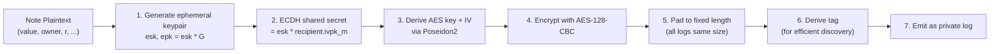

# Note Encryption & Discovery

:::note What you'll understand
How notes are encrypted (ECDH ephemeral key → shared secret → AES-128-CBC), how tag derivation via ECDH commutativity enables O(1) note discovery without trial decryption, the tag hopping window algorithm, and the step-by-step decryption flow. Prerequisites: [Key Hierarchy](./01-key-hierarchy.md).
:::

## The Encryption Pipeline

When a private function creates a note for a recipient:



References:
- `noir-projects/aztec-nr/aztec/src/messages/encryption/aes128.nr`
- `noir-projects/aztec-nr/aztec/src/messages/logs/note.nr`

## Step 1–2: ECDH Key Agreement

The sender generates a one-time ephemeral key pair `(esk, epk)`:

```
esk = random Grumpkin scalar
epk = esk * G  (Grumpkin point)

Shared secret = esk * recipient.ivpk_m
             = esk * (ivsk_m * G)
             = esk * ivsk_m * G

Recipient can recover:
Shared secret = ivsk_m * epk
             = ivsk_m * (esk * G)
             = ivsk_m * esk * G   ← same value (Grumpkin multiplication commutes)
```

**Forward secrecy**: Each note uses a fresh ephemeral key. Compromising the recipient's `ivsk_m` today does not decrypt past notes (the ephemeral keys were discarded after sending). This is the same property as Signal's forward secrecy, applied per-note.

## Step 3–4: AES-128-CBC Encryption

```
(header_key, header_iv) = poseidon2_derive(shared_secret, "header")
(body_key, body_iv)     = poseidon2_derive(shared_secret, "body")

encrypted_header = AES_128_CBC(content_length_bytes, header_key, header_iv)
encrypted_body   = AES_128_CBC(note_plaintext, body_key, body_iv)
```

The header stores the actual content length (so the recipient knows how much of the padded body to decrypt). The body stores the note's fields.

## Step 5: Fixed-Length Padding

All private logs are padded to the same fixed length on-chain. Without padding, an observer could determine how many notes a contract emits (larger log = more note fields = specific contract type). Fixed-length logs prevent this.

**Cost**: Fixed-length logs consume more blob space per note than variable-length would. This is a deliberate privacy trade-off.

## Tag Derivation — The Discovery Mechanism

Tags enable the PXE to find its notes without decrypting everything:

```
// Sender (during TX execution):
tagging_secret = ECDH_commutativity(sender.tsk_m, recipient.ivpk_m, contract)
               = poseidon2(sender.tsk_m * recipient.ivpk_m, contract, sender_index)
tag = poseidon2(tagging_secret, log_index)
emit log with tag prepended

// Recipient PXE (during sync):
tagging_secret = ECDH_commutativity(recipient.tsk_m, sender.ivpk_m, contract)
               = poseidon2(recipient.tsk_m * sender.ivpk_m, contract, sender_index)
// ECDH commutativity: tsk_m * ivpk = ivsk * tpk (same shared secret!)
expected_tag = poseidon2(tagging_secret, log_index)
query node: "give me logs with tag = expected_tag"
```

The ECDH commutativity property (`tsk_sender * ivpk_recipient = ivsk_recipient * tpk_sender`) means both the sender and recipient can independently compute the same tagging secret — without any additional communication.

Reference: `yarn-project/pxe/src/tagging/recipient_sync/load_private_logs_for_sender_recipient_pair.ts`

## Tag Hopping Window

The PXE maintains a "highest finalized index" for each sender-recipient pair. It searches ahead by `WINDOW_LEN` (1000) tags:

```
finalized_index = 42
search: tags[42], tags[43], ..., tags[1042]
found at: 45, 47, 1000

→ update: finalized_index = 1000
→ next search: tags[1000], tags[1001], ..., tags[2000]
```

**Why a window and not just sequential?** Tags are indexed by transaction order within a sender-recipient relationship. If a sender sends transactions 43 and 45 but 44 gets dropped (mempool eviction), the PXE would stall at 43 indefinitely in a strict sequential model. The window allows the PXE to skip gaps.

```ts
// yarn-project/pxe/src/logs/log_service.ts — fetchTaggedLogs()
```

## Encryption Modes

Three modes offer different security/performance trade-offs:

| Mode | Where Encryption Runs | Guarantee | Cost |
|------|----------------------|-----------|------|
| **ONCHAIN_CONSTRAINED** | Inside the Noir circuit | Proof guarantees correct encryption to correct recipient | High proving time (AES in ZK) |
| **ONCHAIN_UNCONSTRAINED** | In the PXE (outside circuit) | Ciphertext emitted as log; correctness relies on honest PXE | Fast proving |
| **OFFCHAIN** | Delivered directly to recipient | No on-chain backup | Minimal |

Reference: `noir-projects/aztec-nr/aztec/src/messages/message_delivery.nr`

`ONCHAIN_CONSTRAINED` is the most secure — the proof guarantees the note is correctly encrypted to the intended recipient. `ONCHAIN_UNCONSTRAINED` is used when the PXE can be trusted to encrypt correctly (most wallet scenarios). `OFFCHAIN` is for real-time applications where on-chain latency is unacceptable.

## Decryption Flow

When the PXE finds a log with a matching tag:

```
Step 1: Extract ephemeral public key from log prefix
        epk = log[0:32]  (Grumpkin point x-coordinate)

Step 2: Re-derive ECDH shared secret
        shared_secret = ivsk_app * epk
        // ivsk_app = app-siloed incoming viewing key

Step 3: Derive AES keys
        (header_key, header_iv) = poseidon2_derive(shared_secret, "header")
        (body_key, body_iv)     = poseidon2_derive(shared_secret, "body")

Step 4: Decrypt header → get content_length
        content_length = AES_decrypt(encrypted_header, header_key, header_iv)

Step 5: Decrypt body → get note plaintext
        plaintext = AES_decrypt(body[0..content_length], body_key, body_iv)

Step 6: Deserialize plaintext → Note
        note = Note { value, owner, randomness, ... }

Step 7: Verify note hash
        recomputed_hash = poseidon2(note.value, note.owner, note.randomness)
        assert recomputed_hash == expected_hash_from_note_hash_tree
```

Decryption is **unconstrained** — it runs in the PXE, not inside a circuit. The circuit only needs to prove note membership via the hash, not re-prove decryption.

## Outgoing Encryption

When you send a note, the PXE also encrypts a copy for you using your `ovsk_m`:

```
outgoing_shared = ovsk_app * recipient.ivpk_m
// This uses ECDH with YOUR outgoing key and the RECIPIENT's public key
// Recoverable by you via: ovsk_app * ivpk_recipient
```

The outgoing log is tagged with your own tagging key. During sync, your PXE recovers both incoming notes (via `ivsk_m`) and sent notes (via `ovsk_m`), giving complete transaction history.

## Implementation Notes

- **AES-128-CBC in ZK**: Running AES inside a Noir circuit costs ~thousands of constraints per block (16 bytes). For `ONCHAIN_CONSTRAINED` mode, this significantly increases proving time. The trade-off is only worth it when you need to prove to the network that you encrypted correctly.
- **Decryption failure handling**: If a tagged log cannot be decrypted (wrong key, corrupted data), the PXE logs a warning and continues. It does not stall note discovery.
- **`WINDOW_LEN` tuning**: Larger windows catch more out-of-order transactions but require more tag-lookup RPCs per sync cycle. The default of 1000 balances sync latency with dropped-TX resilience.

## What Comes Next

Notes belong to accounts. How accounts work — [Account Abstraction](./03-account-abstraction.md).
