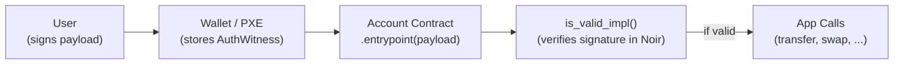

# Account Abstraction

:::note What you'll understand
Why Aztec has no EOAs (every account is a smart contract), how the UTXO-style note model compares to ERC-20 balances, why note nonces are derived from the first nullifier (Faerie Gold attack prevention), and how `AuthWitness` enables flexible delegated authorization. Prerequisites: [Note Encryption](./02-note-encryption.md).
:::

## No EOAs — Every Account is a Contract

In Ethereum, accounts are either EOAs (private key → ECDSA → address) or contracts. Aztec has only contracts:



**How authorization works:**
1. User signs a TX payload hash → creates an `AuthWitness` (a signature or any other proof)
2. PXE stores the `AuthWitness` locally
3. The TX calls the account contract's `entrypoint()` function
4. `entrypoint()` fetches the `AuthWitness` via oracle and calls `is_valid_impl()`
5. `is_valid_impl()` verifies the witness — Schnorr, ECDSA, or any custom scheme

The authentication algorithm is **circuit code** (Noir), not protocol magic. This enables full account abstraction: any authentication scheme that can be expressed as a ZK circuit is natively supported.

## Account Contract Implementations

```rust
// noir-projects/noir-contracts/contracts/account/schnorr_account_contract/src/main.nr
fn is_valid_impl(outer_hash: Field) -> bool {
    let witness: SchnorrSignature = get_auth_witness(outer_hash);
    let pk: PublicKey = storage.signing_pk.read();
    schnorr::verify_signature(pk, witness.sig_s, witness.sig_e, outer_hash)
}
```

| Account Type | Signature Scheme | Use Case |
|-------------|-----------------|----------|
| `SchnorrAccount` | Schnorr on Grumpkin | Native Aztec wallets |
| `EcdsaKAccount` | ECDSA on secp256k1 | MetaMask / Ethereum wallet compatibility |
| `EcdsaRAccount` | ECDSA on secp256r1 | WebAuthn / Passkeys |
| Custom | Any Noir circuit | Multisig, social recovery, biometrics |

## Notes vs ERC-20 Balances — The UTXO Model

Aztec private tokens use a **UTXO-like note model**, not a mapping:

```
// Ethereum ERC-20:
mapping(address => uint256) balances;
// balances[alice] = 100  — publicly readable, single slot

// Aztec private token (in Alice's PXE):
Note { value: 60, owner: alice, randomness: r1 } → commitment H1  (in Note Hash Tree)
Note { value: 40, owner: alice, randomness: r2 } → commitment H2  (in Note Hash Tree)
// Total: 100 — ONLY Alice's PXE knows this
```

**Spending a note (transfer 70 to Bob):**
1. **Nullify** Alice's 60-note (emit nullifier₁) and 40-note (emit nullifier₂)
2. **Create** a 70-note for Bob (commitment H3)
3. **Create** a 30-note for Alice as change (commitment H4)

Nobody outside Alice's PXE knows she had two notes, their values, or that she's receiving change.

**Cash analogy**: Notes are physical bills. Spending $70 when you have a $60 and a $40: break both bills, get $70 to Bob and $30 change to yourself.

## Note Nonces — Faerie Gold Attack Prevention

Every note has a nonce derived from the transaction's **first nullifier**:

```
nonce = poseidon2(first_nullifier, note_index)
unique_note_hash = poseidon2(nonce, siloed_note_hash)
```

**Why derive from the first nullifier?** Consider this attack without nonces:

1. Alice deploys a malicious Token contract
2. The contract's `mint()` function creates notes with the same commitment hash as legitimate Token contract notes
3. Bob receives what looks like a valid note from the real Token contract
4. Bob tries to spend it — the PXE checks membership in the Note Hash Tree — and it's there (but it's Alice's fake note)
5. Spending fails because the nullifier key derivation is contract-scoped — Bob's proof for the legitimate contract's nullifier won't match the fake note

But without unique nonces, Bob might not be able to distinguish the real note from the fake one at discovery time, causing confusion and potential UX attacks.

The **nonce derivation from the first nullifier** makes every note's commitment globally unique — even if two contracts create notes with the same field values. The first nullifier is unique per transaction, so all note nonces in a TX are unique.

**The Faerie Gold attack** (historical): Early versions of the protocol allowed note hash collisions. An attacker could observe a note hash appearing in the tree, then create a TX that re-uses that hash in a different context, tricking a victim's PXE into thinking they'd received a legitimate note. Nonce derivation closes this gap.

Reference: `noir-projects/noir-protocol-circuits/crates/private-kernel-init/src/main.nr` — `first_nullifier_hint`

## AuthWitness — Delegated Authorization

`AuthWitness` enables one account to authorize another to act on its behalf:

### Private Authorization (Off-chain)

```rust
// In a DeFi contract (e.g., swap router):
fn swap(token_in: AztecAddress, amount: Field) {
    // Checks: "did caller authorize this contract to transfer their tokens?"
    assert_current_call_valid_authwit(&mut context, caller);
    // If valid, transfer token_in from caller
    token_in.call(&mut context, selector!("transfer_from"), [caller, self, amount]);
}
```

The hash being authorized: `outer_hash = poseidon2(consumer_address, inner_hash(selector, args))`

- `consumer_address`: The contract calling the authorized function (binds to specific caller)
- `inner_hash`: Hash of the function + arguments (binds to specific action)

This scoping prevents replay: an AuthWitness for "DEX can transfer 100 TokenA" cannot be reused for "DEX can transfer 100 TokenB".

```ts
// yarn-project/aztec.js/src/utils/authwit.ts — createAuthWitness()
// noir-projects/aztec-nr/aztec/src/authwit/auth.nr — assert_current_call_valid_authwit
```

### Public Authorization (On-chain)

```rust
// Stored in the AuthRegistry protocol contract:
fn set_authorized(action_hash: Field, authorized: bool) {
    storage.authorized.write(action_hash, authorized);
    // AuthRegistry[caller][action_hash] = true
}
```

On-chain state → verifiable by anyone. Used for public DeFi interactions where the authorization needs to be transparent (e.g., approve a DEX to spend your public token balance).

## Implementation Notes

- **Auth witness scope**: The `outer_hash` binds to both the authorizing contract and the specific action. You cannot grant a blanket "any action" authorization — each auth witness is action-specific.
- **Schnorr on Grumpkin**: Grumpkin is the in-circuit curve (see [Key Hierarchy](./01-key-hierarchy.md)). Schnorr signatures on Grumpkin are native in BN254 circuits — no non-native field arithmetic needed.
- **EcdsaKAccount for MetaMask**: MetaMask signs with secp256k1 ECDSA. The `EcdsaKAccount` verifies this signature inside a Noir circuit using secp256k1 non-native arithmetic. It works but is more expensive to prove than Schnorr on Grumpkin.
- **Entrypoint batching**: The account contract's `entrypoint()` receives an `ExecutionPayload` that can contain multiple function calls. A single AuthWitness can authorize executing all of them atomically.

## What Comes Next

How contracts are identified and deployed — [Contract Identity](./04-contract-identity.md).
