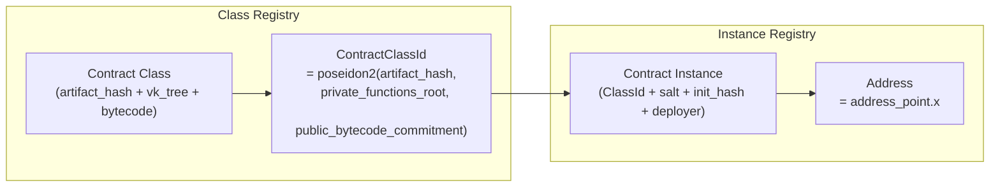

# Contract Identity

:::note What you'll understand
How Aztec separates contract code (classes) from deployments (instances), the exact address formula embedding `ivpk_m`, why private functions can't directly read mutable public state and the two solutions (`DelayedPublicMutable` and `PublicImmutable`), and how initialization nullifiers prevent re-initialization. Prerequisites: [Account Abstraction](./03-account-abstraction.md).
:::

## Contract Classes vs Instances

Aztec separates **code** (class) from **deployment** (instance) — similar to OOP classes and objects:



### Class Registration

A contract class is registered once via `ContractClassRegistry`:

```
ContractClassId = poseidon2(
    artifact_hash,              // Hash of the compiled artifact JSON
    private_functions_root,     // Merkle root of all private function VKs
    public_bytecode_commitment  // KZG commitment to public bytecode
)
```

Registration emits the `ClassId` as a **nullifier** — proving the class exists (anyone can check the nullifier tree) and preventing re-registration of the same class.

Reference: `noir-projects/noir-contracts/contracts/protocol/contract_class_registry_contract/src/main.nr`

### Instance Deployment

```
partial_address = poseidon2(class_id, salt, init_hash, deployer)

// Address derivation (same formula as account contracts)
public_keys_hash = poseidon2(npk_m, ivpk_m, ovpk_m, tpk_m)
pre_address = poseidon2(public_keys_hash, partial_address)
address_point = pre_address * G + ivpk_m    ← ivpk_m embedded
address = address_point.x
```

The instance address is emitted as a **nullifier** — the AVM verifies this nullifier exists before executing any public function at that address.

Reference: `noir-projects/noir-contracts/contracts/protocol/contract_instance_registry_contract/src/main.nr`

## The Private-Reads-of-Public-State Delay Problem

Private functions execute against a **historical anchor block** — a finalized snapshot of the world state. But public state can change every block. If Alice's private function reads a public storage slot (e.g., an exchange rate set by an admin), that rate might be stale or even maliciously manipulated.

**The attack**:
1. Admin calls `setRate(badRate)` at block N
2. Alice's private function uses anchor block N-1 (reads `goodRate`)
3. Alice proves against `goodRate` — her proof is valid for block N-1
4. TX is included at block N+1 — but the actual rate is now `badRate`
5. The TX executes with the wrong rate context

Two solutions exist:

## DelayedPublicMutable — Enforced Change Delay

Public state with a mandatory delay before changes take effect:

```rust
// noir-projects/aztec-nr/aztec/src/state_vars/delayed_public_mutable.nr
pub struct DelayedPublicMutable<T, DELAY> { ... }

// Usage:
fn update_rate(new_rate: Field) {
    // Change becomes active only after DELAY blocks
    storage.exchange_rate.schedule_value_change(new_rate);
}

fn read_rate_in_private(context: &mut PrivateContext) -> Field {
    // Safe: guaranteed the value won't change before this TX expires
    storage.exchange_rate.get_current_value_in_private(context)
}
```

**How it prevents the attack**: The private read asserts that the TX's `expiration_timestamp` is before the scheduled change's `effective_timestamp`. If an admin schedules a rate change, all private functions that might use the old rate expire before the change takes effect.

The `DELAY` parameter (e.g., 24 hours in blocks) gives users time to observe pending changes and act accordingly.

## PublicImmutable — Set Once, Read Always

For values that are set once and never change:

```rust
// noir-projects/aztec-nr/aztec/src/state_vars/public_immutable.nr
pub struct PublicImmutable<T> { ... }

fn initialize(value: T) {
    // Emits an initialization nullifier — can only be called once
    storage.config.initialize(value);
}

fn read_in_private(context: &mut PrivateContext) -> T {
    // Safe: value never changes, any historical read is valid
    storage.config.read()
}
```

**How it prevents the attack**: Private reads of an immutable value are always valid — the value cannot change between the anchor block and TX inclusion. The "initialization nullifier" pattern prevents re-initialization:

```
initialization_nullifier = poseidon2(contract_address, storage_slot, INIT_NULLIFIER_SEPARATOR)
```

When `initialize()` runs, it emits this nullifier. If called again, the nullifier already exists → the proof fails.

## Contract Instantiation and Initialization

Contracts often need constructor-like initialization. Since there is no special `constructor` keyword in Aztec, initialization is an explicit pattern:

```rust
#[public] #[initializer]
fn initialize(admin: AztecAddress, token_name: str) {
    storage.admin.write(admin);
    storage.name.write(token_name);
    // Emits initialization nullifier automatically via #[initializer] macro
}
```

The `#[initializer]` macro generates the nullifier emission. Private functions can check "is this contract initialized?" by proving the initialization nullifier exists in the nullifier tree.

## Private Functions and GETCONTRACTINSTANCE

The AVM opcode `GETCONTRACTINSTANCE` returns deployment information for any contract address. Private functions can also access this via an oracle that reads from the `ContractInstanceRegistry`:

```rust
// In a private Noir function:
let instance = get_contract_instance(target_address);
assert(instance.class_id == EXPECTED_CLASS_ID);
```

This lets contracts verify they're calling an authentic implementation (not a proxy substitution attack).

## Implementation Notes

- **Why nullifiers for class/instance registration?** The nullifier tree provides global uniqueness proofs without a dedicated registry mapping. A circuit can prove "this class exists" by proving the class ID is in the nullifier tree — the same proof mechanism used for note spending.
- **`salt` in instance deployment**: Like Ethereum's `CREATE2`, the salt allows deploying multiple instances of the same class at deterministic, distinct addresses. Salt is hashed into `partial_address`, making different salts produce different addresses.
- **Class vs instance bytecode**: The class stores the bytecode commitment. The AVM retrieves bytecode at execution time via a mapping from `class_id` to bytecode. This is why `GETCONTRACTINSTANCE` (instance → class_id) combined with AVM's bytecode lookup gives full deployment provenance.

## What Comes Next

All these concepts are managed by the PXE on the client side — [PXE Internals](./05-pxe-internals.md).
