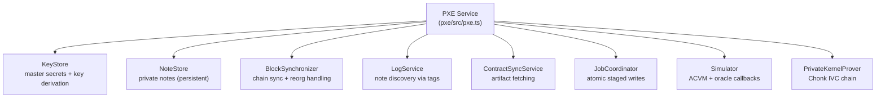
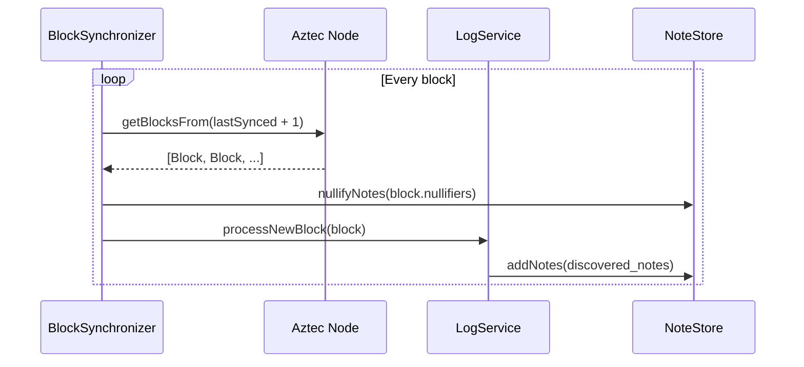
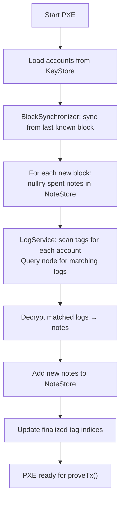

# PXE Internals

:::note What you'll understand
The eight PXE subsystems and their responsibilities, what the PXE can and cannot do at the cryptographic boundary, how nested private calls are handled via recursive oracle dispatch, the state sync flow (block streaming → nullifier checking → note discovery), and the privacy guarantees and their limits. Prerequisites: [Contract Identity](./04-contract-identity.md), [PXE Private Execution](../01-transaction-lifecycle/02-pxe-private-execution.md).
:::

## Architecture Overview

The **PXE** (Private eXecution Environment) is a client-side service that manages all private state. It runs in the user's wallet — browser extension, CLI, or native app:



## The Eight Subsystems

### 1. KeyStore (`pxe/src/key_store/local_key_store.ts`)

Stores master secret keys in encrypted local storage. Derives app-siloed keys on demand:

```ts
deriveAppNullifierSecretKey(account: AztecAddress, contract: AztecAddress): Promise<GrumpkinScalar>
deriveAppIncomingViewingSecretKey(account: AztecAddress, contract: AztecAddress): Promise<GrumpkinScalar>
```

Master secrets **never leave** the KeyStore. App-siloed keys are derived ephemerally and passed to oracles as needed.

### 2. NoteStore (`pxe/src/storage/note_store/note_store.ts`)

Persistent storage for decrypted notes:

```ts
// Note lifecycle:
// ACTIVE   → note is spendable
// NULLIFIED → note was spent (nullifier found on-chain)
class NoteStore {
  addNotes(notes: NoteData[], txHash: TxHash, blockNumber: number): Promise<void>;
  nullifyNotes(nullifiers: Fr[], blockNumber: number): Promise<void>;
  revertToBlock(blockNumber: number): Promise<void>; // reorg handling
}
```

Notes are stored with their block number so reorg handling can remove notes from rolled-back blocks.

### 3. BlockSynchronizer (`pxe/src/block_synchronizer/block_synchronizer.ts`)

Streams new L2 blocks from the Aztec Node and triggers downstream processing:



**Reorg handling**: If the node signals a reorg (blocks rolled back), `BlockSynchronizer` calls `noteStore.revertToBlock(reorgPoint)`, reversing nullifications and removing notes from invalidated blocks.

### 4. LogService (`pxe/src/logs/log_service.ts`)

Discovers notes from on-chain logs using tag-based scanning:

```ts
async fetchTaggedLogs(account: AztecAddress): Promise<PrivateLog[]> {
  // For each known sender-recipient pair:
  //   compute expected tags[finalized..finalized+WINDOW_LEN]
  //   query node for matching logs
  //   decrypt found logs → notes
  //   update finalized index
}
```

The LogService maintains per-account, per-contract, per-sender tag indices. It queries the node's indexed log store (tags are indexed on-chain by the sequencer) rather than scanning raw logs.

### 5. ContractSyncService (`pxe/src/contract_function_simulator/contract_sync_service.ts`)

Ensures contract artifacts are available before execution:

```ts
async ensureContractSynced(contractAddress: AztecAddress): Promise<void> {
  if (!await this.contractStore.hasArtifact(contractAddress)) {
    const artifact = await this.aztecNode.getContractArtifact(contractAddress);
    await this.contractStore.addArtifact(contractAddress, artifact);
  }
}
```

Artifacts (JSON with function ABIs and ACIR bytecode) are fetched from the node and cached locally. A contract's artifact is its identity — the PXE verifies the artifact hash matches the registered `ContractClassId`.

### 6. JobCoordinator (`pxe/src/job_coordinator/`)

Manages atomic "staged writes" — new notes and nullifications from simulation are staged in a temporary cache keyed by `jobId`. They commit to permanent storage only if the transaction succeeds:

```ts
// During simulation:
noteCache.addNote(jobId, note);   // Staged — not yet persistent
noteCache.nullify(jobId, nullifier);

// On TX success:
await noteStore.addNotes(noteCache.getNew(jobId));
await noteStore.nullifyNotes(noteCache.getNullified(jobId));

// On TX failure:
noteCache.discard(jobId);   // Drop staged changes
```

This prevents corrupting the NoteStore with notes from failed transactions.

### 7. Simulator (`pxe/src/contract_function_simulator/`)

Runs Noir circuits via the ACVM with oracle callbacks. See [PXE Private Execution](../01-transaction-lifecycle/02-pxe-private-execution.md) for full details.

### 8. PrivateKernelProver (`pxe/src/private_kernel/`)

Generates the kernel proof chain using Chonk IVC. Wraps `BBPrivateKernelProver` from `bb-prover`. See [Client IVC & Chonk](../02-zk-circuits-state/06-client-ivc-chonk.md).

## Nested Private Call Oracle Recursion

When a private function calls another private function, the oracle handles it recursively:

```ts
// pxe/src/contract_function_simulator/oracle/private_execution_oracle.ts
async privateCallPrivateFunction(
  targetContract: AztecAddress,
  functionSelector: FunctionSelector,
  args: Fr[]
): Promise<PrivateCircuitPublicInputs> {
  // Create a child oracle inheriting parent's noteCache and txContext
  const childOracle = new PrivateExecutionOracle(
    targetContract,
    this.argsHash,
    this.txContext,
    /* inherits: */ this.noteCache, this.contractStore, this.keyStore, ...
  );

  // Recursively execute the child function
  const childResult = await executePrivateFunction(
    this.simulator, childOracle, targetContract, functionSelector, args
  );

  // Store in parent's nested results (for kernel chain building)
  this.nestedExecutionResults.push(childResult);

  return childResult.publicInputs;
}
```

The result is a **tree** of execution results:

```
transfer()
├── _decrease_balance()  (nested call)
└── _increase_balance()  (nested call)
    └── _check_balance() (doubly nested)
```

The PXE traverses this tree depth-first to build the kernel chain (Init handles the root, Inner handles each node in traversal order).

## The Trust Model

### What the ZK Proof Guarantees (Cryptographic Boundary)

The PXE **cannot** do these without breaking the proof:

| Action | Why It's Impossible |
|--------|-------------------|
| Spend notes you don't own | Nullifier derivation requires `nsk_app`; circuit enforces this |
| Forge note commitments | No valid Merkle proof for non-existent leaf |
| Decrypt others' notes | `ivsk` decryption fails silently — wrong key → garbage plaintext |
| Fake kernel output | Kernel circuit verifies each step; invalid witness → invalid proof |
| Double-spend | Nullifier non-membership proof fails if already inserted |

### What Requires Trusting Your PXE

The PXE **can** do these without cryptographic detection:

| Action | Risk Level |
|--------|-----------|
| **Hide notes belonging to you** | Your wallet might display wrong balance |
| **Return misleading simulation** | Wrong gas estimates, wrong return values |
| **Connect to malicious Aztec node** | Wrong chain tip, stale state, censored TXs |
| **Log your private function call patterns** | Metadata leak (which contracts you use) |
| **Fetch wrong contract artifacts** | Wrong ABI could lead to unexpected behavior |

**Analogy**: A browser cannot forge your TLS certificate (cryptographic guarantee), but it can show you a phishing page (trust assumption). PXE is your private blockchain browser.

**Recommendation for maximum privacy**: Run your own Aztec node + PXE. Your keys never leave your hardware.

## State Sync Flow

When the PXE is started fresh:



For an account with many historical transactions, initial sync can take several minutes (scanning tag windows for all sender-recipient pairs). After sync, incremental updates (one block at a time) are fast.

## Privacy Guarantees — What's Hidden vs. Visible

### Hidden from the Network

| Information | Why Hidden |
|-------------|-----------|
| Note values and fields | AES-128-CBC encrypted on-chain |
| Who owns each note | No address-to-note mapping on-chain |
| Which private function was called | Hiding Kernel obscures this |
| Number of nested private calls | Fixed-size proof (HIDING_KERNEL_LOG_N) |
| Link between note creation and spending | Nullifiers are opaque hashes |

### Visible (Public Metadata)

| Information | Why Visible |
|-------------|-----------|
| That a TX occurred | On-chain event |
| Number of note hashes emitted | TX public inputs |
| Number of nullifiers emitted | TX public inputs |
| Public function calls and args | AVM is transparent |
| Fee payer address | On-chain fee payment |
| Gas consumed | On-chain data |

**Privacy budget**: Advanced users can pad TXs with dummy note hashes and nullifiers to hide the real count — at extra gas cost.

## Implementation Notes

- **Job queue serialization**: `PXE.#putInJobQueue()` ensures proving jobs don't run concurrently, preventing race conditions on the note cache and Merkle tree state.
- **`BlockSynchronizer` polling interval**: The PXE polls the Aztec node for new blocks. The interval is configurable — faster polling means lower latency for discovering received notes.
- **Artifact caching**: Contract artifacts can be large (ACIR bytecode). The PXE caches them in a local SQLite database. Cache misses trigger a network fetch — this can add latency to the first `proveTx()` for a new contract.
- **Multi-account PXE**: A single PXE instance can manage multiple accounts. The `JobCoordinator` uses `jobId` to isolate concurrent simulations for different accounts.

## What Comes Next

You now have a complete picture of the Aztec privacy stack. Return to the [Transaction Lifecycle Overview](../01-transaction-lifecycle/index.md) to see how all these pieces compose in practice. For the cryptographic underpinnings, see [Proof System](../02-zk-circuits-state/01-proof-system.md).
