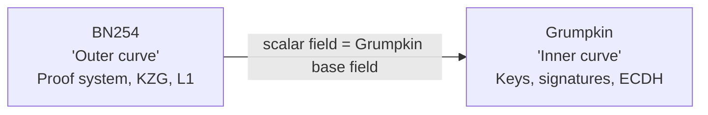
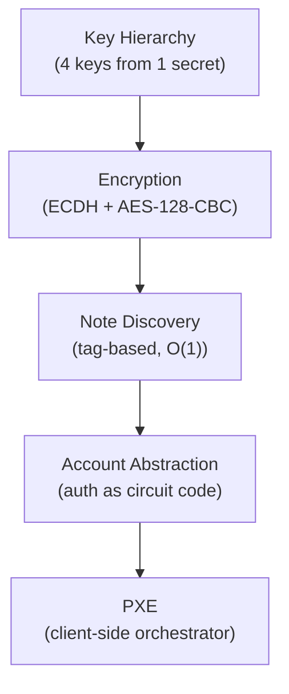

# Keys, Accounts & Privacy

:::note What you'll understand
How Aztec's layered privacy system works — key derivation produces four purpose-specific keys from one secret, ECDH+AES encryption hides note contents, account abstraction makes every account a programmable contract, and the PXE ties it all together on the client. Prerequisites: [Transaction Lifecycle Overview](../01-transaction-lifecycle/index.md), [ZK Circuits Overview](../02-zk-circuits-state/index.md).
:::

## The Two-Curve Model

Aztec uses two elliptic curves with a deliberate relationship:

- **BN254**: Used for ZK proofs (Honk), KZG commitments, and L1 verification. Ethereum's pairing precompile supports BN254.
- **Grumpkin**: Used for all key operations (derivation, ECDH, signatures). Its scalar field equals BN254's base field — making Grumpkin point operations **native** inside BN254 circuits (no expensive non-native arithmetic).

All Aztec public keys are Grumpkin points: `pk = sk * G` where `sk` is a Grumpkin scalar (element of BN254's base field).

## Privacy is Layered

| Layer | Mechanism | What It Protects |
|-------|-----------|-----------------|
| Key hierarchy | SHA-512 → Grumpkin scalar | Compartmentalized secrets per purpose |
| App siloing | Poseidon2(master_key, contract) | Cross-contract key leakage |
| Encryption | ECDH ephemeral + AES-128-CBC | Note content |
| Tag-based discovery | ECDH commutativity | Who received what (vs trial decryption) |
| Account abstraction | Noir auth circuit | Flexible authentication schemes |
| PXE trust model | ZK proof boundaries | What the node cannot forge |

## Section Map

| Page | Covers |
|------|--------|
| [Key Hierarchy](./01-key-hierarchy.md) | 4 master keys, app siloing, address derivation with embedded ivpk |
| [Note Encryption](./02-note-encryption.md) | ECDH, AES-128-CBC, forward secrecy, tag derivation, decryption flow |
| [Account Abstraction](./03-account-abstraction.md) | No EOAs, UTXO note model, Faerie Gold, AuthWitness delegation |
| [Contract Identity](./04-contract-identity.md) | Classes vs instances, address formula, DelayedPublicMutable, PublicImmutable |
| [PXE Internals](./05-pxe-internals.md) | 8 subsystems, trust model, nested call oracle recursion, state sync |
