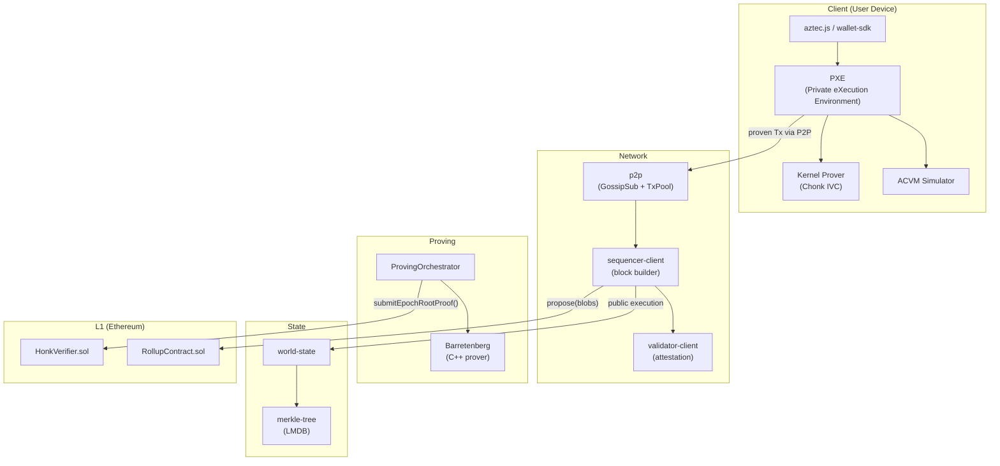

# Aztec Core Internals

Reference documentation for contributors to the Aztec monorepo. These pages explain how every major subsystem works from first principles, with direct references to the TypeScript and Noir source files.

:::info Who this is for
These docs target engineers working **inside** the Aztec monorepo — not contract authors. You should be comfortable reading TypeScript, have a basic familiarity with Ethereum, and be willing to follow source file references to their implementations.
:::

## How to Read This Documentation

Three parallel tracks cover the major subsystems. You can read them independently, but the order below is recommended for first-timers:

| Track | Pages | Covers |
|-------|-------|--------|
| **01 · Transaction Lifecycle** | 9 pages | End-to-end flow from `contract.method().send()` to L1 finality across 8 phases |
| **02 · ZK Circuits & State** | 8 pages | Proof system, the 5 Merkle trees, private kernel circuits, rollup circuits, and the AVM |
| **03 · Keys, Accounts & Privacy** | 7 pages | Key derivation, note encryption/discovery, account abstraction, and PXE internals |

## Architecture Overview



## Key Concepts at a Glance

### Why ZK?

Aztec uses zero-knowledge proofs — not just validity proofs — because private state cannot be validated by re-execution. An optimistic fraud proof requires the challenger to replay the disputed computation with its private inputs, which breaks privacy. ZK proofs establish correctness without revealing any inputs.

### Two Execution Engines

Every transaction may touch two distinct VMs:

- **ACVM** (Aztec Constraint VM) — runs Noir private functions on the **user's device** inside PXE. Private inputs never leave the user.
- **AVM** (Aztec Virtual Machine) — runs Noir public functions on the **sequencer** during block building. State is public, execution is deterministic.

### Five Merkle Trees

All L2 state lives in five Poseidon2 Merkle trees:

| Tree | Type | Purpose |
|------|------|---------|
| Note Hash | Append-only (h=42) | Private note commitments |
| Nullifier | Indexed (h=42) | Spent notes / double-spend prevention |
| Public Data | Indexed (h=40) | Public contract storage |
| L1→L2 Message | Append-only (h=36) | Cross-chain messages from Ethereum |
| Archive | Append-only (h=30) | Block header history |

### Three Finality Stages

| Stage | Trigger | Guarantee |
|-------|---------|-----------|
| **Pending** | `propose()` on L1 + ≥2/3+1 committee attestations | Block is part of chain; not yet proven |
| **Proven** | `submitEpochRootProof()` on L1 passes ZK verification | Cryptographically correct |
| **Finalized** | Ethereum L1 block finalizes | Irreversible |

## Critical Source Files Quick-Reference

```
# User intent → PXE
yarn-project/aztec.js/src/contract/base_contract_interaction.ts
yarn-project/wallet-sdk/src/base-wallet/base_wallet.ts
yarn-project/pxe/src/pxe.ts

# Private execution & proving
yarn-project/pxe/src/contract_function_simulator/contract_function_simulator.ts
yarn-project/pxe/src/private_kernel/private_kernel_execution_prover.ts
noir-projects/noir-protocol-circuits/crates/private-kernel-init/src/main.nr

# P2P & mempool
yarn-project/p2p/src/client/p2p_client.ts
yarn-project/p2p/src/mem_pools/tx_pool/aztec_kv_tx_pool.ts
yarn-project/p2p/src/msg_validators/tx_validator/factory.ts

# Block building & public execution
yarn-project/sequencer-client/src/sequencer/sequencer.ts
yarn-project/simulator/src/public/public_processor/public_processor.ts
yarn-project/simulator/src/public/avm/avm_simulator.ts

# Proving infrastructure
yarn-project/prover-client/src/orchestrator/orchestrator.ts
yarn-project/prover-client/src/proving_broker/proving_broker.ts

# L1 settlement
l1-contracts/src/core/libraries/rollup/ProposeLib.sol
l1-contracts/src/core/libraries/rollup/EpochProofLib.sol
```

## Where to Start

- **New to Aztec entirely?** → Read [Transaction Lifecycle Overview](./01-transaction-lifecycle/index.md) first.
- **Want to understand proving?** → Read [ZK Circuits Overview](./02-zk-circuits-state/index.md) then dive into the specific circuit pages.
- **Working on PXE or keys?** → Go straight to [Keys, Accounts & Privacy Overview](./03-keys-accounts-privacy/index.md).
- **Debugging a specific phase?** → Use the sidebar to jump directly to that phase's page.
